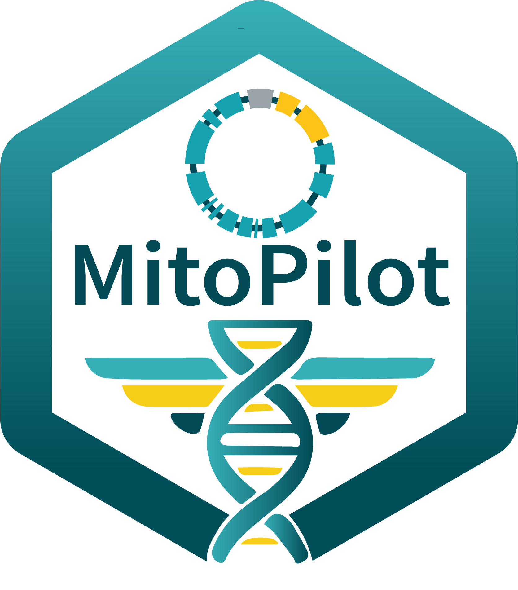

<!-- README.md is generated from README.Rmd. Please edit that file -->

# MitoPilot <a href="https://smithsonian.github.io/MitoPilot/"></a>

<!-- badges: start -->

[](https://lifecycle.r-lib.org/articles/stages.html#experimental)
[](https://github.com/Smithsonian/MitoPilot/actions/workflows/R-CMD-check.yaml)
<!-- badges: end -->

Please see the [documentation
website](https://smithsonian.github.io/MitoPilot/) for more details.

# Overview

MitoPilot is a package for the assembly and annotation of mitochondrial
genomes from genome skimming data. The core application consists of a
[Nextflow](https://www.nextflow.io/docs/latest/index.html) pipeline that
is wrapped in an R package, which includes an R-Shiny graphical
interface to monitor and interact with processing parameters and
outputs. Currently the pipeline expects paired-end Illumina reads as the
raw input and performs the following steps.

1.  Mitogenome assembly
      - [fastp](https://github.com/OpenGene/fastp) for quality control
        and adapter trimming
      - [GetOrganelle](https://github.com/Kinggerm/GetOrganelle)
        (default), [MitoFinder](https://github.com/RemiAllio/MitoFinder),
        or MapToRef for mitogenome assembly
      - [bowtie2](https://github.com/BenLangmead/bowtie2) for read
        mapping to calculate coverage and error rates.
      - [NCBI BLAST](https://blast.ncbi.nlm.nih.gov/Blast.cgi) against a
        local database of all annotated metazoan mitogenomes in GenBank,
        packaged in the MitoPilot container, to find the closest
        reference for automatic and manual curation
2.  Mitogenome annotation
      - [MITOS2](https://gitlab.com/Bernt/MITOS) for rRNA, PCG, and tRNA
        annotation
      - [tRNAscan-SE](https://github.com/UCSC-LoweLab/tRNAscan-SE) for
        tRNA annotation
      - [MitoFinder](https://github.com/RemiAllio/MitoFinder) for rRNA
        and PCG annotation (optional)
      - [ARWEN](https://doi.org/10.1093/bioinformatics/btm573) for tRNA
        annotation (optional)
      - [ARAGORN](https://doi.org/10.1093/nar/gkh152) for tRNA
        annotation (optional)
      - [ORFfinder](https://www.ncbi.nlm.nih.gov/orffinder/) identify
        additional open reading frames (ORFs) (optional)
      - Custom scripts for gene boundary refinement and annotation file
        formatting
      - Validation to flag possible issues or known errors that would be
        rejected by NCBI GenBank
      - Manual curation of annotations using the integrated Shiny App
3.  Data export
      - Custom scripts to export data in a format suitable for
        submission to NCBI GenBank

Optionally, MitoPilot can proceed straight to annotation and curation if
the user supplies mitogenome assemblies with the
`new_project_userAsmb()` function.


# Installation

MitoPilot needs R (\>= 4.4.0), Java 17+, Nextflow (24.10.x - 25.10.x),
and a container runtime (Docker locally, or Singularity/Apptainer on a
cluster).

``` r
if (!requireNamespace("BiocManager", quietly = TRUE)) {
  install.packages("BiocManager")
}
BiocManager::install("Smithsonian/MitoPilot")
```

See [Installation and
Requirements](https://smithsonian.github.io/MitoPilot/articles/Installation.html)
for the full requirements, disk space, updating and version pinning, and
container cache setup. Cluster-specific instructions are available for
[Smithsonian
Hydra](https://smithsonian.github.io/MitoPilot/articles/NMNH-Hydra.html)
and [NOAA
SEDNA](https://smithsonian.github.io/MitoPilot/articles/NOAA-SEDNA.html);
for any other cluster see [HPC cluster
support](https://smithsonian.github.io/MitoPilot/articles/Custom-HPC.html).

# Quick start

MitoPilot ships a small pre-filtered test dataset. Running it end to end
is the recommended way to verify your installation and learn the
interface before using your own data.

The [Get
Started](https://smithsonian.github.io/MitoPilot/articles/MitoPilot.html)
tutorial walks the whole pipeline using this test project.

Want to skip straight to using MitoPilot with your own data? Head on
over to [Starting Your Own
Project](https://smithsonian.github.io/MitoPilot/articles/Your-Own-Project.html).

# Taxonomic Scope

MitoPilot was initially built for fish mitogenomes, but It has since
been extended with curation and validation rulesets for the groups
below.

<table class="clade-table">
<thead>
<tr><th>Clade</th><th>Common name</th><th>curate_target</th><th>Status</th></tr>
</thead>
<tbody>
<tr><td><a href="https://www.ncbi.nlm.nih.gov/datasets/taxonomy/7898/">Actinopterygii</a></td><td>Ray-finned fishes</td><td><code>fish_mito</code></td><td>Tested</td></tr>
<tr><td><a href="https://www.ncbi.nlm.nih.gov/datasets/taxonomy/6340/">Annelida</a></td><td>Annelids</td><td><code>annelid_mito</code></td><td>Testing in progress</td></tr>
<tr><td><a href="https://www.ncbi.nlm.nih.gov/datasets/taxonomy/7713/">Ascidiacea</a></td><td>Sea squirts</td><td><code>ascidiacea_mito</code></td><td>Untested</td></tr>
<tr><td><a href="https://www.ncbi.nlm.nih.gov/datasets/taxonomy/7588/">Asteroidea</a></td><td>Sea stars</td><td><code>starfish_mito</code></td><td>Tested</td></tr>
<tr><td><a href="https://www.ncbi.nlm.nih.gov/datasets/taxonomy/8782/">Aves</a></td><td>Birds</td><td><code>bird_mito</code></td><td>Untested</td></tr>
<tr><td><a href="https://www.ncbi.nlm.nih.gov/datasets/taxonomy/6544/">Bivalvia</a></td><td>Bivalves</td><td><code>bivalvia_mito</code></td><td>Untested</td></tr>
<tr><td><a href="https://www.ncbi.nlm.nih.gov/datasets/taxonomy/10205/">Bryozoa</a></td><td>Bryozoans</td><td><code>bryozoa_mito</code></td><td>Untested</td></tr>
<tr><td><a href="https://www.ncbi.nlm.nih.gov/datasets/taxonomy/6830/">Copepoda</a></td><td>Copepods</td><td><code>copepod_mito</code></td><td>Testing in progress</td></tr>
<tr><td><a href="https://www.ncbi.nlm.nih.gov/datasets/taxonomy/35069/">Crinoidea</a></td><td>Crinoids</td><td><code>crinoidea_mito</code></td><td>Untested</td></tr>
<tr><td><a href="https://www.ncbi.nlm.nih.gov/datasets/taxonomy/10197/">Ctenophora</a></td><td>Ctenophores</td><td><code>ctenophore_mito</code></td><td>Testing in progress</td></tr>
<tr><td><a href="https://www.ncbi.nlm.nih.gov/datasets/taxonomy/6042/">Demospongiae</a></td><td>Demosponges</td><td><code>demospongiae_mito</code></td><td>Untested</td></tr>
<tr><td><a href="https://www.ncbi.nlm.nih.gov/datasets/taxonomy/7147/">Diptera</a></td><td>True flies</td><td><code>diptera_mito</code></td><td>Tested</td></tr>
<tr><td><a href="https://www.ncbi.nlm.nih.gov/datasets/taxonomy/7625/">Echinoidea</a></td><td>Sea urchins</td><td><code>echinoidea_mito</code></td><td>Untested</td></tr>
<tr><td><a href="https://www.ncbi.nlm.nih.gov/datasets/taxonomy/6448/">Gastropoda</a></td><td>Gastropods</td><td><code>gastropoda_mito</code></td><td>Testing in progress</td></tr>
<tr><td><a href="https://www.ncbi.nlm.nih.gov/datasets/taxonomy/6102/">Hexacorallia</a></td><td>Hexacorals</td><td><code>hexacoral_mito</code></td><td>Tested</td></tr>
<tr><td><a href="https://www.ncbi.nlm.nih.gov/datasets/taxonomy/7705/">Holothuroidea</a></td><td>Sea cucumbers</td><td><code>holothuroidea_mito</code></td><td>Untested</td></tr>
<tr><td><a href="https://www.ncbi.nlm.nih.gov/datasets/taxonomy/80999/">Homoscleromorpha</a></td><td>Homoscleromorph sponges</td><td><code>homoscleromorpha_mito</code></td><td>Untested</td></tr>
<tr><td><a href="https://www.ncbi.nlm.nih.gov/datasets/taxonomy/6074/">Hydrozoa</a></td><td>Hydrozoans</td><td><code>hydrozoa_mito</code></td><td>Testing in progress</td></tr>
<tr><td><a href="https://www.ncbi.nlm.nih.gov/datasets/taxonomy/8504/">Lepidosauria</a></td><td>Lepidosaurs</td><td><code>lepidosaur_mito</code></td><td>Untested</td></tr>
<tr><td><a href="https://www.ncbi.nlm.nih.gov/datasets/taxonomy/6681/">Malacostraca</a></td><td>Malacostracans</td><td><code>malacostraca_mito</code></td><td>Testing in progress</td></tr>
<tr><td><a href="https://www.ncbi.nlm.nih.gov/datasets/taxonomy/40674/">Mammalia</a></td><td>Mammals</td><td><code>mammal_mito</code></td><td>Untested</td></tr>
<tr><td><a href="https://www.ncbi.nlm.nih.gov/datasets/taxonomy/6217/">Nemertea</a></td><td>Ribbon worms</td><td><code>nemertea_mito</code></td><td>Testing in progress</td></tr>
<tr><td><a href="https://www.ncbi.nlm.nih.gov/datasets/taxonomy/6132/">Octocorallia</a></td><td>Octocorals</td><td><code>octocoral_mito</code></td><td>Tested</td></tr>
<tr><td><a href="https://www.ncbi.nlm.nih.gov/datasets/taxonomy/7618/">Ophiuroidea</a></td><td>Brittle stars</td><td><code>ophiuroidea_mito</code></td><td>Untested</td></tr>
<tr><td><a href="https://www.ncbi.nlm.nih.gov/datasets/taxonomy/6157/">Platyhelminthes</a></td><td>Flatworms</td><td><code>platyhelminthes_mito</code></td><td>Untested</td></tr>
<tr><td><a href="https://www.ncbi.nlm.nih.gov/datasets/taxonomy/6341/">Polychaeta</a></td><td>Polychaetes</td><td><code>polychaeta_mito</code></td><td>Testing in progress</td></tr>
<tr><td><a href="https://www.ncbi.nlm.nih.gov/datasets/taxonomy/57294/">Pycnogonida</a></td><td>Sea spiders</td><td><code>pycnogonida_mito</code></td><td>Untested</td></tr>
<tr><td><a href="https://www.ncbi.nlm.nih.gov/datasets/taxonomy/6142/">Scyphozoa</a></td><td>True jellyfishes</td><td><code>scyphozoa_mito</code></td><td>Testing in progress</td></tr>
<tr><td><a href="https://www.ncbi.nlm.nih.gov/datasets/taxonomy/6433/">Sipuncula</a></td><td>Peanut worms</td><td><code>sipuncula_mito</code></td><td>Untested</td></tr>
<tr><td><a href="https://www.ncbi.nlm.nih.gov/datasets/taxonomy/8459/">Testudines</a></td><td>Turtles</td><td><code>turtle_mito</code></td><td>Tested</td></tr>
<tr><td><a href="https://www.ncbi.nlm.nih.gov/datasets/taxonomy/30304/">Thaliacea</a></td><td>Salps</td><td><code>thaliacea_mito</code></td><td>Testing in progress</td></tr>
<tr><td><a href="https://www.ncbi.nlm.nih.gov/datasets/taxonomy/116172/">Thecostraca</a></td><td>Barnacles</td><td><code>thecostraca_mito</code></td><td>Untested</td></tr>

</tbody>
</table>

See the [curation ruleset
browser](https://smithsonian.github.io/MitoPilot/articles/Ruleset-Browser.html)
for details about each curation ruleset. The curation ruleset can be set
individually for each sample in the `Curate Opts.` window in the
MitoPilot app.

All curation rulesets ship inside the Docker image
([macguigand/MitoPilot](https://hub.docker.com/repository/docker/macguigand/mitopilot)).
If MitoPilot doesn’t have a curation ruleset for your taxonomic group,
please open an [issue](https://github.com/Smithsonian/MitoPilot/issues)
or contact Dan MacGuigan at <macguigand@si.edu>.

For groups other than fishes, make sure you build or pick the
appropriate reference databases. There are three independent kinds of
databases:

  - **Assembly** references for GetOrganelle, MitoFinder, or MapToRef.
    `MitoPilot::custom_assembly_db()` builds a clade-wide database for
    GetOrganelle and MitoFinder automatically, with no external tools
    required; MapToRef instead uses a single reference mitogenome you
    supply yourself. Each sample can use a different one: add a
    `Reference` column to your mapping CSV, or call
    `MitoPilot::set_maptoref_refs()`. A reference may be a file path, a
    URL, or an NCBI accession. See [building custom
    databases](https://smithsonian.github.io/MitoPilot/articles/custom_dbs.html).
  - **Annotation** references for MITOS2. MitoPilot includes Chordata
    and Metazoa databases, selectable in the `Annotate Opts.` window.
  - **Curation** references, chosen independently of the annotation
    database. Bundled options are `Metazoa_RefSeq235` (the default),
    `Metazoa_RefSeq231`, `Metazoa_RefSeq89`, and `Chordata`. MitoPilot
    also folds each sample’s assembly BLAST results into the curation
    references automatically.

# Documentation

| Page                                                                                                                                                          | What it covers                                           |
| ------------------------------------------------------------------------------------------------------------------------------------------------------------- | -------------------------------------------------------- |
| [Get Started](https://smithsonian.github.io/MitoPilot/articles/MitoPilot.html)                                                                                | Full walkthrough, then starting your own project         |
| [Installation and Requirements](https://smithsonian.github.io/MitoPilot/articles/Installation.html)                                                           | Prerequisites, installing, updating, container cache     |
| [HPC cluster support](https://smithsonian.github.io/MitoPilot/articles/Custom-HPC.html)                                                                       | Executors, cluster profiles, SSH tunnel, submitting runs |
| [Curation ruleset browser](https://smithsonian.github.io/MitoPilot/articles/Ruleset-Browser.html)                                                             | What each clade ruleset enforces                         |
| [Building custom databases](https://smithsonian.github.io/MitoPilot/articles/custom_dbs.html)                                                                 | Assembly and curation reference databases                |
| [Handling difficult assemblies](https://smithsonian.github.io/MitoPilot/articles/Difficult-Assemblies.html)                                                   | Resolving competing assemblies and fragmented scaffolds  |
| [FAQ](https://smithsonian.github.io/MitoPilot/articles/FAQ.html) and [Troubleshooting](https://smithsonian.github.io/MitoPilot/articles/Troubleshooting.html) | Common questions and pipeline failures                   |
| [Reference](https://smithsonian.github.io/MitoPilot/reference/index.html)                                                                                     | All functions                                            |
| [Changelog](https://smithsonian.github.io/MitoPilot/news/index.html)                                                                                          | Release notes and container tags                         |
