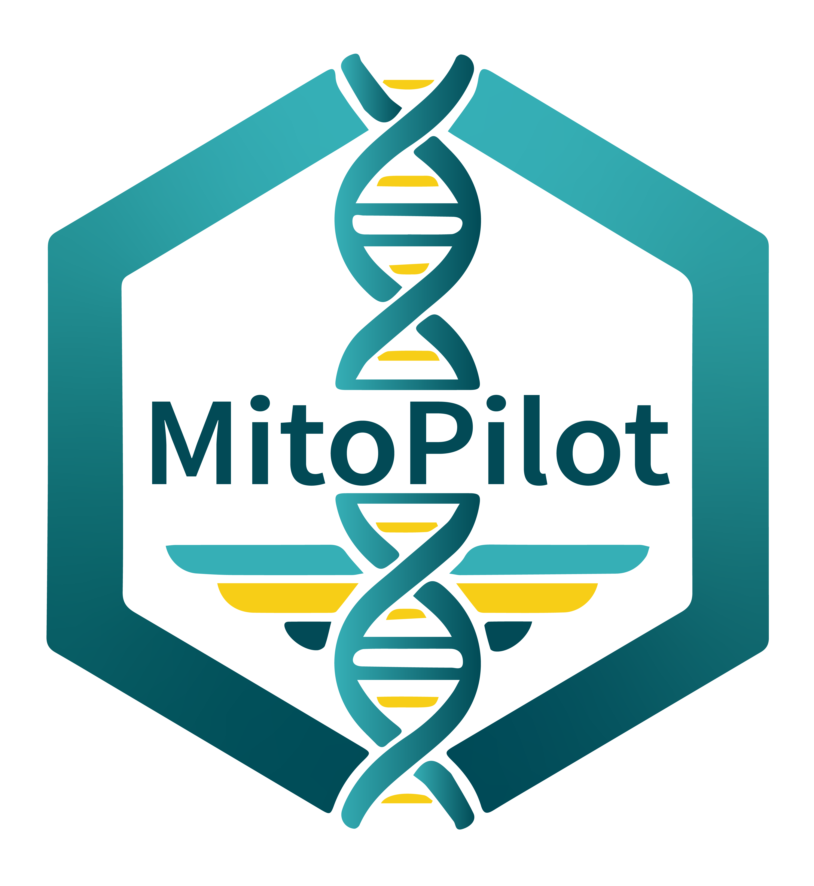

<!-- README.md is generated from README.Rmd. Please edit that file -->

# MitoPilot <a href="https://smithsonian.github.io/MitoPilot/"></a>

<!-- badges: start -->

[](https://lifecycle.r-lib.org/articles/stages.html#experimental)
[](https://github.com/Smithsonian/MitoPilot/actions/workflows/R-CMD-check.yaml)
<!-- badges: end -->

# Overview

MitoPilot is a package for the assembly and annotation of mitochondrial
genomess from genome skimming data. The core application consists of a
[Nextflow](https://www.nextflow.io/docs/latest/index.html) pipeline that
is wrapped in an R package, which includes an R-Shiny graphical
interface to monitor and interact with processing parameters and
outputs. Currently the pipeline expects paired-end Illumina reads as the
raw input and performs the following steps:

1.  Mitogenome assembly
    - [fastp](https://github.com/OpenGene/fastp) for quality control and
      adapter trimming
    - [GetOrganelle](https://github.com/Kinggerm/GetOrganelle) (default)
      or [MitoFinder](https://github.com/RemiAllio/MitoFinder) for
      mitogenome assembly
    - [bowtie2](https://github.com/BenLangmead/bowtie2) for read mapping
      to calculate coverage and error rates.
2.  Mitogenome annotation
    - [MITOS2](https://gitlab.com/Bernt/MITOS) for rRNA, PCG, and tRNA
      annotation
    - [tRNAscan-SE](https://github.com/UCSC-LoweLab/tRNAscan-SE) for
      tRNA annotation
    - Custom scripts for gene boundary refinement and annotation file
      formatting
    - Validation to flag possible issues or known errors that would be
      rejected by NCBI GenBank
    - Manual curation of annotations using the integrated Shiny App.
3.  Data export
    - Custom scripts to export data in a format suitable for submission
      to NCBI GenBank

# Taxonomic Scope

MitoPilot was initially built for fish mitogenome assembly. By default,
MitoPilot uses the included
[GetOrganelle](https://github.com/Smithsonian/MitoPilot/tree/main/ref_dbs/getOrganelle)
and
[MitoFinder](https://github.com/Smithsonian/MitoPilot/tree/main/ref_dbs/MitoFinder)
fish reference databases. However, MitoPilot has been developed with
modularity and extensibility in mind to facilitate broader application
in the future.

MitoPilot allows the user to provide custom reference databases for
assembly with GetOrganelle or MitoFinder. We have provided some
[documentation](https://smithsonian.github.io/MitoPilot/articles/custom_dbs.html)
to help you build a custom reference database.

For annotation with MITOS2, we have provided reference databases for
[chordates](https://github.com/Smithsonian/MitoPilot/tree/main/ref_dbs/Mitos2/Chordata)
and
[metazoans](https://github.com/Smithsonian/MitoPilot/tree/main/ref_dbs/Mitos2/Metazoa).
You can toggle between these databases in `Annotate Opts.` window in the
MitoPilot GUI. We will add more annotation reference database options in
the future.

Currently, MitoPilot has curation/validation rulesets for the following
groups of organisms:

- fishes
- starfish (testing in progress)
- dipterans (testing in progress)
- mammals (untested)
- copepods (untested)
- octocorals (untested)

The custom logic in the annotation curation and validation scripts needs
to be tweaked for optimal performance with other taxonomic groups.
Because all of the curation rulesets are contained in the underlying
Docker image (currently hosted at
[macguigand/MitoPilot](https://hub.docker.com/repository/docker/macguigand/mitopilot)),
customization or extension will involve updating the Docker image
appropriately and specifying the new image in the Nextflow configuration
file (see below).

The Dockerfile is included in this repository and a custom local Docker
Image can be generated by modifying the Dockerfile as needed and running
`./docker/deploy-local.sh latest` in the repository root directory.

If you have a group of organisms that you would like to try with
MitoPilot, feel free to post an
[issue](https://github.com/Smithsonian/MitoPilot/issues) or reach out to
Dan MacGuigan directly at <daniel.macguigan@noaa.gov>.

# Installation

We provide detailed installation instructions for the following
computing clusters:

- [Smithsonian NMNH
  Hydra](https://smithsonian.github.io/MitoPilot/articles/NMNH-Hydra.html)
- [NOAA
  SEDNA](https://smithsonian.github.io/MitoPilot/articles/NOAA-SEDNA.html)

To use MitoPilot, you will need [R
(\>=4.4.0)](https://www.r-project.org/) and
[Nextflow](https://www.nextflow.io/docs/latest/install.html). In
addition, depending or where Nextflow will be executing the pipeline
(e.g., locally or on a remote cluster), you may also need to install
[Docker](https://docs.docker.com/engine/install/) or
[Singularity](https://docs.sylabs.io/guides/latest/user-guide/quick_start.html#quick-installation-steps).

Once you have R and Nextflow installed, install `{MitoPilot}` in R from
GitHub:

``` r
if (!requireNamespace("BiocManager", quietly = TRUE)) {
  install.packages("BiocManager")
}
BiocManager::install("Smithsonian/MitoPilot")
```

Alternatively, you can clone this repository and install the package
locally from the project folder:

``` r
devtools::install()
```

# Usage

MitoPilot includes a set of pre-filtered test data, a function for
setting up an example project (`new_test_project()`), and detailed
[tutorial
documentation](https://smithsonian.github.io/MitoPilot/articles/MitoPilot.html).
It is highly recommended that you use the test project to ensure
successful installation and familiarize yourself with the pipeline
before starting a MitoPilot project with your own data.

## Initializing A Project

The MitoPilot workflow begins by initializing a new project with the
`new_project()` function. If running from within RStudio (recommended) a
new R-project will also be initialized and opened in a new RStudio
session.

``` r
MitoPilot::new_project(
  path = "path/to/project",
  mapping_fn = "path/to/mapping_file.csv",
  data_path = "path/to/raw_data",
  executor = "local"
)
```

- Path
  - The path specifies where the new project directory will be created.
    If no path is provided, the project will be created in the current
    working directory.
- Mapping File
  - The mapping file should be in CSV format and must contain the
    following columns:
    - `ID` (a unique identifier for each sample)
    - `R1` and `R2` (specifying the forward and reverse file names for
      the raw Illumina paired end data)
    - `Taxon` (e.g. species or genus name, no required format)
  - In addition to the required columns, any other sample metadata can
    be included in the mapping file. These columns can also be used when
    exporting files for NCBI GenBank Submissions, so metadata that is
    important for submission (e.g., BioSample ID) can be included here.
- Data Path
  - Full path to the data directory, which should contain the raw
    Illumina paired-end reads specified in the mapping file.
- Executor
  - The executor specifies where the computational work will be
    performed by Nextflow. For example choosing `local` will run the
    pipeline on the local machine, while `awsbatch` will run the
    pipeline on AWS Batch. Running `new_project()` will generate a
    executor-specific .config file in the project directory that must be
    edited to specify additional parameters for the pipeline to run.

**NOTE**: If running MitoPilot via RStudio Server on a computing
cluster, you likely need to specify `Rproj = FALSE` when calling the
`MitoPilot::new_project` function.

### Initializing a Project with User Assemblies

MitoPilot can also initialize a project with user-supplied mitogenome
assemblies. This may be helpful if you have existing assemblies and only
wish to utilize the annotation and curation features of MitoPilot.
Alternatively, you could use this approach to “re-import” assemblies
produced by MitoPilot that required manual editing with an external
tool.

To use your own mitogenome assemblies, you will need a mapping file with
two additional columns:

- `Assembly`
  - Contains the names of your mitogenome FASTA files. Ideally, each
    FASTA file should contain a single contig or scaffold representing
    the complete mitogenome. The format of the FASTA file names and
    sequence headers does not matter.
- `Topology`
  - Indicate whether the assembly is “linear” or “circular”.

All of your mitogenome FASTA files must be located in a single
directory, which you will supply to the `assembly_path` argument of the
`new_project_userAsmb()` function.

``` r
MitoPilot::new_project_userAsmb(
  path = "path/to/project",
  mapping_fn = "path/to/mapping_file.csv",
  data_path = "path/to/raw_data",
  assembly_path = "path/to/mitogenome/assembly/fasta/files"
  executor = "local"
)
```

Note that all samples in a MitoPilot project created with
`new_project_userAsmb()` must have user-supplied assemblies. You cannot
have MitoPilot project with mixed samples (i.e. some assembled, some
unassembled).

### Nextflow Configuration File

Initializing a new project will populate the `.config` file in the
project directory that may include place holders for important
parameters, in the format: `<<PARAMETER_NAME>>`. For example, all new
configuration files will include the line `rawDir = '<<RAW_DIR>>'`,
which should be updated to `rawDir = '/path/to/your/data'` indicating
the location of the raw data file specified in the mapping file. The
configuration files can also be modified to specify custom docker images
for one or more of the processing steps. After initializing a new
project you should review the `.config` file to ensure that all
necessary parameters are provided.

### Database Creation

MitoPilot makes use of the Nextflow plugin
[nf-sqldb](https://github.com/nextflow-io/nf-sqldb) to store and
retrieve processing parameters and information about the samples and
their processing status. The database (`.sqlite`) is created
automatically when the project is initialized and is stored in the
project directory.

The interactive MitoPilot GUI also interacts with this database to allow
you run the pipeline, modify parameters, and view the results. When
initializing a new project, default processing parameters for the
pipeline modules are stored in the database, but any processing
parameters can also be passed to the `new_project()` function to modify
the initial defaults. For example, the following options would modify
the allocated memory and GetOrganelle command line options :

``` r
MitoPilot::new_project(
  mapping = "path/to/mapping_file.csv",
  executor = "local",
  assemble_memory = 24,
  getOrganelle = "-F 'anonym' -R 20 -k '21,45,65,85,105,115' -J 1 -M 1 --expected-max-size 20000 --target-genome-size 16500"
)
```

For complete list of available parameters that can be set during project
initialization, see the `new_db()` function documentation.

Although the MitoPilot GUI provides an interface to the database, during
troubleshooting it is often helpful to directly explore the contents of
the project’s `.sqlite` database. This can be easily done in R using the
`{dplyr}` extension, [{dbplyr}](https://dbplyr.tidyverse.org/), which is
used extensively in the MitoPilot package, along with
[{DBI}](https://dbi.r-dbi.org/), for database interactions.
Alternatively, many interactive tools exist specifically for working
with SQLite databases, such as [DB Browser for
SQLite](https://sqlitebrowser.org/).

### Database Modification

MitoPilot databases can be modified using the R helper functions
`update_sample_metadata()`, `update_sample_seqdata()`, and
`add_samples()`. You must close any existing connections (e.g. the
MitoPilot GUI) prior to modifying the database. These functions will
automatically create backups of the database in case you need to revert
your changes. For more information, please see the [manual
pages](https://smithsonian.github.io/MitoPilot/reference/index.html) for
these functions.

# Running The Pipeline

Once a project is initialized, the pipeline status can be viewed using
the MitoPilot GUI. The GUI can be launched by running the `MitoPilot()`
command in the R console from the project directory. The GUI will open
in a new browser window and is primarily comprised of an interactive
table, with 3 modules (Assembly, Annotate, Export), where each row
represents a sample in the project.

Please note that we have tested the MitoPilot GUI on Chrome and Firefox
web browsers. There are known bugs when running the GUI on Safari.

## Sample Status

In the Assemble and Annotate modules the icon at the start of each row
indicates the sample status, where:

1.  (⏳) Hold / Waiting = Indicates that the sample is ready to be
    updated, but will not be updated the next time the pipeline is run.
2.  (🏃) Ready to Run = Indicates that the sample will be updated the
    next time the pipeline is run.
3.  (✅) Completed Successfully = Indicates that the sample has been
    successfully processed.
4.  (⚠️) Completed with Warning - Processing is complete but may have
    failed or needs manual review.

There is an additional icon indicating whether a samples is locked () or
unlocked (). A locked sample will be protected from further updates by
Nextflow. Locking a sample will also make it available in the next
MitoPilot module - a sample must be locked in the Assemble module to
proceed with Annotation and must be locked the the Annotation modules to
proceed with data Export. Both the “state” and “locked” status of one or
more samples can be modified by selecting the sample rows in the table
and using the “STATE” and “LOCK” buttons at the top of the interface.

## Processing parameters

In the Assemble and Annotate modules, the processing parameters for one
or more samples can be modified by clicking on the link in the relevant
column (e.g., `Assemble Opts.`). This will open a popup that can be used
to modify options by either selecting an existing option set from the
drop-down menu, or by entering a new name for the option set and
modifying the parameters. If multiple rows are selected in the table
when the options popup is triggered, the changes will apply to all
selected samples (though selecting any locked sample will prevent this
action). An existing options set can also be modified by checking the
“editing” box in the popup, but this may trigger a warning that the
edits will affect more samples than are currently selected (i.e., all
sample that are using that options set).

## Running Nextflow

When one or more samples are in the “Ready to Run” state, the Nextflow
pipeline can be run by clicking the “UPDATE” button at the top of the
interface. This will open a popup where the `Start Nextflow` button can
be pressed and output from the pipeline can be viewed to track progress.

Alternatively, the Nextflow command displayed in the popup can be copied
and run in the a terminal from the project directory, which can be
useful if you would like to specify additional command line options or
override input parameters. Or you can paste the Nextflow command into a
job submission script for a computing cluster. We have provided examples
for the [NMNH
Hydra](https://smithsonian.github.io/MitoPilot/articles/NMNH-Hydra.html#running-large-mitopilot-jobs)
and [NOAA
SEDNA](https://smithsonian.github.io/MitoPilot/articles/NOAA-SEDNA.html#running-large-mitopilot-jobs)
clusters.

# Development Notes

- This package uses [{renv}]() for package management. After cloning the
  repository, run `renv::restore()` to install the necessary packages.
- To work from the package repository, but reference a MitoPilot project
  in a different directory, set the `MitoPilot.db` option to the
  location of the `.sqlite` database for the project
  (e.g. `options("MitoPilot.db" = "~/Jonah/MitoPilot-testing/.sqlite")`).
- When modifying the underlying R-package functions references in the
  Nextflow pipeline, or modifying / adding reference databases specified
  in `docker/Dockerfile`, the docker image should be rebuilt. The
  `docker/deploy-local.sh` script can be used to build a local image, or
  the `docker/deploy-aws.sh` and `docker/deploy-dockerhub.sh` scripts
  can be modified to deploy a remote image to your account. In any case,
  the Nextflow `.config` file should be modified such that one or more
  of the processing steps reference the new image.
