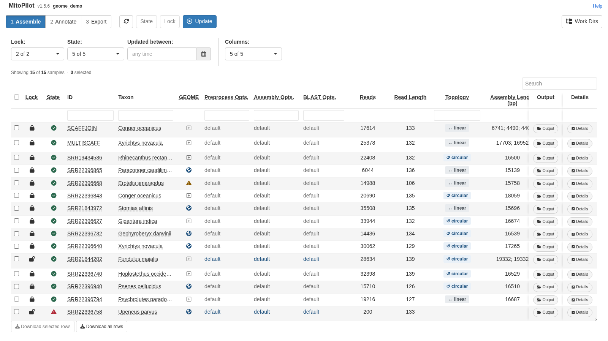
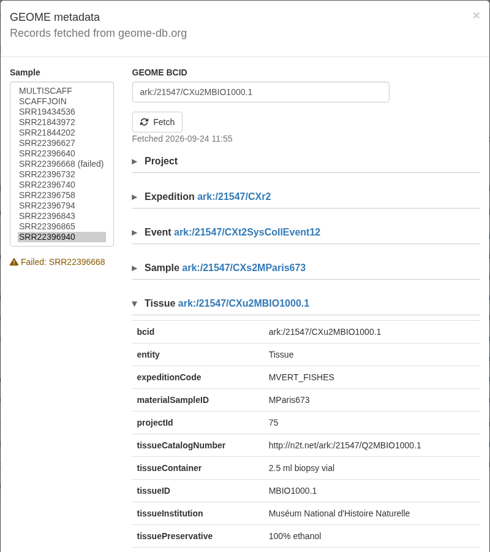
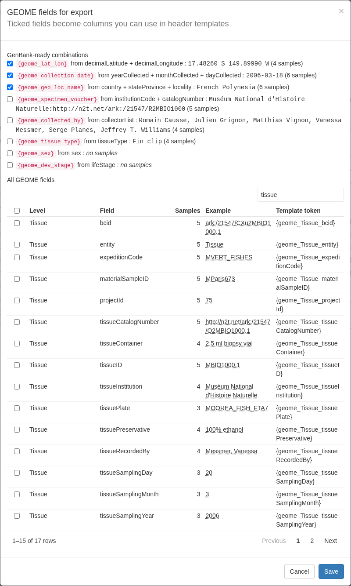

<style>
.alert {
  border-left: 5px solid;
  padding: 10px;
  margin: 10px 0;
  border-radius: 5px;
}
.alert-tip { border-color: #28A745; background-color: #E9F7EF; }
.alert-note { border-color: #007BFF; background-color: #EBF5FF; }
.alert-warning { border-color: #FFC107; background-color: #FFF9E6; }
.alert-danger { border-color: #DC3545; background-color: #F8D7DA; }
strong { font-weight: bold; }
</style>

```{r, include = FALSE}
knitr::opts_chunk$set(eval = FALSE)
```

## What GEOME is and what MitoPilot pulls

[GEOME](https://geome-db.org) (the Genomic Observatories Metadatabase) stores
specimen, tissue, and collecting-event metadata for biodiversity projects. Every
record has a BCID, a persistent identifier in ARK format such as
`ark:/21547/CXu2MBIO1000.1`.

Give MitoPilot a BCID for a sample and it fetches that record, then walks up
its parent records (for example Tissue, then Sample, then collecting Event) and
adds the details of the GEOME expedition and project the record belongs to.
Everything is stored in the project database, so you can:

- browse the full record for each sample in the app, and
- pick GEOME fields, including GenBank-ready source modifiers such as
  `lat_lon` and `collection_date`, to use in FASTA headers at export.

Linking samples to GEOME is optional. Projects without BCIDs work exactly as
before.

<div class="alert alert-warning">
<strong>Public records only.</strong> MitoPilot can read public GEOME records.
Records in private GEOME projects are not supported yet, because logging in to
GEOME from another program needs credentials issued by the GEOME team.
</div>

## Finding a BCID

Open a record on [geome-db.org](https://geome-db.org) (a tissue, sample, or
event) and copy its identifier, which starts with `ark:/` followed by a number,
for example `ark:/21547/CXu2MBIO1000.1`. Use the BCID of the most specific
record that matches your sequenced material, usually the tissue: MitoPilot
fetches everything above it automatically.

Full URLs are accepted and trimmed to the bare ARK, so any of these work:

```
ark:/21547/CXu2MBIO1000.1
https://n2t.net/ark:/21547/CXu2MBIO1000.1
https://geome-db.org/record/ark:/21547/CXu2MBIO1000.1
```

## Adding BCIDs at project setup

Add a column of BCIDs to your mapping file (see
[Running Your Own Project](Your-Own-Project.html#the-mapping-file)) and name
that column with `mapping_geome`:

```
ID,Taxon,R1,R2,Tissue_BCID
FISH01,Psenes pellucidus,FISH01_R1.fastq.gz,FISH01_R2.fastq.gz,ark:/21547/CXu2MBIO1000.1
FISH02,Xyrichtys novacula,FISH02_R1.fastq.gz,FISH02_R2.fastq.gz,ark:/21547/CXu2MBIO100.1
FISH03,Conger oceanicus,FISH03_R1.fastq.gz,FISH03_R2.fastq.gz,
```

```r
new_project(path = "my_project", mapping_fn = "mapping.csv",
            mapping_geome = "Tissue_BCID", data_path = "reads/")
```

- The column is stored in the project as `GEOME_BCID`. If your column already
  has that name, you can leave out `mapping_geome`.
- Blank cells are fine: those samples simply have no GEOME link.
- MitoPilot fetches the GEOME records during setup, which needs an internet
  connection. When setting up offline, pass `fetch_geome = FALSE` and run
  `fetch_geome()` later.

`new_project_userAsmb()` takes the same `mapping_geome` and `fetch_geome`
arguments.

## Adding or changing BCIDs later

`add_samples()` and `update_sample_metadata()` accept `mapping_geome` too.
With `update_sample_metadata()`, samples whose BCID changed (or was added) are
fetched again, and a blank cell removes that sample's BCID and its GEOME data.

To fetch again without touching the mapping file, use `fetch_geome()`:

```r
fetch_geome("my_project")                       # refresh all
fetch_geome("my_project", ids = "S01")          # refresh one
fetch_geome("my_project", ids = c("S01", "S02"),
            bcids = c("ark:/21547/CYB2REEDY", "ark:/21547/CYA2Reedy01"))
```

The last form sets (or replaces) the BCIDs of those samples before fetching.
A blank BCID there removes the sample's GEOME link.

When some fetches fail, `fetch_geome()` finishes the rest and then gives one
warning listing each failed sample with the reason, for example:

```
Warning message:
GEOME fetch failed for SRR22396668 (BCID not found in GEOME)
```

Records are fetched when you run these functions, not when the pipeline runs.
Re-run `fetch_geome()` whenever the records in GEOME have been updated.

## Viewing records in the app

### The GEOME column

The Assemble, Annotate, and Export tables have a **GEOME** column right after
**Taxon**:

| Icon | Meaning |
|---|---|
| Globe | GEOME record fetched. |
| Warning triangle | The sample has a BCID, but the last fetch failed. Hover over the icon to see why. |
| Faint plus | The sample has no BCID. |



The column belongs to the **GEOME** entry in each table's **Columns** picker.
It is switched on when at least one sample in the project has a BCID, and off
otherwise. To add BCIDs from the app in a project that has none yet, tick
**GEOME** in the Columns picker, then click the plus icon of a sample.

### The GEOME viewer

Click any icon in the GEOME column to open the viewer for that sample.
Clicking the icon does not select or deselect the row.



- **Sample** (left) lists every sample in the project. Samples whose last
  fetch failed are marked "(failed)", and a list of all failed samples sits
  below.
- The record is shown level by level from the top down: Project, Expedition,
  then the GEOME records themselves (for example Event, Sample, Tissue). Click
  a level's name to expand or collapse it. Each level's BCID links to its page
  on geome-db.org (`https://geome-db.org/record/<bcid>`).
- **GEOME BCID** holds the selected sample's BCID. Paste or edit one and click
  **Fetch** to store it and fetch the record. The time of the last fetch, or
  the reason it failed, is shown underneath. Clearing the box and clicking
  **Fetch** removes the sample's GEOME link.
- **Refresh all** fetches every sample with a BCID again.

The table icons update when the viewer changes a sample.

## Using GEOME fields at export

Fetched GEOME data does not reach your exported files until you choose which
fields to use. In the Export module, click **GEOME Fields** in the toolbar.



The top of the window lists **GenBank-ready combinations**: values built from
one or more GEOME fields in the format GenBank expects for a FASTA source
modifier. Each shows an example value and how many samples have one. Source
fields are taken from the nearest level that has them (a tissue value wins
over a sample value, which wins over an event value).

| Column | Built from | Example |
|---|---|---|
| `geome_lat_lon` | `decimalLatitude`, `decimalLongitude` | `17.48260 S 149.89990 W` |
| `geome_collection_date` | `yearCollected`, `monthCollected`, `dayCollected` | `2006-03-18`, `2009-11`, or `2009` |
| `geome_geo_loc_name` | `country`, then `stateProvince` and `locality` | `French Polynesia: Moorea` |
| `geome_specimen_voucher` | `catalogNumber` (required), `institutionCode` (optional prefix) | `UF:12345` |
| `geome_collected_by` | `collectorList` | as in GEOME |
| `geome_tissue_type` | `tissueType` | as in GEOME |
| `geome_sex` | `sex` | as in GEOME |
| `geome_dev_stage` | `lifeStage` | as in GEOME |

A combination is empty for a sample unless its required parts exist. For
example, `geome_lat_lon` needs both coordinates, and `geome_collection_date`
needs at least a four-digit year.

Below that, **All GEOME fields** lists every raw field found in the project's
records, with its level, the number of samples that have it, and an example.
Raw fields become columns named `geome_<Level>_<field>`, for example
`geome_Tissue_tissueType` or `geome_Event_depthOfBottomInMeters`. Use the
search box to find a field, and click rows to tick them.

Nothing is ticked by default. Click **Save** and each ticked field becomes a
column in the Export table. These columns are part of the **GEOME** entry in
the Columns picker, so they show and hide together with the GEOME icon column.
The ticked set is saved with the project.

Ticked fields can then be used in the **Mitogenome FASTA header** template of
the Export Data window (see
[Exporting](Test-Project-Export.html#export)) like any other column:

```
{seqid} [organism={Taxon}] [mgcode={genetic_code}] [location=mitochondrion] [lat_lon={geome_lat_lon}] [collection_date={geome_collection_date}] [geo_loc_name={geome_geo_loc_name}] [specimen_voucher={geome_specimen_voucher}] {Taxon} mitochondrion, {completeness}
```

For a sample linked to `ark:/21547/CXu2MBIO1000.1`, a template using the first
three GEOME tokens writes a header like:

```
>SRR22396940 [organism=Psenes pellucidus] [mgcode=2] [location=mitochondrion] [lat_lon=17.48260 S 149.89990 W] [collection_date=2006-03-18] [geo_loc_name=French Polynesia] Psenes pellucidus mitochondrion, complete genome
```

<div class="alert alert-warning">
<strong>Empty values stay in the header.</strong> If a sample has no value for
a field, the header still gets the modifier, filled with <code>NA</code>:
<code>[lat_lon=NA]</code>, which GenBank rejects. Only add a GEOME modifier to a
template when every sample in the export group has a value for it. The sample
counts in the GEOME Fields window and the columns in the Export table show
which samples are missing one. MitoPilot never changes your templates on its
own.
</div>

The ticked columns are also written to the group's `sample_info` CSV.

## Limits and troubleshooting

- **Public records only.** Private GEOME projects are not supported yet (see
  above).
- **Internet access is needed** by the machine running R or the app, since
  that is where GEOME is contacted. Compute nodes running the pipeline never
  contact GEOME.
- **A failed refresh keeps the previous data.** If a sample was fetched before
  and a later fetch fails, its old records stay in place and remain usable at
  export; only the status changes to failed.

Messages you may see in the viewer, on a warning icon, or in the
`fetch_geome()` warning:

| Message | Meaning |
|---|---|
| `BCID not found in GEOME` | GEOME has no record with that identifier. GEOME answers unknown IDs with a server error, so a typo in a well-formed BCID shows up this way. Check the BCID against the record page. |
| `record is private or needs a GEOME login` | The record belongs to a private GEOME project. |
| `could not reach GEOME (...)` | No connection to `api.geome-db.org`: offline, a firewall, or GEOME is down. The details in brackets come from the connection error. Try again later with `fetch_geome()` or **Refresh all**. |
| `'x' is not a GEOME BCID (expected ark:/NNNNN/...)` | The value does not look like a BCID. Copy the `ark:/...` identifier from the record page. |
| `GEOME returned HTTP ...` | Any other error from GEOME. Some malformed identifiers are rejected this way. |
