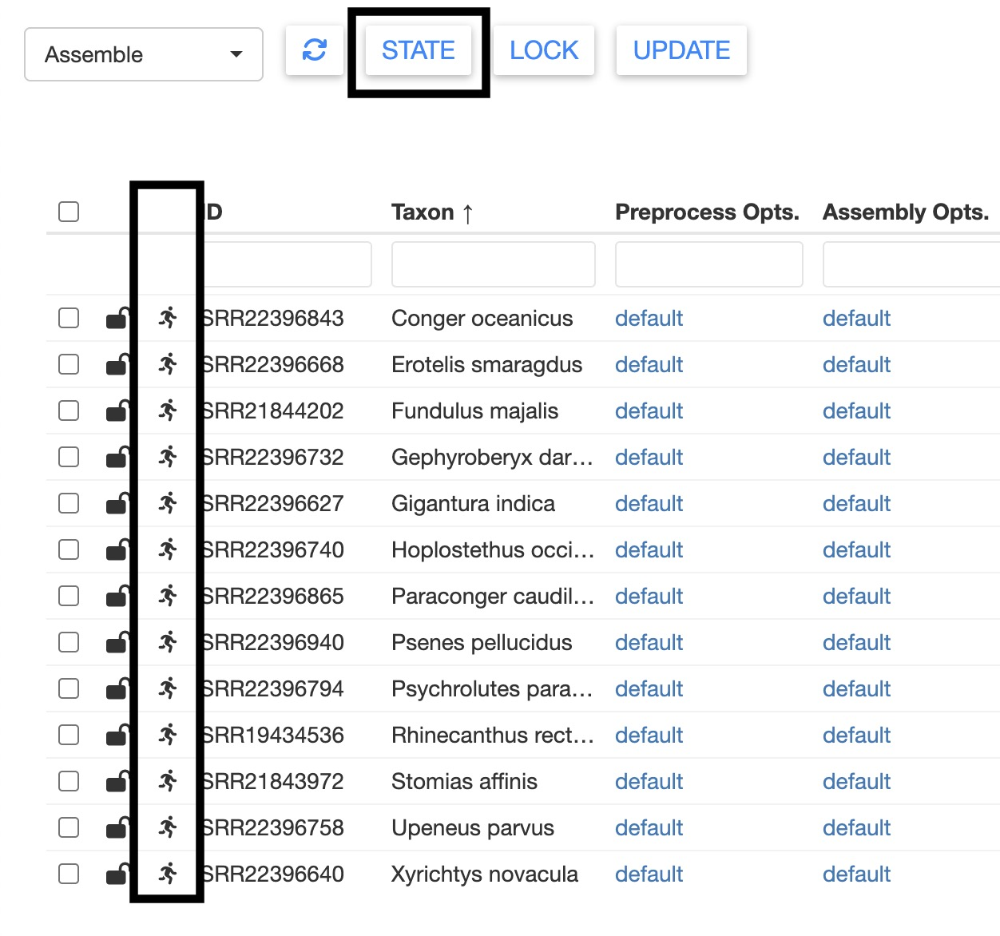
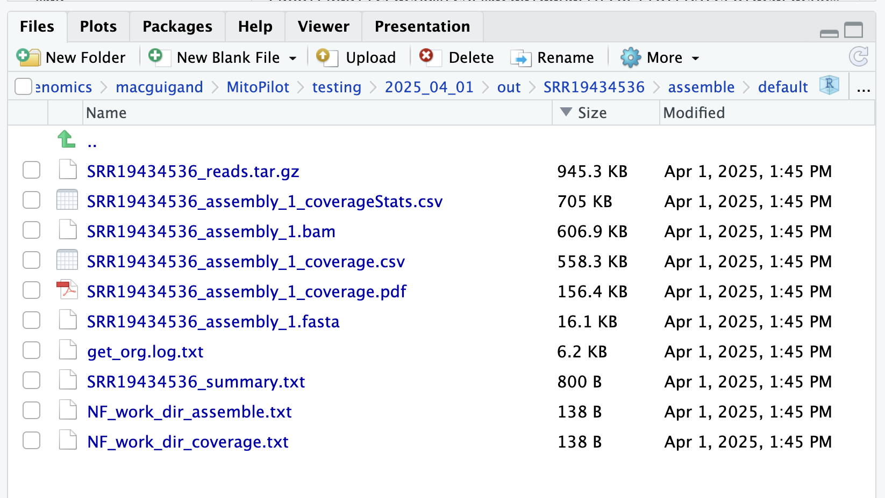
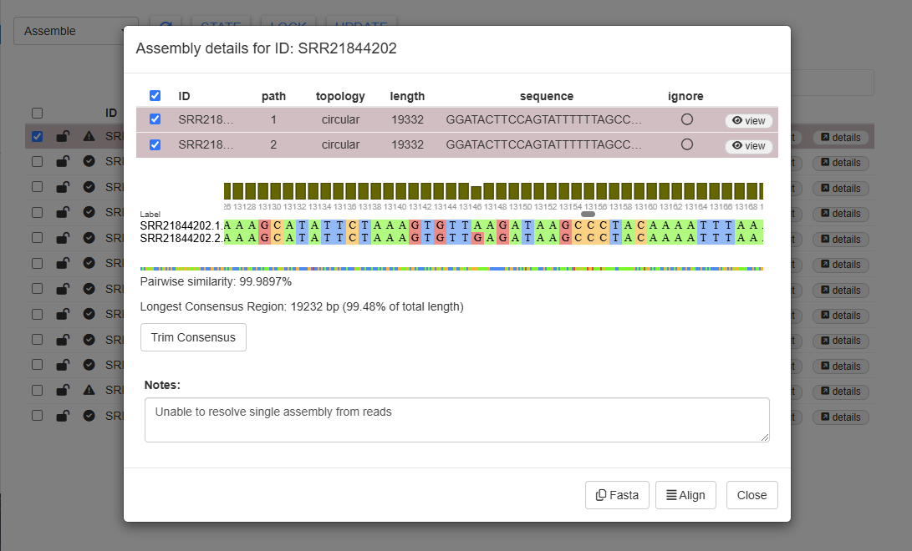
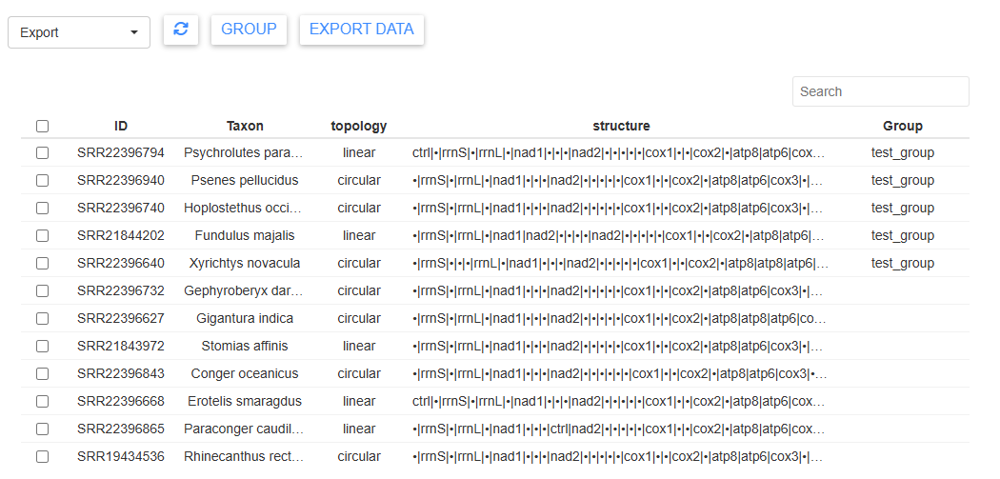
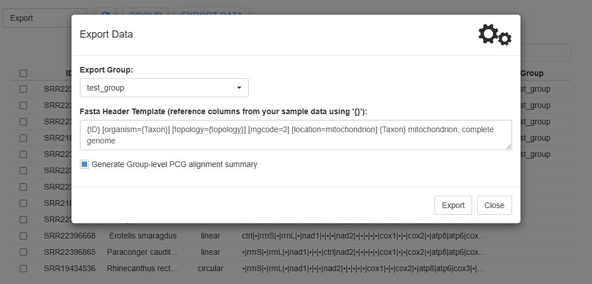

<style>
.alert {
  border-left: 5px solid;
  padding: 10px;
  margin: 10px 0;
  border-radius: 5px;
}
.alert-tip { border-color: #28A745; background-color: #E9F7EF; }
.alert-note { border-color: #007BFF; background-color: #EBF5FF; }
.alert-warning { border-color: #FFC107; background-color: #FFF9E6; }
.alert-danger { border-color: #DC3545; background-color: #F8D7DA; }
strong { font-weight: bold; }
</style>

## Installation

We recommend running the included test project (Illumina data for 13 fish species) before trying out MitoPilot with your own samples. The following tutorial provides a step-by-step walkthrough.

First, make sure you have [R
(\>=4.0.0)](https://www.r-project.org/) and
[Nextflow](https://www.nextflow.io/docs/latest/install.html) installed. This tutorial also assumes that you are using [RStudio](https://posit.co/download/rstudio-desktop/) to interface with R. If you're working on a computing cluster, we recommend checking out [RStudio Server](https://posit.co/products/open-source/rstudio-server/).

We have provided detailed installation and usage instructions for the [Smithsonian Hydra](https://Smithsonian.github.io/MitoPilot/articles/NMNH-Hydra.html) and [NOAA SEDNA](https://Smithsonian.github.io/MitoPilot/articles/NOAA-SEDNA.html) computing clusters.

Next you'll need to install the `{MitoPilot}` R package from GitHub. Within RStudio, run the following.

```{r eval=F}
if (!requireNamespace("BiocManager", quietly = TRUE)) {
    install.packages("BiocManager")
}
if (!requireNamespace("remotes", quietly = TRUE)) {
    install.packages("remotes")
}
BiocManager::install("Smithsonian/MitoPilot")
```
## Project Initialization

Now we can initialize the test project. For your own data, you would use the function `MitoPilot::new_project`. However, for the test data, we'll use `MitoPilot::new_test_project`.

```{r eval=F}
# load the package
library(MitoPilot)

# specify the directory where your test project will be created
# if the directory does not exist, MitoPilot will create it
wd = "/pool/public/genomics/macguigand/MitoPilot/testing/2025_04_01"

# specify an execution environment, "local", "NMNH_Hydra", or "NOAA_SEDNA"
ex = "NMNH_Hydra"

# initialize the test project
MitoPilot::new_test_project(
    path = wd,
    executor = ex,
    container = "macguigand/mitopilot",
    full_size = FALSE,
    Rproj = FALSE
)
```

<div class="alert alert-note">
  <strong>Note:</strong>If you are using an execution environment that is not currently supported, you could use `config = config.MyEnv` to pass a custom Nextflow config to the `MitoPilot::new_test_project` function. <strong>THIS FEATURE IS CURRENTLY UNDER DEVELOPMENT.</strong>
</div>

If the test project was successfully initialized, you should see the following.

```
Creating project directory: /pool/public/genomics/macguigand/MitoPilot/testing/2025_04_01
SRR22396794 - Psychrolutes paradoxus
SRR22396940 - Psenes pellucidus
SRR22396740 - Hoplostethus occidentalis
SRR21844202 - Fundulus majalis
SRR22396640 - Xyrichtys novacula
SRR22396732 - Gephyroberyx darwinii
SRR22396627 - Gigantura indica
SRR21843972 - Stomias affinis
SRR22396843 - Conger oceanicus
SRR22396668 - Erotelis smaragdus
SRR22396758 - Upeneus parvus
SRR22396865 - Paraconger caudilimbatus
Project initialized successfully.
Please open and review the .config file to ensure all required options are specified.
```

## Exploring the MitoPilot GUI

We can now launch the R Shiny Graphical User Interface (GUI) to examine our test project and start the MitoPilot analysis pipeline.

```{r eval=F}
# the function to launch the GUI must be called from within your project's directory
setwd(wd)
MitoPilot::MitoPilot()
```


Nice! We can see some basic information about our samples. When initializing your own project, this is pulled from the mapping CSV file.

The dropdown menu at the top left switches between the different MitoPilot modules: Assemble, Annotate, and Export. If necessary, the circular arrow button in the top left will refresh the sample table.


Clicking on a column name will sort the table by that column. 


You can filter samples using the search box in the top right. Most columns can also be filtered using the text boxes at the top of the table.


To the left of the sample ID column are two icons. The first icon shows whether the sample is locked or unlocked. If a sample is unlocked, it will be included when running the current pipeline module. A locked sample cannot be edited for the current module, but will be made available for the next pipeline module. You can toggle the lock by selecting the sample (check mark), then pressing `LOCK` at the top of the window. Multiple samples can be locked or unlocked simultaneously.


The other icon shows the state of the sample. These states vary depending on the analysis module and will be automatically updated when running the pipeline. However, you can also manually change the state of a sample using the `STATE` button. For example, in the Assemble module you could prevent samples from running through the pipeline by manually setting their states to `Hold / Waiting`.




## Modifying Pipeline Parameters

Within the GUI, we can modify options for each step of the current pipeline module. Click on one of the `default` links in the `Preprocess Opts` column.


Here you can see the default options for pre-processing your raw FASTQ files. We can modify these by clicking the `edit` checkbox. Let's change the memory to 20 GB. You could also change the options passed to [fastp](https://github.com/OpenGene/fastp), but we'll keep those at the defaults for now.


We can save these new parameter options by clicking on the `Parameter set name` box, typing a new name, and clicking  `Add YOUR NEW NAME...` in the dropdown. Finally, click `Update` in the bottom right to save your selection.


Once you've saved a new parameter set, you can easily access it again using the dropdown menu.


After clicking `Update`, your table should now show `test` for all samples in the `Preprocess Opts` column.


You can set different parameters for different samples by simply selecting the set you want to change and repeating the above process. But for this test dataset, let's keep everything consistent.

Let's also change the `Assembly Opts`. Repeat the process above, and creating a new `himem` setting with 6 CPUs and 36 GB of memory.


In the `Assembly Opts` window, you can also modify the parameters for GetOrganalle, including the seeds and labels databases. The default fish reference databases are downloaded from the MitoPilot GitHub repository. You could use [custom databases](https://smithsonian.github.io/MitoPilot/articles/custom_dbs.html) by providing the full path to the appropriate FASTA files on your local computer or cluster. For this test project, we'll leave all of the GetOrganalle settings at the default values.

## Running the Assemble Module

Let's get started with the pipeline! Select all samples, then click the `UPDATE` button. A new window should appear with a Nextflow command.


You have three options for running the pipeline. First, you could copy the Nextflow command and run it in a terminal window. This requires you to maintain an open connection while Nextflow is running, which may cause issues for large, complex datasets.

Alternatively, you could embed the Nextflow command within a batch job submission script for a computing cluster. This allows you to run the analyses in the background, which is preferable for datasets with a large number of samples that may take several hours to process.

We have provided instructions for running MitoPilot Nextflow commands as batch jobs on the [Smithsonian Hydra](https://Smithsonian.github.io/MitoPilot/articles/NMNH-Hydra.html#running-large-mitopilot-jobs) and [NOAA SEDNA](https://Smithsonian.github.io/MitoPilot/articles/NOAA-SEDNA.html#running-large-mitopilot-jobs) computing clusters.

The final option is the `Start Nextflow` button, which will run the analysis pipeline within the GUI. This requires you to keep the GUI open while the pipeline is running.

<div class="alert alert-warning">
  <strong>Warning:</strong>Currently, the `Start Nextflow` button is not compatible with the NOAA SEDNA computing cluster. Please use the command line or batch job method, making sure to run `mamba activate MitoPilot_deps` prior to calling Nextflow.</strong>
</div>

Since our test dataset is small, let's run Nextflow within the GUI. Click `Start Nextflow` to launch the pipeline.


And we're off! You should see Nextflow output being printed the to `Progress` window. This window will continually update as the pipeline progresses. As long as the gears in the top right are spinning, the pipeline is still running.

The Assemble pipeline module has 3 steps: preprocessing (filtering) the raw FASTQ files with [fastp](https://github.com/OpenGene/fastp), assembling the mitogenomes using [GetOrganelle](https://github.com/Kinggerm/GetOrganelle), and calculating coverage maps for the assemblies using [bowtie2](https://github.com/BenLangmead/bowtie2).

If you're working on a computing cluster, Nextflow distributes the analyses across multiple batch jobs. This can allow you to run hundreds of samples simultaneously. You can use your cluster's job scheduler to check on the status of MitoPilot jobs. Some samples may finish faster than others.


You may notice that some samples fail at certain steps (though this is unlikely for the test dataset). Often this is due to a memory error, so MitoPilot will retry failed samples with more RAM. The Nextflow log tracks the number of failed samples and retries.


The test dataset should take a few minutes to finish. When it's done, your `Progress` window should look something like this.


If you scroll to the bottom of the progress window, you can find some runtime statistics.


Click `Close` to return to the samples table.

## Inspecting Assembly Results

The sample table should now be updated with new information about the mitogenome assemblies.


If you want to locate the results files for a sample, scroll all the way to the right and click `output`. This will open the appropriate folder in the `Files` pane of your RStudio session.



You can also view the results within the MitoPilot GUI. For example, select SRR21843972 (_Stomias affinis_), then click `details`. This will open a new window with the mitogenome sequence.


Select the sequence and click the `Fasta` button in the bottom right. This will copy the FASTA formatted mitogenome to your clipboard, which you can paste into your favorite text editor. This could be useful for a quick BLAST search.



You can also click the `view` button, which will open a summary figure in a new tab, including mean read depth, sequence error rate, and GC content.


Notice that in this figure, read depth drops off dramatically at both ends of the sequence. SRR21843972 was unable to assemble a circular mitogenome due to poor read coverage in this region. To assemble a circular mitogenome, you could try running the Assemble module again with different `GetOrganelle` settings (see their [Wiki](https://github.com/Kinggerm/GetOrganelle/wiki/FAQ)) or more sequence data.

## Problematic Samples

In this test dataset, there are two problematic samples which returned failed states. You can see which samples failed by looking for the exclamation mark state icon. Selecting a sample with that icon and clicking on the `STATE` button will confirm.


One failed sample is SRR22396758 (_Upeneus parvus_). We purposefully truncated the data for this sample to contain only 200 reads. 

With so few reads, this sample failed to meet the `min_depth` threshold and returned a message "Insufficient sequencing depth" in the `Notes` column. When analyzing your own data, you can specify the `min_depth` threshold with the `new_project` function.

The other failed sample is SRR21844202
(_Fundulus majalis_). This sample had plenty of data and we were able to assemble a mitogenome. However, the message in the `Notes` columns says "Unable to resolve single assembly from reads."

[GetOrganelle](https://github.com/Kinggerm/GetOrganelle) produced two alternate assembly paths for this sample. This is usually due to complicated assembly graphs near a repeat region. Please refer to [the GetOrganlle paper](https://doi.org/10.1186/s13059-020-02154-5) for more information about multiple assembly paths.

Let's take a peek at SRR21844202 (_Fundulus majalis_). Select the sample, scroll all the way to the right, and click on `details`.


We can see two assemblies listed here. Clicking on `view` will show us the coverage, error, and GC content graphs for each assembly.

Path #1


Path #2


The two assembly paths differ slightly around 13,000 bp.

We can chose to move forward with just one assembly path by clicking the "ignore" button for one of the assembly paths.
 
Alternatively, we can use the consensus sequence. Select both paths and click the `Align` button in the bottom right. The sequence alignment will pop up, showing us that the two paths have 99.9897% sequence similarity.

If we scroll through the alignment, we can see a few base pair differences.


Selecting `Trim Consensus` will remove any conflicting regions of the aligned assembly paths and produce a shorter consensus sequence of both alignments. Doing so will automatically ignore the original two assembly paths.


Click close and return to the samples table. You will see that the `# Paths` column for SRR21844202 is highlighted and there is a note indicating that the assembly was edited. This sample has also been automatically changed to a locked state.


<div class="alert alert-warning">
  <strong>Warning:</strong> Carefully consider your options for samples with multiple assembly paths. You may wish to align each assembly against a reference or compare depth of sequencing coverage. There is no one-size-fits-all solution.
</div>

## Running the Annotate Module
We can now move on to the Annotate pipeline module. This module consists of an annotation step using [Mitos2](https://gitlab.com/Bernt/MITOS) and [tRNAscan-SE](https://github.com/UCSC-LoweLab/tRNAscan-SE), a taxon-specific curation step to refine the annotation models, and a validation step to flag possible issues or known errors that would be rejected by NCBI GenBank.

First, we need to lock all of the successful samples in the Assemble module. Select all of the samples except SRR22396758 (_Upeneus parvus_) and click the `LOCK` button. Then use the dropdown menu in the top left to navigate to the Annotate module.


Like before, let's edit the `Annotate Opts` and increase the memory allocation to 60 GB. In this window, you could also edit the Mitos2 and tRNAscan-SE options. In the future, we will allow users to specify custom reference databases for annotation.


You can also edit the curation options. Currently, we only have one set of curation parameters: `fish_mito`. This will be updated in the near future.


To run the Annotate module, select all samples, click `UPDATE`, then click `Start Nextflow`. This will take a few minutes. As long as the gears in the top right are spinning, the pipeline is still running.


Once all steps are complete, the gears will stop spinning and you'll see a summary message printed at the bottom of the `Progress` window. Click `Close` to return to the sample table.

## Exploring Annotation Results
There are a LOT of results to explore from the Annotate module. The sample table reports some basic stats about the number of protein-coding genes (PCGs), tRNAs, and rRNAs. The `missing` column reports which mitochondrial genes were not annotated (based on the provided curation model). The `extra` column notes the number of potentially duplicated genes.

Lastly, the `warnings` column indicates how many warning flags were raised during the validation step. Samples with many warnings will require more manual curation to ensure that they are not rejected during submission to NCBI GenBank. Warning messages are explained in further detail [here](https://smithsonian.github.io/MitoPilot/articles/Fish-Mitogenome-Curation.html).


The annotation results for each sample can be examined more closely by clicking the `details` button. First, let's examine the details for a good sample, SRR19434536 (_Rhinecanthus rectangulus_).


This sample has the expected number of genes and has no warnings. However, the `notes` column shows that MitoPilot still made some tweaks to the annotation during the curation step. For example, the start position of rRNA rrnL was moved 22 bp upstream and the stop codon for NAD2 was trimmed by 2 bp.

Nucleotide sequences (and amino acid sequence for PCGs) can be copied to the clipboard using the `nt` (and `aa`) buttons on the far right. This could be helpful if you'd like to manually BLAST some genes.

Clicking on the `Coverage Map` button will show a plot of sequence depth, zooming to the position of the highlighted gene.



<div class="alert alert-note">
  <strong>Note:</strong> The `Coverage Map` feature does not work consistenly on the NMNH Hydra cluster. We are working on a fix.
</div>

For protein coding genes, you can click the `Alignment` button to show the protein alignment of your annotated gene against a reference database. Currently, this shows only the top hits (filtered in blast using `-best_hit_score_edge 0.01`) from the curation process, which may be one or more sequences.



By default, MitoPilot uses RefSeq as the BLAST database. If you would like to use your own custom BLAST database, you can check the `Local blast` box. MitoPilot will return a message with the instructions: run `options('MitoPilot.local.db' = '/path/to/local/blastp/db')` within your RStudio session. You will need to restart the MitoPilot GUI for this change to take effect.

## Editing Annotation Results
MitoPilot offers some basic functions to manually edit your annotation results. Let's open the alignment for the SRR19434536 (_Rhinecanthus rectangulus_) "cox1" gene. Clicking the `EDIT` button brings up a few options to change the start and stop position annotation.

Try clicking the `+` button next to `START`. It will take a few seconds, since MitoPilot has to redo the alignments. But you should see that the "cox1 (focal)" sequence start position has shifted.


This is clearly a worse alignment. Click `RESET` to undo your changes.

You can also delete annotations by selecting them and clicking `Delete` at the bottom of the details window. Delete with caution; there's no easy way to add the annotation back without [running the sample through the Annotate module again](https://smithsonian.github.io/MitoPilot/articles/FAQ.html#how-do-i-restore-annotatations-after-manual-editing).

The `Linearize` button will convert a circular assembly to a linear assembly. This may be useful if the D-loop region was poorly assmebled or annotated.

You can use `Mark as reviewed/unreviewed` to change the state of the `Reviewed` column, which may be helpful for tracking the progress of your manual edits.

Please note that annotation editing is a bit temperamental and you may encounter bugs. Please report any problems on the [MitoPilot GitHub issues page](https://github.com/Smithsonian/MitoPilot/issues).

## Running the Export Module
Let's move to the final step of the pipeline: the Export module. This module allows you to create groups of samples, then generate alignments and files formatted for submission to GenBank.

First, we need to lock the successful samples in the Annotate module. Select all of the samples and click the `LOCK` button. Then use the dropdown menu in the top left to navigate to the Export module.

Next, let's create a group of samples. Sort the samples table by clicking on the `Taxon` column, then select the first five samples and click the `GROUP` button.

A new window will appear showing some summary information for the selected samples. Type a name for the group, click `Add..`, then click `Create`. You can then click `Close` to return to the sample table.


The sample table now shows the group assignment in the `Group` column.


<div class="alert alert-note">
  <strong>Note:</strong> You can assign new samples to an existing group. Simply select the samples you wish to add, click `GROUP`, then choose the existing group from the dropdown menu.
</div>

<div class="alert alert-note">
  <strong>Note:</strong> Each sample can only belong to one group. MitoPilot will produce a warning message if you attempt to re-assign a sample to a new group.
</div>

We can proceed to exporting the data for this group. Click `EXPORT DATA`, which will open a new window. Only samples that have been added to a group can be exported in this manner.


If you have multiple groups, you can select the appropriate one from the dropdown menu.

MitoPilot allows you to create a custom FASTA header for your samples, pulling data from  columns the CSV file you supplied for the `mapping_fn` argument of the `MitoPilot::new_project` function. This conveniently allows you to include metadata needed for your NCBI GenBank submission. To reference a column, use curly brackets. For example `organism={Taxon}` will autofill values in the "Taxon" column into the FASTA header.

For this test project, we can leave the `Fasta Header Template` at the default value.

The `Generate Group-level PCG alignment summary` will run alignments of all the protein coding genes in your group. For large groups, this can take a while. But it's useful for a final quality control check.

Let's toggle the `Export individual genes` button. This will generate additional FASTA files and GenBank feature tables for each protein coding gene. This can be helpful if you want to use individual genes for phylogenetic analyses or submit them to GenBank. These gene FASTA files have their own custom header template that you can modify.

Click `Export` to generate the final files. It may take a couple of minutes, but as long as the gears are spinning, MitoPilot is still running. 

Once complete, MitoPilot will print the location of the exported files. By default, that location is `YOUR_PROJECT_DIRECTORY/out/export/YOUR_GROUP_NAME`.


## Exploring the Final Results

MitoPilot will produce three output files. First, the `.html` file contains visualizations of each protein coding gene alignment in your export group. This may be useful to quickly identify samples with poor annotations that need additional manual curation.


For example, the ATP8 annotation for "SRR22396640" clearly stands out when compared with the other samples in this export group.


Next are the two files you will need for submission to NCBI GenBank. The `.fasta` file contains the mitogenome assemblies for each sample, following the header template you specified when exporting the data. MitoPilot attempts to adjust the start position of every assembly to the start of the trnF gene.


Additionally there is the `.tbl` file, a [standardized 5-column, tab-delimited feature table](https://www.ncbi.nlm.nih.gov/genbank/feature_table/) containing information about the annotated genes for each mitogenome.


With a real dataset, you could use these two files for [submission to NCBI GenBank](https://www.ncbi.nlm.nih.gov/genbank/organelle_submit/).

The export directory also contains a sub-directory `GFFs` with annotations for each sample in [GFF3 format](https://gmod.org/wiki/GFF3). GFF files can be loaded by tools like [Geneious](https://www.geneious.com/) for additional manual inspection prior to submission.


Lastly, if you selected the `Export individual genes` option, there will be another directory `genes` containing sub-directories for every protein coding gene. In these you will find FASTA files and feature tables for the corresponding gene. There will also be a concatenated FASTA file and feature table containing all protein coding genes, named `GROUP_PCGs.fasta/tbl`.  


## Wrap-up

Congratulations, you've reached the end of the test project tutorial! Hopefully you now have a solid understanding of the MitoPilot interface and can begin to analyze and explore your own mitogenome datasets.
