<style>
.alert {
  border-left: 5px solid;
  padding: 10px;
  margin: 10px 0;
  border-radius: 5px;
}
.alert-tip { border-color: #28A745; background-color: #E9F7EF; }
.alert-note { border-color: #007BFF; background-color: #EBF5FF; }
.alert-warning { border-color: #FFC107; background-color: #FFF9E6; }
.alert-danger { border-color: #DC3545; background-color: #F8D7DA; }
/* Smithsonian palette: blue #009CDE, yellow #FFCD00, black #101820 */
.alert-hydra {
  border-color: #101820;
  background-color: #E7F6FC;
  color: #101820;
}
.alert-hydra .hydra-tag {
  display: inline-block;
  background-color: #FFCD00;
  color: #101820;
  font-size: 0.75em;
  font-weight: bold;
  letter-spacing: 0.04em;
  padding: 1px 7px;
  border-radius: 10px;
  margin-right: 6px;
  vertical-align: 2px;
}
strong { font-weight: bold; }
img { max-width: 100%; border: 1px solid #ddd; border-radius: 4px; }
.figure { margin: 1.2em 0; }
.figure .caption, p.caption {
  font-size: 0.82em;
  line-height: 1.35;
  color: #6c757d;
  font-style: italic;
  margin-top: 0.4em;
}
.part-break {
  border: none;
  border-top: 4px solid #101820;
  margin: 5.5em 0 3.4em;
}
</style>

MitoPilot takes you from raw Illumina paired-end reads to polished mitogenome records ready
for submission to NCBI GenBank. The heavy lifting is a
[Nextflow](https://www.nextflow.io/) pipeline; you drive it from an R Shiny app
that shows you every sample, assembly, and annotation. MitoPilot automatically
curates annotations based on clade-specific rulesets and also allows you
to manually adjust annotations when needed.

This page walks the whole pipeline using the built-in test project, then shows you
how to start a project with your own data.

<div class="alert alert-hydra">
<span class="hydra-tag">HYDRA</span>
<strong>Are you a Smithsonian user?</strong>
Boxes like this one flag the
places where usage on the Smithsonian Hydra computing cluster differs from a generic setup. 
Before starting this tutorial, work
through the
<a href="NMNH-Hydra.html#get-an-r-session-on-hydra">Get an R session</a> and
<a href="NMNH-Hydra.html#install-nextflow">Install Nextflow</a> sections. Smithsonian users
can also check out the [2025 workshop website](https://smithsonianworkshops.github.io/MitoPilot_workshop_2025/)
</div>

<hr class="part-break" />

# What you need

| Requirement | Notes |
|---|---|
| [R](https://www.r-project.org/) >= 4.4.0 | RStudio is recommended but not required |
| [Nextflow](https://www.nextflow.io/docs/latest/install.html) 24.10.x - 25.10.x | Needs Java 17 or newer |
| [Docker](https://docs.docker.com/engine/install/) or [Singularity](https://docs.sylabs.io/guides/latest/user-guide/quick_start.html) | Containerized execution is handled by Nextflow |
| Disk space | About 15 GB for the container image, plus room for your data |
| Internet access | Reference annotations and taxonomy are fetched from NCBI |

<div class="alert alert-note">
<strong>Note.</strong> MitoPilot checks your Nextflow version when the package
loads and when you create or open a project. If the version is too old the
package refuses to load; if it is too new, MitoPilot quietly pins
<code>NXF_VER</code> to a version that works.
</div>

<hr class="part-break" />

# Install

Everything in this tutorial happens in **R**, preferably from RStudio. The only
steps that need a **terminal** are installing Nextflow and, on a cluster,
checking on submitted jobs; those are called out where they come up.

Open R and run the following.

```r
if (!requireNamespace("BiocManager", quietly = TRUE)) {
  install.packages("BiocManager")
}
BiocManager::install("Smithsonian/MitoPilot", ask = FALSE)
```

The first install pulls a long list of dependencies and takes a while. Warnings
about system library paths that are not writeable are usually harmless.

To update later:

```r
remove.packages("MitoPilot")
BiocManager::install("Smithsonian/MitoPilot")
.rs.restartR()   # or restart R yourself
```

<div class="alert alert-tip">
<strong>Tip.</strong> Each MitoPilot version pairs with a matching container
image. If needed, you can clear your container cache
(<code>docker image prune</code> or <code>singularity cache clean</code>) to ensure a
new image is pulled. Careful, this will clear all cached images, not just MitoPilot.
</div>

Load the package:

```r
library(MitoPilot)
```

You should see a welcome message naming the Nextflow version MitoPilot will use.
If Nextflow cannot be found, make sure it is on your `PATH` in the same R session
(`Sys.which("nextflow")`). See [HPC cluster support](Custom-HPC.html) if you
are working on a cluster.

<div class="alert alert-hydra">
<span class="hydra-tag">HYDRA</span>
<strong>Run <code>hydra_setup()</code> once per session.</strong> RStudio Server
sessions on Hydra start with a stripped <code>PATH</code> that leaves out the
job scheduler engine, Java, and your <code>~/bin</code>, so Nextflow cannot find
<code>qsub</code> and job submission fails. Before creating a project or opening the app,
you must call the following function:

<pre><code class="r">library(MitoPilot)
hydra_setup()
</code></pre>

It puts the Hydra Java and job scheduler directories at the front of your
<code>PATH</code> and pins a compatible Nextflow version for the session. It has
no effect anywhere else, and warns if you are not on Hydra.
</div>

<hr class="part-break" />

# Run the test project

MitoPilot ships with a small test dataset: 15 samples of pre-filtered Illumina
reads, mostly marine fishes. It is deliberately messy. Some samples assemble
cleanly, one has far too little data, one produces two competing assemblies, and
two produce fragmented assemblies. This allows you to see more complex situations that need
user judgment.

```r
library(MitoPilot)

# Anywhere you have space. MitoPilot creates the directory if needed.
wd <- "~/MitoPilot_test/run_01"

new_test_project(
  path = wd,
  executor = "local",
  full_size = FALSE,
  Rproj = FALSE
)
```

`executor = "local"` runs everything on the machine you are sitting at and uses
Docker. To run on a cluster instead, see
[HPC cluster support](Custom-HPC.html) and pass the matching executor name.
`full_size = FALSE` uses the small pre-filtered reads that ship with the package;
`TRUE` downloads about 10 GB of raw data, which takes much longer to process.

MitoPilot lists the samples as it sets them up, then writes a hidden `.config`
file holding the Nextflow settings for the project directory. The defaults are fine for the
test project.

<div class="alert alert-hydra">
<span class="hydra-tag">HYDRA</span>
<strong>Use the Hydra executor, and pick the right disk.</strong> Pass
<code>executor = "NMNH_Hydra"</code> so work is dispatched to compute nodes
instead of running on the login or RStudio node. Put projects under
<code>/pool</code> or <code>/scratch</code>. Home directories are far too small
for Nextflow work directories, and projects cannot be run from
<code>/store</code>.
</div>

<hr class="part-break" />

# Open the app

Once your project is initialized, run the following in your R session:

```r
wd <- "~/MitoPilot_test/run_01"
setwd(wd)     # the app must be launched from the project directory
MitoPilot()
```

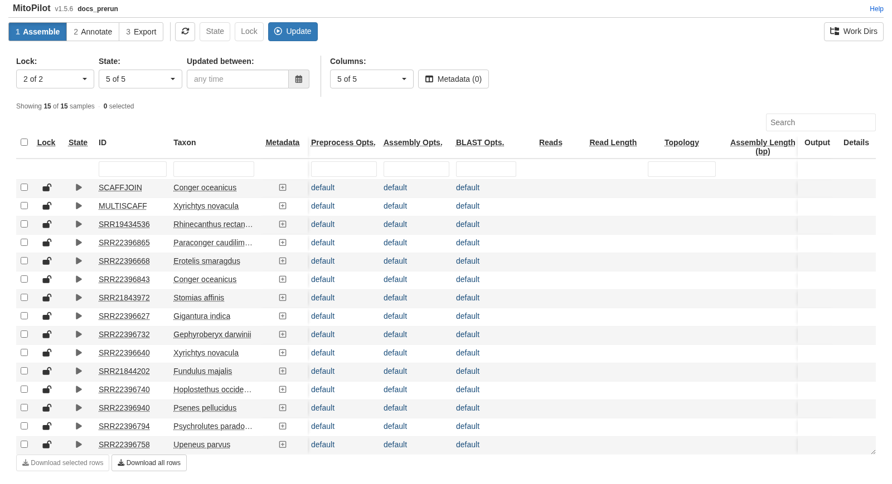

This is a fresh project, so the result columns are still empty: the sample
metadata comes from your mapping file, and everything else fills in as the
pipeline runs.

Each row is a sample. The dropdown at the top left switches between the three
pipeline modules, **Assemble**, **Annotate**, and **Export**, which you work
through in that order. The circular arrow refreshes the table.

Two icons sit to the left of each sample ID:

- **The lock.** Unlocked samples are available for the next pipeline run to process.
  Locking a sample freezes it in the current module and makes it available for the next
  module. Select samples and use the `LOCK` button to toggle.
- **The state.** Status of the sample in the current module. The pipeline sets
  these automatically, but you can override them with the `STATE` button. This
  is how you can park samples you do not want to process yet or reset samples that 
  have already completed the pipeline.

Clicking a column header sorts alphanumerically. The search box at the top right filters
everything, and most columns have their own filter box.

<hr class="part-break" />

# Assemble

The Assemble module cleans the reads, builds mitogenome assemblies, maps the
reads to the assembly to calculate coverage, and BLASTs each assembly against a
database of metazoan mitogenomes to find its closest published relative.

## Set the options

Every processing step has an options set, shown as a link in the sample table.
Click the `default` link in the **Preprocess Opts.** column to see how the reads
will be cleaned.

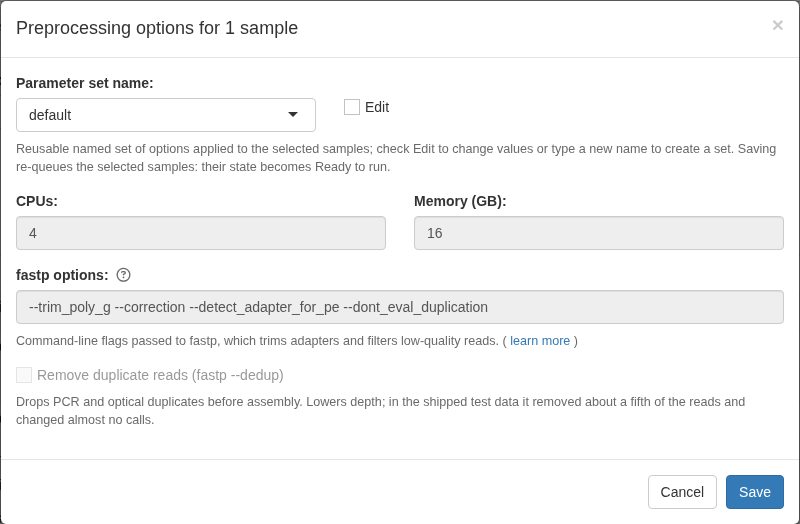

The **Assembly Opts.** column works the same way, and controls the assembler.

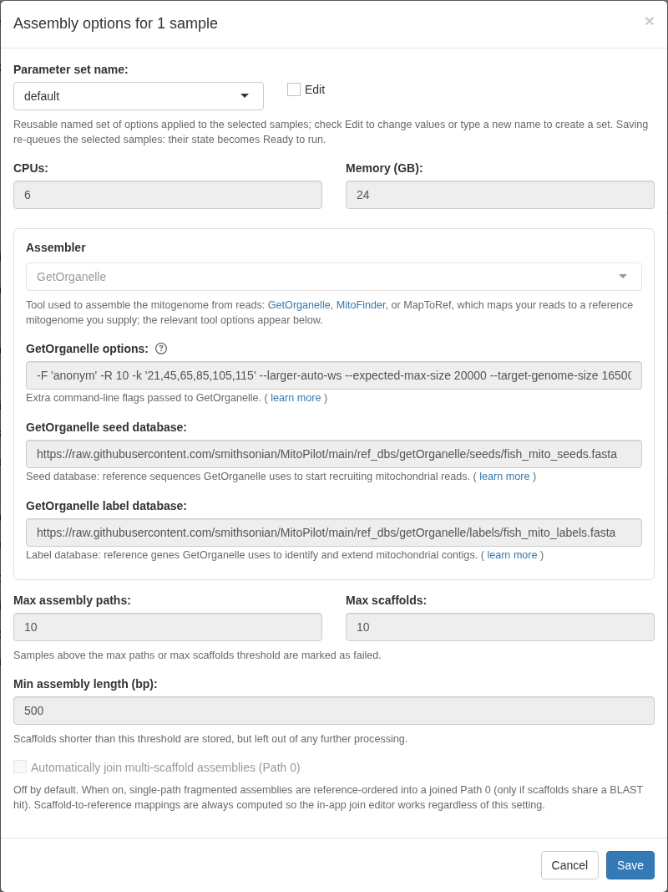

Nothing is editable until you tick **Edit**. The important controls:

- **CPUs and Memory** per sample. Raise memory if samples fail with out-of-memory
  errors.
- **Assembler.** [GetOrganelle](https://github.com/Kinggerm/GetOrganelle) by
  default, or [MitoFinder](https://github.com/RemiAllio/MitoFinder). GetOrganelle
  only assembles reads it recognizes as mitochondrial, which makes it fast but
  dependent on good reference databases. MitoFinder assembles everything, which
  is much slower but can work better for groups with few reference mitogenomes.
- **Seeds and Labels databases.** The reference sequences GetOrganelle uses to
  recruit and extend mitochondrial reads. The defaults are fish; for other
  groups, build your own with `custom_assembly_db()` (see
  [custom databases](custom_dbs.html)).
- **MitoFinder reference database.** Only used when the assembler is MitoFinder.
  A GenBank-format (`.gb`) file of one or more reference mitogenomes that
  MitoFinder uses to identify mitochondrial contigs. The default is the zebrafish
  mitogenome (NC_002333.2), so for anything other than a fish, supply a reference
  from your own group. `custom_assembly_db()` can build this file too.
- **Max assembly paths / Max scaffolds.** Samples are marked failed instead 
  of continuing in the pipeline if they exceed these thresholds.
- **Automatically join multi-scaffold assemblies.** Off by default, and worth
  leaving off until you understand your data. See
  [multiple paths and scaffolds](Multiple-Assemblies.html).

Options are saved as named, reusable sets. To make one, tick **Edit**, change
what you want, type a new name in the **Parameter set name** box, and click
**Update**. That name now appears in the dropdown for any sample. Different
samples can use different parameter sets, which can allow you to selectively tweak 
memory usage, assembly method, etc. for difficult samples.

For the test project the defaults are fine.

<div class="alert alert-hydra">
<span class="hydra-tag">HYDRA</span>
<strong>Raise the memory defaults before running.</strong> The package defaults
are tuned for a laptop and are too low for Hydra's queues. For the test project,
edit the options sets and use:

<ul>
<li><strong>Preprocess Opts.</strong> memory <strong>40 GB</strong></li>
<li><strong>Assembly Opts.</strong> memory <strong>80 GB</strong></li>
</ul>

Tick <strong>Edit</strong>, change the memory, give the set a name such as
<code>hydra</code>, and click <strong>Update</strong> so it applies to every
selected sample.
</div>

<div class="alert alert-hydra">
<span class="hydra-tag">HYDRA</span>
<strong>CPUs and memory are per-job request.</strong> On Hydra these values
become the job scheduler's resource request. The Hydra
config flags high-memory steps automatically when a request crosses the
per-CPU threshold. See the [Hydra wiki](https://confluence.si.edu/spaces/HPC/pages/163152285/Compute+Nodes)
for details about the available compute nodes.
</div>

## Run the workflow

Click **UPDATE** at the top of the window. MitoPilot shows the Nextflow command
it is about to run and how many samples it applies to.

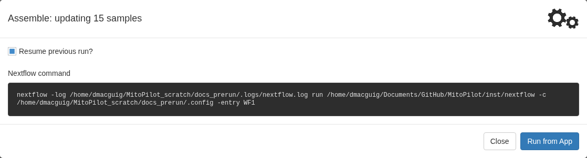

**Run from App** runs the pipeline in your R session (distributing individual tasks to compute nodes if you are working on a HPC cluster). 
The Progress window updates as samples move through the steps, and the spinning gears in the corner
mean work is still happening. This is the simplest option, and the right one for
a project this size.

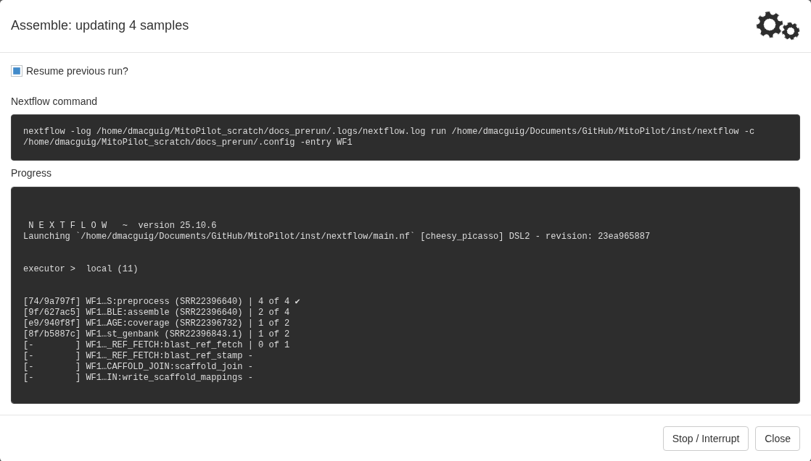

Each line is a pipeline step, with a count of how many samples have finished it.
**Stop / Interrupt** halts the run; you can resume it later without redoing
completed work.

<div class="alert alert-warning">
<strong>Warning.</strong> Running from the app ties the pipeline to the app
session. Closing the MitoPilot app will kill the pipeline.
For large projects, or anything on a cluster, save or submit a job
script instead so the run survives a dropped connection. See
<a href="Custom-HPC.html">HPC cluster support</a>.
</div>

<div class="alert alert-hydra">
<span class="hydra-tag">HYDRA</span>
<strong>Submit as Job.</strong> MitoPilot detects Hydra and adds a
<strong>Submit as Job</strong> button next to <strong>Run from App</strong>. It
submits the workflow to the cluster for you, so the run keeps going after you
close the app or lose your connection. Monitor it by running
<code>qstat</code> in a terminal (the Terminal tab in RStudio Server works) and reading the
log files in the project's <code>.logs</code> directory. Reopen the app when
the job finishes. For anything beyond a dozen samples, use <strong>Submit as Job</strong> rather than
running from the app.
</div>

Assemble runs three steps per sample: read pre-processing with
[fastp](https://github.com/OpenGene/fastp), assembly with GetOrganelle or MitoFinder, and
read mapping with [bowtie2](https://github.com/BenLangmead/bowtie2) to compute
depth and error rates. It then BLASTs each assembly to find its closest published
relative, and fetches that reference's annotations from NCBI.
Nextflow runs all samples in parallel through these steps.

Failures are normal and often mean a sample ran out of memory.
Common error messages are covered in the [troubleshooting](Troubleshooting.html) articles.

### Finding the reference: local vs remote BLAST

The reference search runs against a **local database of metazoan mitogenomes
bundled with the MitoPilot Docker/Singularity container**. This is
the default, and for most projects it is all you need.

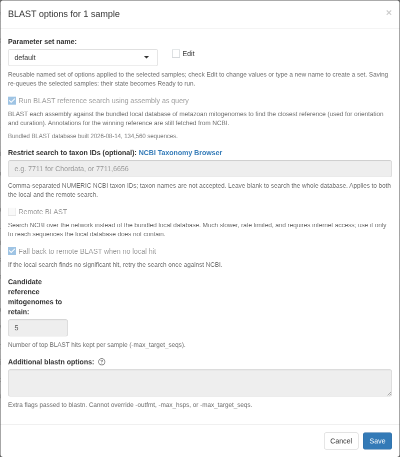

The **BLAST Opts.** window reports the build date and size of the bundled
database, recorded the first time a local search runs in a project. Two settings
change the behavior:

- **Remote BLAST** searches NCBI over the network instead of the local database.
  It is much slower (sometimes hours per search) and rate limited. Only worth using to reach
  sequences not contained in the BLAST database included with the MitoPilot container.
- **Fall back to remote BLAST when no local hit** is on by default. If the local
  search comes up empty, MitoPilot retries that sample once against NCBI.

You can restrict either search to particular **NCBI taxon IDs** (numeric IDs, not
names). The **Entrez query** box applies to remote searches only.

<div class="alert alert-note">
<strong>Note.</strong> Local BLAST does not remove the need for an NCBI API key.
Only the <em>search</em> is local. Once a reference is chosen, MitoPilot still
goes to NCBI for that record's sequence, annotations, and taxonomic
lineage, all of which feed into curation and export. For projects with more than a handful of
samples, set <code>ncbi_api_key</code> at project setup so those requests are not
throttled.
</div>

## Read the results

When the run finishes, the sample table should automatically fill in. If not
try clicking the circular arrow refresh button.

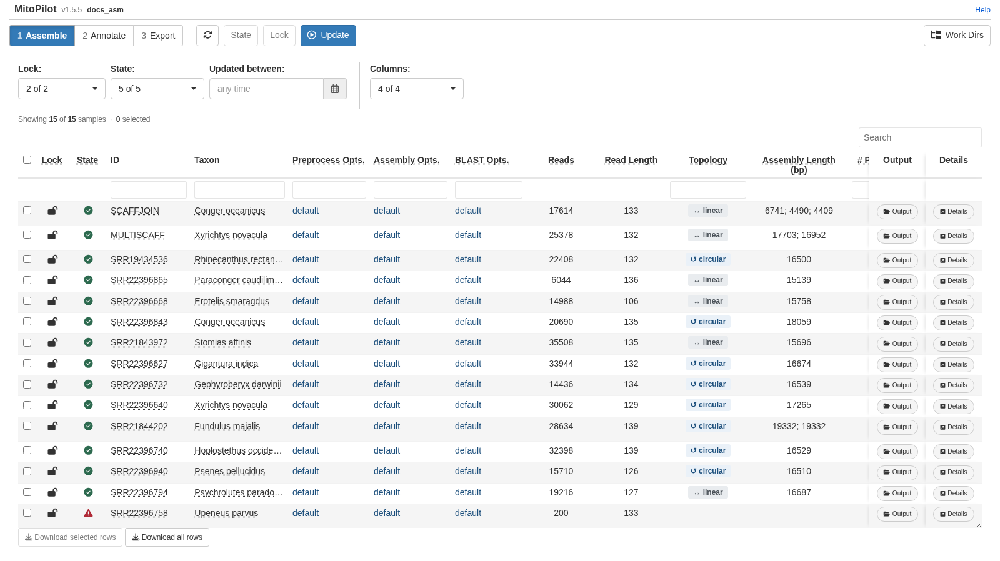

Useful columns: **Reads** surviving pre-processing, **Topology** (circular or
linear), **Asmb. Length**, and **# Paths** / **# Scaffolds**, which tell you
whether the sample came back as one clean sequence or something messier. The
BLAST columns name the closest GenBank record. The `output` button opens the sample's 
results folder. 

The `details` button opens a new window for the assembly.

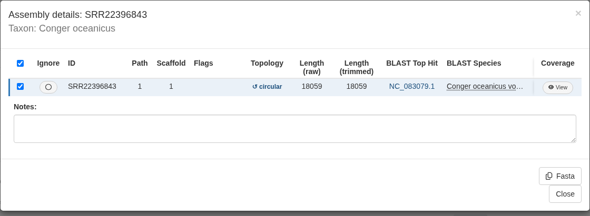

For a sample that assembled cleanly there is one row here. Samples that produced more than one
assembly get more rows and more tools, covered below.

Select the row and use the `Fasta`
button to copy the sequence to your clipboard. 

### Coverage and error

In this assembly details window, `view` opens a plot of read depth, error rate, and GC
content along the assembly.

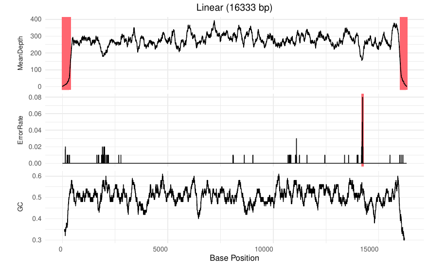

This is SRR21843972 (*Stomias affinis*). Depth collapses at both ends, which is
why the assembly came back linear rather than circular: there were not enough
reads spanning that region to close the circle. To assemble a circular mitogenome,
we could try different GetOrganelle settings or using MitoFinder for assembly.

Note that GenBank will still accept and verify partial (linear) mitogenomes.
A linear mitogenome is not a failure and can still be annotated.

<div class="alert alert-hydra">
<span class="hydra-tag">HYDRA</span>
<strong>Buttons that open files.</strong> On RStudio Server, the
<code>output</code> button opens that sample's results folder in the
<strong>Files</strong> pane at the bottom right of your RStudio session, and the
coverage <code>view</code> plot opens the PDF the same way. If you reached the
app through an SSH tunnel from a container instead, these buttons may do nothing, because
the app tries to open them on the cluster rather than on your laptop.
</div>

### Detailed troubleshooting

**Work Dirs** at the top right opens a browser of the working directories for
every step of the pipeline, including failed attempts. It is the most
reliable way to reach logs and intermediate files when something goes wrong.

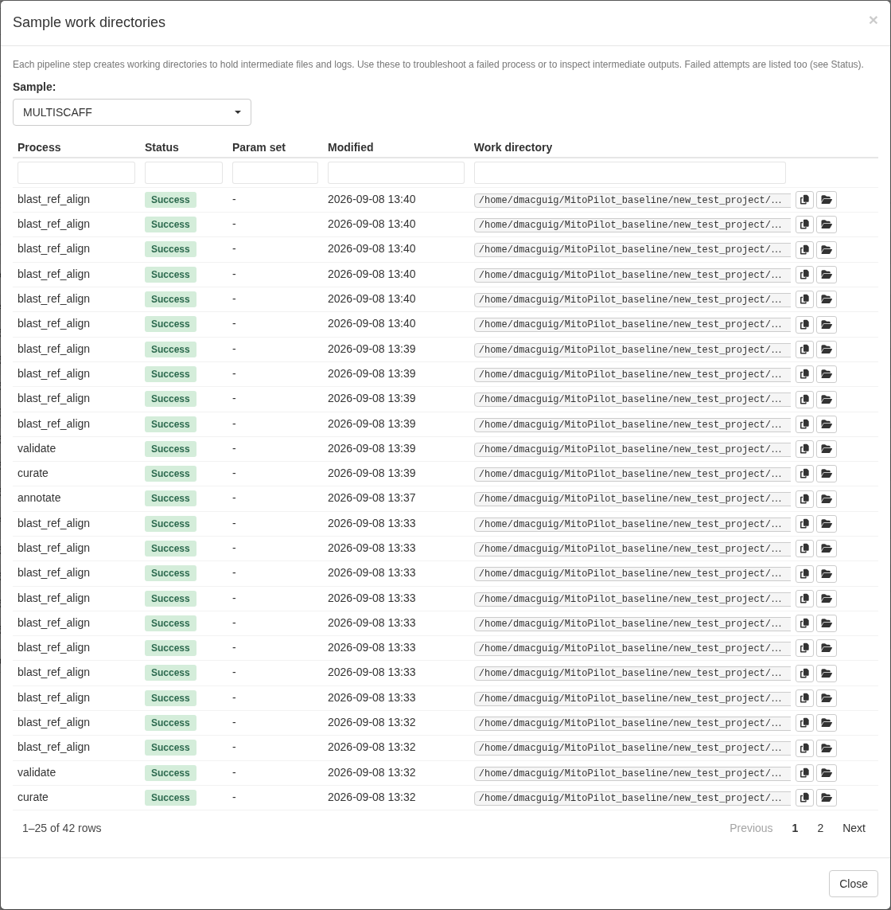

## Problematic samples

Three test samples are deliberately problematic, and between them they cover most of
what goes wrong with real data.

### Not enough data

SRR22396758 (*Upeneus parvus*) carries a warning icon and the note
"Insufficient sequencing depth". Its read files were intentionally truncated to 200 reads. 
This sample fails to meet the default `min_depth` argument at project setup. There is
nothing to fix here, so leave this sample behind when you lock the rest.

### Two competing assemblies

SRR21844202 (*Fundulus majalis*) is flagged "Unable to resolve single assembly
from reads": GetOrganelle found two valid paths through a tangled assembly graph.
Open `details` and you see both, each 19,332 bp.

Select both and click **Align**.

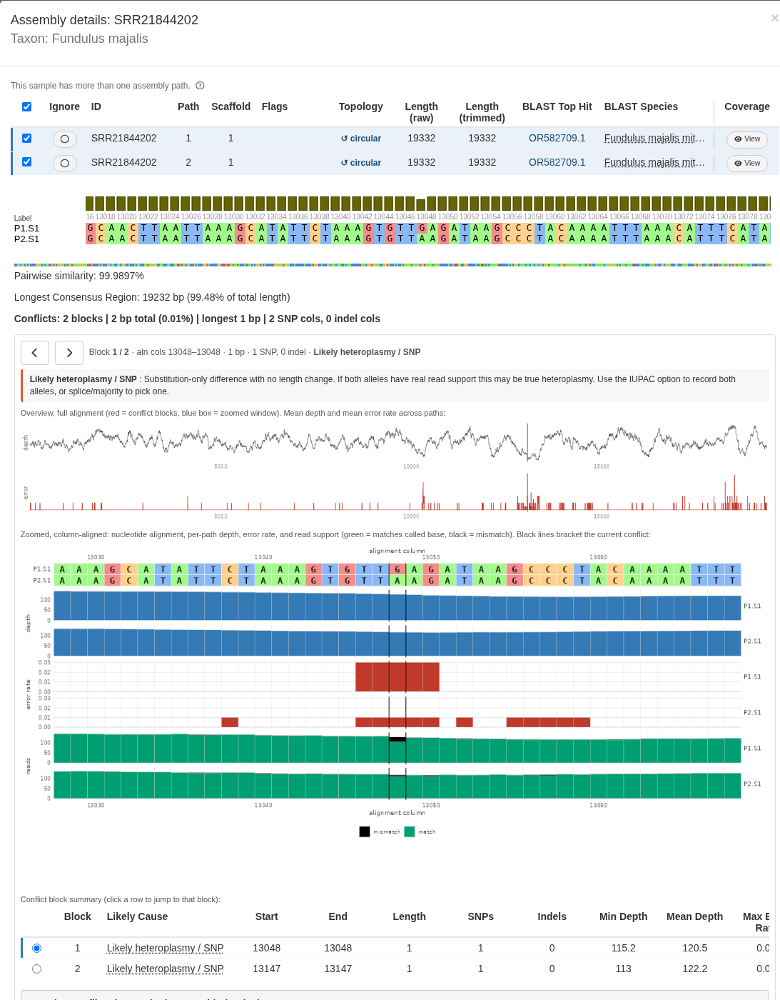

The paths are 99.99% identical, disagreeing at two single-base positions.
MitoPilot classifies each conflict, here "Likely heteroplasmy / SNP", and shows
read depth and error rate around it so you can see whether both alleles have real
support.

From here you can:

- **Ignore the extras.** Click the ignore button on the paths you do not want.
  Only what remains goes to annotation. This is what we do for the test project.
- **Build a resolved assembly.** Choose how to handle each conflict block and
  MitoPilot writes a single reconciled sequence as **Path 0**, superseding the
  alternatives.

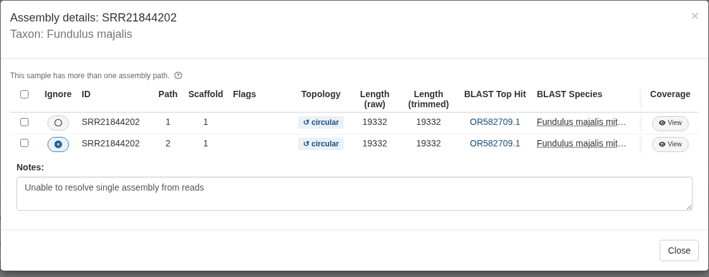

<div class="alert alert-note">
<strong>Note.</strong> Resolving discrepancies with IUPAC ambiguity codes provided as an
option. But be aware that annotation may handle ambiguous bases poorly if 
they occur in a protein-coding region.
</div>

### Fragmented assemblies

Two samples come back in pieces, but they need different treatment.

**SCAFFJOIN** (*Conger oceanicus*) is one mitogenome broken into three
scaffolds. Open its details and MitoPilot shows the scaffold join editor.

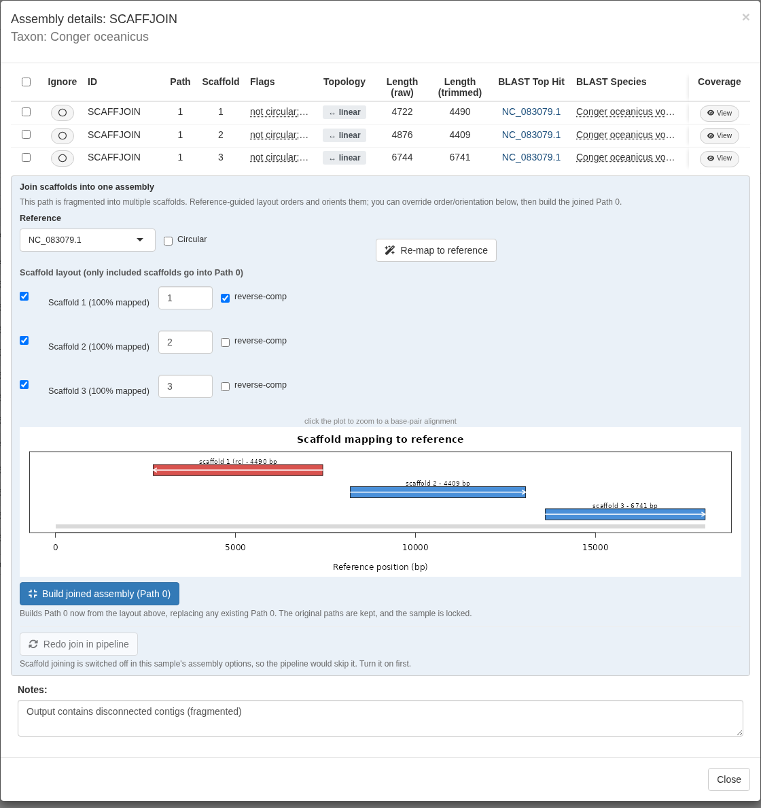

All three scaffolds map to the same reference (NC_083079.1) at 100% coverage,
and the plot shows their mapping positions against the reference. That is the 
signature of a mitogenome that the assembler could not connect into a single contig. 
You can override the order or orientation, tick
**Circular** if appropriate, and then click **Build joined assembly (Path 0)**.

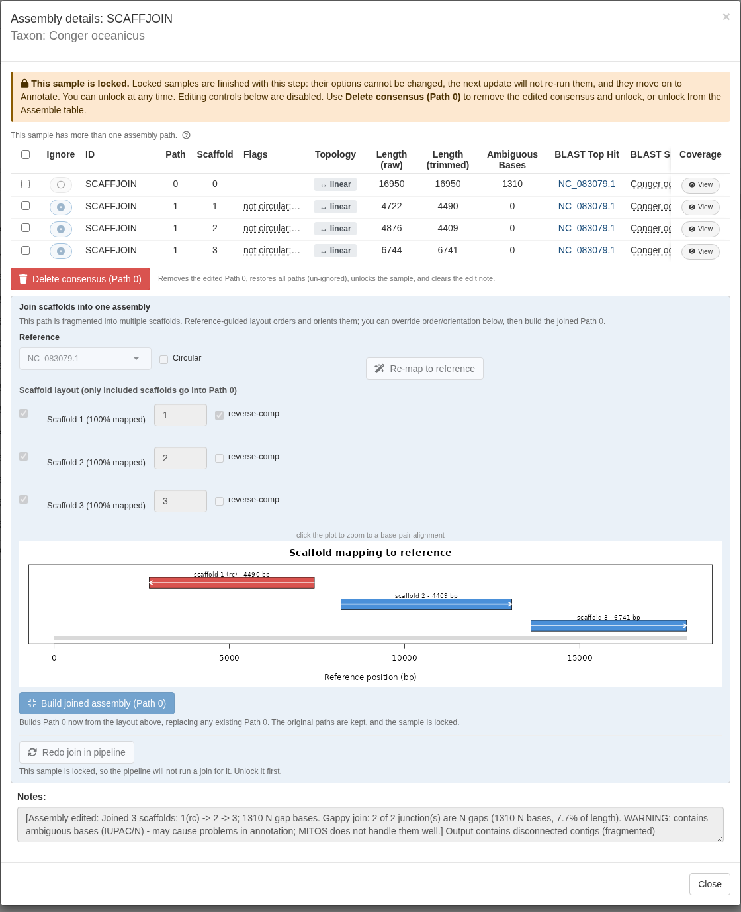

The joined Path 0 is 17,652 bp, the three original scaffolds are marked ignored,
and the sample is locked automatically. The note records how it was built,
including how many N bases fill the gaps. Those Ns are real missing sequence, and
MitoPilot warns you about them because MITOS2 does not handle ambiguous bases
well.

**MULTISCAFF** looks superficially similar, two scaffolds in one path, but it is
the opposite case.

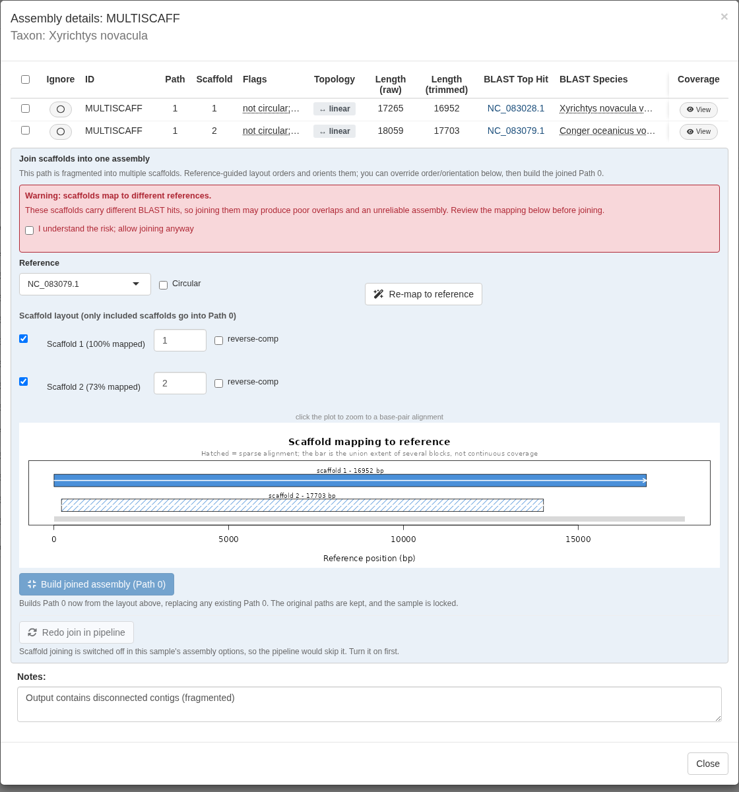

These scaffolds carry *different* BLAST hits,
and the mapping plot shows the second one only sparsely aligned (hatched shading) to the
reference. This likely represents contamination or a mixed sample.
Joining them would fabricate a chimeric mitogenome. Leave them separate, and each is
annotated, validated, and exported as its own record.

<div class="alert alert-tip">
<strong>Tip.</strong> Fragmented does not automatically mean joinable. Check that
the pieces map to the same reference in a sensible order before 
you join anything. Contamination, NUMTs, and naturally
multipartite mitogenomes all look like "extra scaffolds" at first glance.
</div>

## Lock and move on

Select every sample that assembled successfully, which is all of them except
SRR22396758, and click **LOCK**.

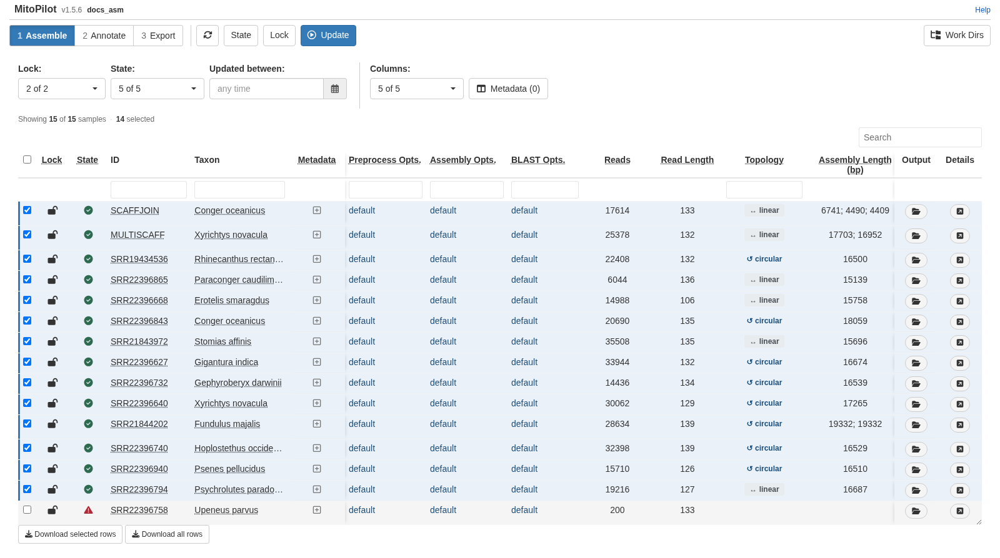

Locking freezes those samples in Assemble and releases them to the Annotate
module. Switch modules with the dropdown at the top left.

<hr class="part-break" />

# Annotate

This module finds the genes, curates the gene models against reference sequences from GenBank,
and validates the result against rules for your taxonomic group. It attempts to flag any issues
that would cause a rejection during GenBank submission.

Each row here is one **assembly unit**, not one sample. A sample that kept several
scaffolds or paths will be represented by several rows, and each is annotated and validated on its
own.

## Set the options

**Annotate Opts.** controls the annotation tools.


Genes come from [MITOS2](https://gitlab.com/Bernt/MITOS) (protein-coding genes, tRNAs,
and rRNAs) and [tRNAscan-SE](https://github.com/UCSC-LoweLab/tRNAscan-SE)
(tRNAs), with MitoFinder, ARWEN, ARAGORN, and ORFfinder available as optional annotators. 
The MITOS2 reference database defaults to `Chordata`, but `Metazoa_RefSeq89` is the
general-purpose choice for other groups.

**Curate Opts.** controls what MitoPilot does with those raw annotations.


The setting that matters most is **Target**, the taxonomic ruleset. It sets the
expected gene content, the allowed start and stop codons, the naming
conventions, and the genetic code. It defaults to Actinopterygii, which is correct
for the test fishes. 

For your own data, pick the closest clade from the
[ruleset browser](Ruleset-Browser.html). The validation parameters below are the
ruleset itself, laid out so you can see exactly which rules a sample is being
judged against.

<div class="alert alert-note">
<strong>No ruleset for your samples?</strong> If you do not see an appropriate clade for your samples,
please post an
[issue](https://github.com/Smithsonian/MitoPilot/issues) or reach out to
Dan MacGuigan directly at <macguigand@si.edu>. We are always looking to expand the taxonomic scope
of MitoPilot.
</div>

When ready, click **UPDATE** and run the workflow the same way you ran Assemble.

This module is slower than Assemble. MITOS2 takes a few minutes per unit,
and curation aligns every protein-coding gene against reference sequences. 
When working on a computing cluster with your own project, consider 
running this step as a job rather than directly from the MitoPilot app.

## Read the results


Scroll right in the table for the columns that matter:

- **PCGCount, tRNACount, rRNACount**: how many of each gene type were annotated.
  For a vertebrate mitogenome you expect 13, 22, and 2.
- **Missing**: expected genes that were not found.
- **Extra**: genes annotated more times than the ruleset expects.
- **Warnings**: how many validation flags were raised. This is your work queue.

A few units stand out in the test project. For example, SRR21844202 has an extra `trnW` and two
warnings. 

SCAFFJOIN is missing `atp8` and `trnK` and carries eight warnings.
This is a real consequence of joining scaffolds across coverage gaps. The
sequence in those gaps is set to "N", so the genes in those gaps cannot be annotated.

<div class="alert alert-note">
<strong>Note.</strong> The <strong>Warnings column includes</strong> dropdown menu at
the top filters which warning types are counted. Narrow it to one warning type to
pull out every sample with that problem and work through them as a batch.
</div>

## Inspect a sample

Click `details` on any row. Here we'll look at sample SRR19434536.


The annotation table lists every gene with its position, strand, and the tool
that called it. The **Notes** column records changes made during automatic curation, such as
a start position moved upstream or a stop codon trimmed.
**Warnings** shows what validation flagged. The `nt` and `aa` buttons copy the
nucleotide or amino acid sequence to your clipboard.

The badges along the top track the sample: topology, ID verified, reviewed,
problematic, and partial. The buttons at the bottom toggle them, which is how you
keep track of what you have already looked at across a large project.

Below the table are three collapsible views.

**Coverage Map** plots read depth along the assembly with the gene models drawn below,
zoomed to whichever gene you have selected. The gene bars are
semi-transparent so overlapping gene models are easy to spot.


**BLAST Reference Synteny** lines your annotation up against the closest GenBank
mitogenome, with a percent-identity bar between them. Click anywhere in this plot to show a
zoomed-in base-pair level alignment of your sample
versus the reference.

The reference mitogenome shown in this plot will be exported in your GenBank submission files as a note: 
"annotation compared to GenBank accession XXX".
If the reference mitogenome is a poor match, you can flag it (remove the submission note)
or use the dropdown menu to pick a better reference from among the top BLAST hits.


**Alignment** shows a selected protein-coding gene aligned to its reference hits
and the curation database.


The nucleotide boundary box shows the exact sequence at each end of the gene with
the codon frame marked, along with the start and stop codons that were called.
Below it, the protein alignment shows your gene ("focal") alongside the reference
proteins.

## Manually fix annotations

Click **EDIT** in the alignment section to nudge the start or stop position 
and watch the alignment respond. 


By default, the `+` and `-` buttons search
for the next valid start or stop codon (according to the curation ruleset you selected). 
You can toggle the `single codon` button to
instead nudge the position one codon at a time. This can lead to a **partial**
gene model with undetermined start or stop codons.

Clicking the `poly-A stop` button will truncate a stop codon to **TA** or **T**. 
Sometimes this is required by GenBank to avoid overlapping gene models. When transcribed,
these genes will have their stop codon completed by the addition of the 3' poly-A tail.

You can manually set a gene to have an undetermined start or stop codon by clicking the
Partial `5'` or `3'` buttons. MitoPilot will add the appropriate format and notes for that gene
in the GenBank submission files. Best to use this sparingly, as GenBank may not accept a submission
with many "partial" gene models.

Other useful editing tools:

- **Merge PCGs/rRNAs** joins gene models that were split into separate pieces,
  which is how you handle spliced or fragmented genes.
- **Auto-assign ORFs** renames open reading frames found by ORFfinder based
  on sequence similarity with the curation database of protein-coding genes.
- **Delete** removes an annotation entirely. Bring back a deleted annotation
  using the **Restore** button.
- **Trim unannotated ends** cuts assembly overhang that carries no genes, can
  be undone.
- **Linearize** converts a circular assembly to linear, useful when the control
  region assembled poorly. 
- **Align fewer refs** in the Alignment panel speeds up editing by restricting the alignment to the top
  five hits, which matters because the alignment is recomputed on every start/stop codon nudge.

You can record what you did in the **Notes** box; it saves automatically and is retained
with the sample.

<div class="alert alert-warning">
<strong>Warning.</strong> Validation warnings do not disappear when you fix the
underlying problem. They record the state at the time the Annotate module ran. Use the
<strong>Reviewed</strong> toggle to track what you have actually dealt with.
</div>

## Lock and move on

When you are satisfied, select the samples and click **LOCK** to release them to
the Export module.

# Export

The Export module turns finished annotations into the files GenBank needs for submission: 
a FASTA of the sequences and a five-column feature table of the annotations. MitoPilot
allows you to export entire mitogenomes, individual genes, or both. Export also generates
GFF3 annotation files and alignment summaries.

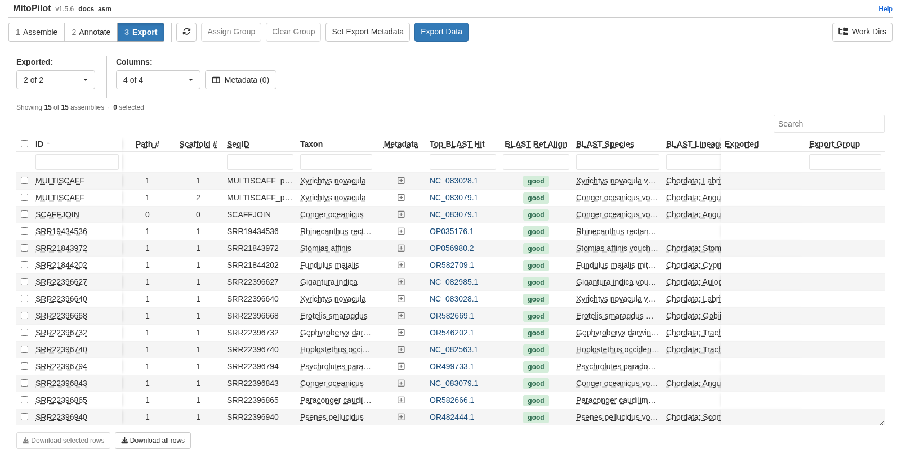

## Make a group

Export works on **groups**, which correspond to submission batches. Select the
samples you want and click **ASSIGN GROUP**.

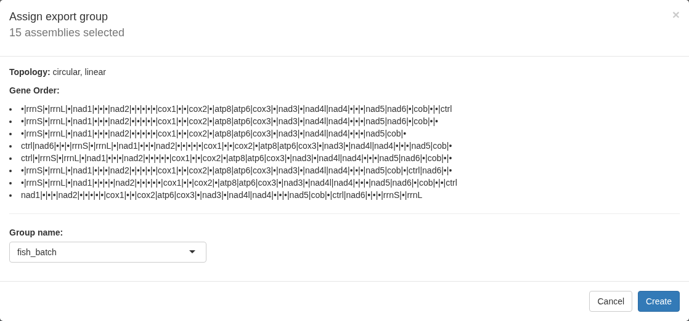

The window summarizes what you selected: how many records, which topologies, and
the gene order of each. Type a name (letters, numbers, dashes, and underscores
only) and click **Create**.

For the test project, select everything. MitoPilot then stops you:

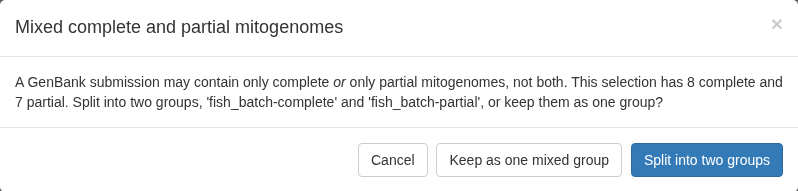

A GenBank submission may contain complete mitogenomes or partial mitogenomes, but not
both. This selection has some of each. **Split into two groups** produces `fish_batch-complete` 
and `fish_batch-partial`.
Note that completeness is derived from each assembly's topology, with circular meaning complete and
linear meaning partial, unless you overrode it using the per-sample Partial flag
or the `linear_complete` project setting.

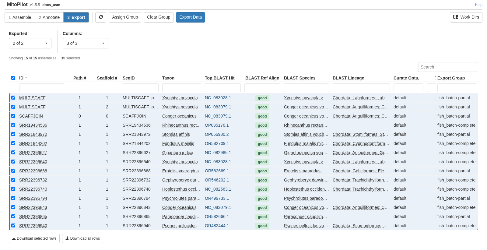

A unit can only belong to one export group at a time. **CLEAR GROUP** removes the selected
samples from their group. Re-assigning a grouped sample asks for confirmation
first, because files already written for the old group are not cleaned up.

## Export

Click **EXPORT DATA**.

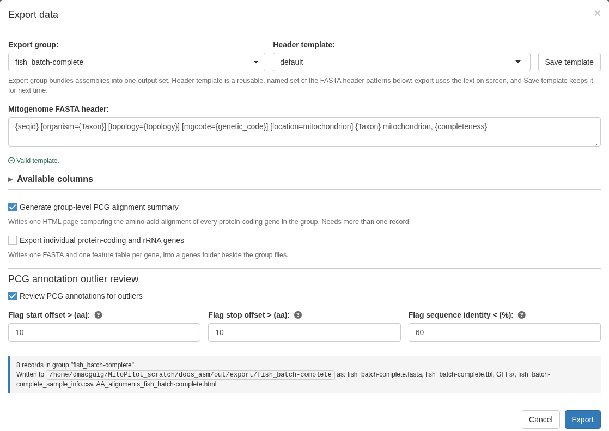

**Header Template** is the FASTA definition line. Any extra columns you put in the mapping file at
project setup are available here and can be referenced using `{column_name}`.
This is how you can include things like voucher numbers and BioSample
accessions in the GenBank submission files.

There are two special parameters. First, `{completeness}` expands to "complete genome" or
"partial genome" and belongs at the end of the header for GenBank to parse it
correctly. Second, `{seqid}` takes the value in the ID column of the mapping file and 
appends the scaffold/path number if that sample is exporting multiple sequences.

Templates are validated as you type and can be saved by name for
reuse.

Other options in the Export Data window:

- **Generate Group-level PCG alignment summary** aligns every protein-coding gene
  across the group and writes an HTML report. Worth the wait as a final check.
- **Export individual protein-coding and rRNA genes** writes per-gene FASTA files
  and feature tables, with their own header template. Useful for phylogenetics or
  single-gene submissions.
- **Review PCG annotations for outliers** runs a final pre-submission check described below.

Then click **Export**.

<div class="alert alert-note">
<strong>Note.</strong> If any sample in the group contributes more than one
record, MitoPilot asks you to confirm before exporting. Each scaffold becomes its own
GenBank record with a <code>ID_p&lt;path&gt;_s&lt;scaffold&gt;</code> SeqID.
This allows you to submit samples that have truly fragmented mitogenomes.
Samples that still have more than one assembly path cannot be exported at all,
since different assembly paths usually represent multiple versions of the same molecule.
</div>

## The outlier review

With the review enabled, MitoPilot aligns each protein-coding gene across the
group and stops on any gene where a sample looks out of line.

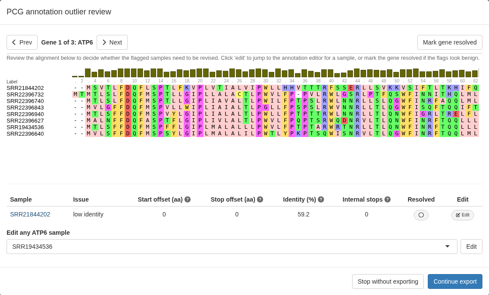

A sample's gene is flagged when it appears truncated or extended compared to the rest of the submission
group, as determined by the `offset` parameter settings. 

Sequences are also flagged when their identity compared the rest of the group 
falls below the specified threshold. In the screenshot above,
SRR21844202's ATP6 is at 59.2% identity against the others.

You can page through the flagged genes with **Prev** and **Next**, jump straight
into the annotation editor for any sample with **edit**, mark a gene resolved
once you have looked at it, or cancel the export entirely. You can also edit
genes for samples that were not automatically flagged. 

Files are written only
when you click **Done**, so edits made during review will appear in the exported files.

<div class="alert alert-tip">
<strong>Tip.</strong> Low identity is not automatically an error. ATP8 and NAD6
are genuinely fast-evolving and routinely flag in a diverse export group.
</div>

## Exported files

During export, files are saved to `<project>/out/export/<group name>/`:

| File | What it is |
|---|---|
| `<group>.fasta` | The mitogenome sequences with your header template applied |
| `<group>.tbl` | The [five-column feature table](https://www.ncbi.nlm.nih.gov/genbank/feature_table/) of annotations |
| `<group>_sample_info.csv` | The sample metadata behind the submission |
| `AA_alignments_<group>.html` | The group-level protein alignment report |
| `GFFs/` | One [GFF3](https://gmod.org/wiki/GFF3) per sample, can be reviewed using Geneious or other tools |
| `genes/` | Per-gene FASTA and feature tables, if you asked for them |

The FASTA and the feature table are the two files you need for a
[GenBank organelle submission](https://www.ncbi.nlm.nih.gov/genbank/organelle_submit/).

The HTML report is the file to read first.

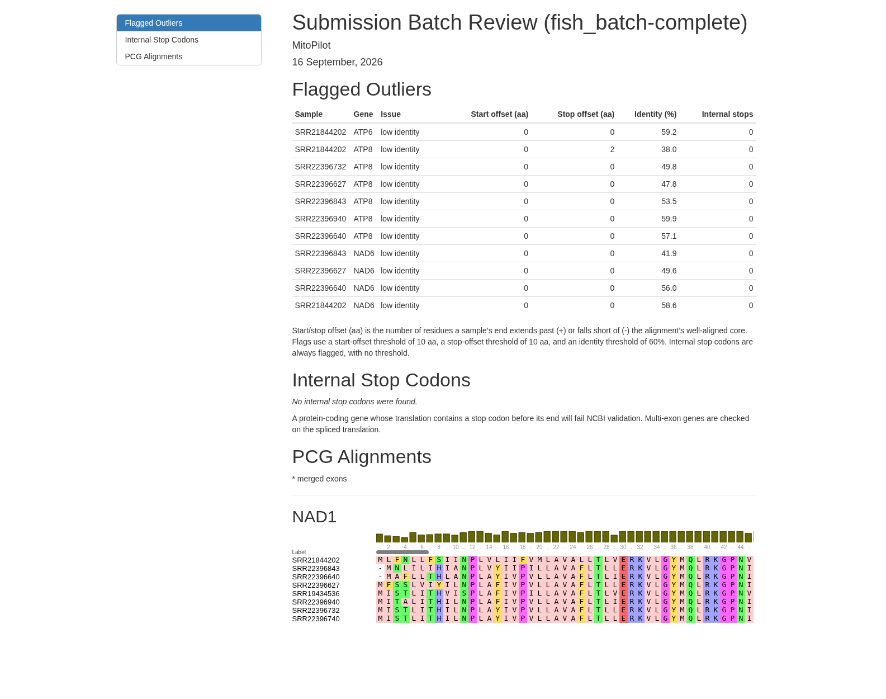

It opens with every flagged outlier in one table, then shows the alignment for
each protein-coding gene across the group. Poor annotations tend to be obvious here.

<div class="alert alert-hydra">
<span class="hydra-tag">HYDRA</span>
<strong>Getting files off the cluster.</strong> Export runs inside the app rather
than as a cluster job. You will need to [download the data](https://confluence.si.edu/spaces/HPC/pages/163152227/Transferring+Files+to+from+Hydra) 
to submit to GenBank.
</div>

<hr class="part-break" />

# Starting your own project

Once you are comfortable with how MitoPilot works, starting your own project is mostly a matter of
pointing MitoPilot at your sequence data and telling it what kind of organism you are
working on.

## What you need

- **A directory of paired-end Illumina reads.** Two gzipped FASTQ files per
  sample. The data directory does not have to be inside the project directory.
- **A mapping file.** A CSV describing your samples.

## The mapping file

Four columns are required:

| Column | Contents |
|---|---|
| `ID` | Unique identifier for the sample. Used as the SeqID at export, so keep it short and free of spaces. |
| `Taxon` | Taxonomic information. Only included for your own benefit, so no required format. |
| `R1` | File name of the forward reads (name only, not a path). |
| `R2` | File name of the reverse reads (name only, not a path). |

Any other columns you add are carried along and can be pulled into GenBank FASTA
headers at export, so this is the place to put voucher numbers, BioSample
accessions, collection data, and anything else your submission needs.

```
ID,Taxon,R1,R2,Voucher,BioSample
OCT001,Muricea elongata,OCT001_R1.fastq.gz,OCT001_R2.fastq.gz,USNM:1234567,SAMN00000001
OCT002,Leptogorgia virgulata,OCT002_R1.fastq.gz,OCT002_R2.fastq.gz,USNM:1234568,SAMN00000002
```

You do not have to get the mapping file columns right the first time. `update_sample_metadata()`
adds new columns or revises the values in existing projects. Close the app before
updating the metadata, since this function needs sole access to the project database.

<div class="alert alert-note">
<strong>Note.</strong> If your identifier column is not called <code>ID</code>,
you can pass its name with <code>mapping_id</code> instead of renaming the column.
</div>

## Initialize the project

```r
library(MitoPilot)

new_project(
  path = "~/my_mitogenomes/run_01",
  mapping_fn = "~/my_mitogenomes/mapping.csv",
  data_path = "~/my_mitogenomes/raw_data",
  executor = "local"
)
```

That is the minimum. Everything below is optional, but for anything other than a
ray-finned fish you will want at least `curate_target` and custom assembly
databases.

### Arguments worth setting

Many of these options can also be set in the MitoPilot app. Setting them at project
initialization may save you time.

**`curate_target`** picks the curation and validation ruleset, which controls
expected gene content, allowed start and stop codons, gene naming, and the
genetic code. The default is `"fish_mito"`. Browse the available rulesets in the
[curation ruleset browser](Ruleset-Browser.html) and pass the one matching your
clade, for example `curate_target = "octocoral_mito"`.

**`genetic_code`** is normally left alone: MitoPilot takes it from the curation ruleset.
Set it only when you need to override that, using an
[NCBI translation table number](https://www.ncbi.nlm.nih.gov/Taxonomy/Utils/wprintgc.cgi).

**`custom_seeds_db` and `custom_labels_db`** point GetOrganelle at reference
sequences for your group. The defaults are for fishes, but you can build
databases for any clade with the R function `custom_assembly_db()`, see
[building custom databases](custom_dbs.html). Give absolute paths, not paths
starting with `~`.

**`assembler` and `mitofinder_db`** switch the assembler to `"MitoFinder"` and
point it at a reference database. The reference database must be GenBank format (`.gb`) and can
be a local path or a URL. The default is the zebrafish mitogenome, so supply
your own for anything that is not a fish. Leave both alone to stay on
GetOrganelle.

**`annotate_ref_db`** selects the MITOS2 reference database. The default is
`"Chordata"`; `"Metazoa_RefSeq89"` is the general-purpose alternative and is the
right choice for most invertebrates.

**`min_depth`** is the minimum number of read pairs after pre-processing for
a sample to continue (default 2,000,000). Lower it if your reads have already
been filtered or baited.

**`linear_complete`** should be `TRUE` for taxa whose complete mitogenome is
genuinely linear, will cause export to label them "complete genome" rather than "partial".

**`ncbi_api_key`** raises your NCBI request limits. Worth setting even
though the BLAST search itself is local, because MitoPilot fetches
 annotations and taxonomic lineage for each BLAST hit directly from NCBI. Get an API key from
[NCBI](https://www.ncbi.nlm.nih.gov/datasets/docs/v2/api/api-keys/).

**`executor`** decides where the work runs: `"local"`, one of the generic cluster
templates (`"slurm"`, `"sge"`, `"pbs"`, `"lsf"`, `"awsbatch"`), a site profile
(`"NMNH_Hydra"`, `"NOAA_SEDNA"`), or a profile you saved yourself with
`generate_config()`. See [HPC cluster support](Custom-HPC.html).

Below is a more complete `new_project` example for an octocoral dataset on a SLURM cluster:

```r
new_project(
  path = "~/octocorals/run_01",
  mapping_fn = "~/octocorals/mapping.csv",
  data_path = "~/octocorals/raw_data",
  executor = "slurm",
  curate_target = "octocoral_mito",
  annotate_ref_db = "Metazoa_RefSeq89",
  custom_seeds_db = "/data/refs/octocoral_seeds.fasta",
  custom_labels_db = "/data/refs/octocoral_labels.fasta",
  min_depth = 500000,
  ncbi_api_key = "YOUR_KEY"
)
```

After setting up the project, open the app from the project directory and work through Assemble,
Annotate, and Export exactly as in the test project:

```r
setwd("~/octocorals/run_01")
MitoPilot()
```

<div class="alert alert-tip">
<strong>Tip.</strong> Run a handful of samples through the whole pipeline before
analyzing hundreds. Curation settings that are wrong for your clade are much
cheaper to discover on a small test run.
</div>

<div class="alert alert-hydra">
<span class="hydra-tag">HYDRA</span>
<strong>A Hydra project in full.</strong> Keep the data and the project on
<code>/pool</code> or <code>/scratch</code> (not <code>/store</code>), and call
<code>hydra_setup()</code> before anything else in the session:

<pre><code class="r">library(MitoPilot)
hydra_setup()

new_project(
  path = "/pool/public/genomics/&lt;&lt;USER&gt;&gt;/octocorals/run_01",
  mapping_fn = "/pool/public/genomics/&lt;&lt;USER&gt;&gt;/octocorals/mapping.csv",
  data_path = "/pool/public/genomics/&lt;&lt;USER&gt;&gt;/octocorals/raw_data",
  executor = "NMNH_Hydra",
  curate_target = "octocoral_mito",
  ncbi_api_key = "YOUR_KEY"
)
</code></pre>

Reference databases you pass to the `new_project` function must be
readable from the compute nodes. Best to put them on shared storage rather than in
your home directory.
</div>

## Adding samples later

`add_samples()` appends new rows to an existing project from an additional
mapping file, so a project can grow as sequencing comes in rather than being
re-created from scratch.

## Using pre-existing mitogenome assemblies

If your mitogenomes were assembled elsewhere, for example by mapping to a reference
in Geneious, use `new_project_userAsmb()` instead. MitoPilot will skip assembly
and let you perform annotation, curation, and export.

It needs two extra columns in the mapping file:

| Column | Contents |
|---|---|
| `Assembly` | File name of the assembly FASTA for the sample (one file per sample) |
| `Topology` | `circular` or `linear` |

```r
new_project_userAsmb(
  path = "~/my_assemblies/run_01",
  mapping_fn = "~/my_assemblies/mapping.csv",
  data_path = "~/my_assemblies/raw_data",
  assembly_path = "~/my_assemblies/assemblies",
  executor = "local"
)
```

You still run the Assemble module, but it only maps reads to your assemblies to
compute coverage and error rates.

If you have no reads at all, set `no_raw_data = TRUE` and omit `data_path`.
MitoPilot will skip read mapping entirely and hide the coverage columns that
depend on it.

<div class="alert alert-warning">
<strong>Warning.</strong> A project holds either MitoPilot assemblies or
externally supplied ones, never both. Use separate projects if you have a mix.
</div>

<hr class="part-break" />

# Where to go next

- [Multiple paths and scaffolds](Multiple-Assemblies.html)
- [Curation ruleset browser](Ruleset-Browser.html) and
  [Fish mitogenome curation](Fish-Mitogenome-Curation.html)
- [Building custom databases](custom_dbs.html)
- [HPC cluster support](Custom-HPC.html),
  [NMNH Hydra](NMNH-Hydra.html), and [NOAA SEDNA](NOAA-SEDNA.html)
- [FAQ](FAQ.html) and [troubleshooting](Troubleshooting.html)
