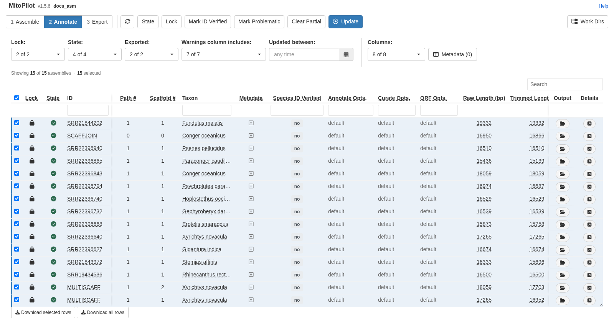

<style>
.alert {
  border-left: 5px solid;
  padding: 10px;
  margin: 10px 0;
  border-radius: 5px;
}
.alert-tip { border-color: #28A745; background-color: #E9F7EF; }
.alert-note { border-color: #007BFF; background-color: #EBF5FF; }
.alert-warning { border-color: #FFC107; background-color: #FFF9E6; }
.alert-danger { border-color: #DC3545; background-color: #F8D7DA; }
/* Smithsonian palette: blue #009CDE, yellow #FFCD00, black #101820 */
.alert-hydra {
  border-color: #101820;
  background-color: #E7F6FC;
  color: #101820;
}
.alert-hydra .hydra-tag {
  display: inline-block;
  background-color: #FFCD00;
  color: #101820;
  font-size: 0.75em;
  font-weight: bold;
  letter-spacing: 0.04em;
  padding: 1px 7px;
  border-radius: 10px;
  margin-right: 6px;
  vertical-align: 2px;
}
strong { font-weight: bold; }
img { max-width: 100%; border: 1px solid #ddd; border-radius: 4px; }
.figure { margin: 1.2em 0; }
.figure .caption, p.caption {
  font-size: 0.82em;
  line-height: 1.35;
  color: #6c757d;
  font-style: italic;
  margin-top: 0.4em;
}
</style>

MitoPilot takes you from raw genome skimming reads to mitogenome records ready
for submission to NCBI GenBank. The heavy lifting is a
[Nextflow](https://www.nextflow.io/) pipeline; you drive it from an R Shiny app
that shows you every sample, every assembly, and every annotation, and lets you
fix the ones that need a human.

This page walks the whole pipeline on the built-in test project, then shows you
how to start a project with your own data.

<div class="alert alert-hydra">
<span class="hydra-tag">HYDRA</span>
<strong>Smithsonian NMNH Hydra users.</strong> Boxes like this one flag the
places where Hydra differs from a generic setup. First time on Hydra? Work
through <a href="NMNH-Hydra.html">NMNH Hydra setup</a> before starting here.
</div>

# What you need

| Requirement | Notes |
|---|---|
| [R](https://www.r-project.org/) >= 4.4.0 | RStudio is recommended but not required |
| [Nextflow](https://www.nextflow.io/docs/latest/install.html) 24.10.x - 25.10.x | Needs Java 17 or newer |
| [Docker](https://docs.docker.com/engine/install/) or [Singularity](https://docs.sylabs.io/guides/latest/user-guide/quick_start.html) | Only if the pipeline runs where you are sitting. On a cluster, the container runs on the compute nodes |
| Disk space | About 15 GB for the container image, plus room for your data |
| Internet access | The pipeline BLASTs each assembly against GenBank |

<div class="alert alert-note">
<strong>Note.</strong> MitoPilot checks your Nextflow version when the package
loads and when you create or open a project. Too old and it refuses to load; too
new and it quietly pins <code>NXF_VER</code> to a version that works.
</div>

# Install

```r
if (!requireNamespace("BiocManager", quietly = TRUE)) {
  install.packages("BiocManager")
}
BiocManager::install("Smithsonian/MitoPilot", ask = FALSE)
```

The first install pulls a long list of dependencies and takes a while. Warnings
about system library paths that are not writeable are harmless.

To update later:

```r
remove.packages("MitoPilot")
BiocManager::install("Smithsonian/MitoPilot")
.rs.restartR()   # or restart R yourself
```

<div class="alert alert-tip">
<strong>Tip.</strong> Each MitoPilot release pairs with a matching container
image. After updating the R package, clear your container cache
(<code>docker image prune</code>, or <code>singularity cache clean</code>) so the
new image is pulled.
</div>

Load it:

```r
library(MitoPilot)
```

You should see a welcome message naming the Nextflow version MitoPilot will use.
If Nextflow cannot be found, make sure it is on your `PATH` in the same R session
(`Sys.which("nextflow")`), and see [HPC cluster support](Custom-HPC.html) if you
are working on a cluster.

<div class="alert alert-hydra">
<span class="hydra-tag">HYDRA</span>
<strong>Run <code>hydra_setup()</code> once per session.</strong> RStudio Server
sessions on Hydra start with a stripped <code>PATH</code> that leaves out the
grid engine, Java, and your <code>~/bin</code>, so Nextflow cannot find
<code>qsub</code> and job submission fails. Call it right after loading the
package, before creating a project or opening the app:

<pre><code class="r">library(MitoPilot)
hydra_setup()
</code></pre>

It puts the Hydra Java and grid-engine directories at the front of your
<code>PATH</code> and pins a compatible Nextflow version for the session. It has
no effect anywhere else, and warns if you are not on Hydra.
</div>

# Run the test project

MitoPilot ships with a small test dataset: 15 samples of pre-filtered Illumina
reads, mostly marine fishes. It is deliberately messy. Some samples assemble
cleanly, one has far too little data, one produces two competing assemblies, and
two produce fragmented assemblies, so you get to see the situations that need
your judgement before you meet them in your own data.

```r
library(MitoPilot)

# Anywhere you have space. MitoPilot creates the directory if needed.
wd <- "~/MitoPilot_test/run_01"

new_test_project(
  path = wd,
  executor = "local",
  full_size = FALSE,
  Rproj = FALSE
)
```

`executor = "local"` runs everything on the machine you are sitting at, using
Docker. To run on a cluster instead, see
[HPC cluster support](Custom-HPC.html) and pass the matching executor name.
`full_size = FALSE` uses the small pre-filtered reads that ship with the package;
`TRUE` downloads about 10 GB of raw data from ENA.

MitoPilot lists the samples as it sets them up, then writes a hidden `.config`
file holding the Nextflow settings for the project. The defaults are fine for the
test project.

<div class="alert alert-hydra">
<span class="hydra-tag">HYDRA</span>
<strong>Use the Hydra executor, and pick the right disk.</strong> Pass
<code>executor = "NMNH_Hydra"</code> so work is dispatched to compute nodes
instead of running on the login or RStudio node. Put projects under
<code>/pool</code> or <code>/scratch</code>. Home directories are far too small
for Nextflow work directories, and projects cannot be run from
<code>/store</code>.

<pre><code class="r">new_test_project(
  path = "/pool/public/genomics/&lt;&lt;USER&gt;&gt;/MitoPilot/test_project",
  executor = "NMNH_Hydra"
)
</code></pre>
</div>

# Open the app

```r
setwd(wd)     # the app must be launched from the project directory
MitoPilot()
```


Each row is a sample. The dropdown at the top left switches between the three
pipeline modules, **Assemble**, **Annotate**, and **Export**, which you work
through in that order. The circular arrow refreshes the table.

Two icons sit to the left of each sample ID:

- **The lock.** Unlocked samples are the ones the next pipeline run will process.
  Locking a sample freezes it in the current module and releases it to the next
  one. Select samples and use the `LOCK` button to toggle.
- **The state.** Where the sample stands in the current module. The pipeline sets
  these automatically, but you can override them with the `STATE` button, which
  is how you park samples you do not want to process yet.

Clicking a column header sorts by it, the search box at the top right filters
everything, and most columns have their own filter box.

<div class="alert alert-hydra">
<span class="hydra-tag">HYDRA</span>
<strong>Reaching the app.</strong> On the dedicated RStudio Server
(<a href="https://galaxy.si.edu/R4">galaxy.si.edu/R4</a>) the app opens in a
browser tab like any other Shiny app. If instead you tunnelled to your own
RStudio Server session, the app is served through that same tunnel. Use Chrome or
Firefox; there are known problems with Safari.
</div>

# Assemble

The Assemble module cleans the reads, builds mitogenome assemblies, maps the
reads back to measure coverage, and BLASTs each assembly against GenBank to find
its closest published relative.

## Set the options

Every processing step has an options set, shown as a link in the sample table.
Click the `default` link in the **Assembly Opts.** column to see what the
assembler will do.


Nothing is editable until you tick **Edit**. The important controls:

- **CPUs and Memory** per sample. Raise memory if samples fail with out-of-memory
  errors.
- **Assembler.** [GetOrganelle](https://github.com/Kinggerm/GetOrganelle) by
  default, or [MitoFinder](https://github.com/RemiAllio/MitoFinder). GetOrganelle
  only assembles reads it recognises as mitochondrial, which makes it fast but
  dependent on good reference databases. MitoFinder assembles everything, which
  is much slower but can work better for groups with few reference mitogenomes.
- **Seeds and Labels databases.** The reference sequences GetOrganelle uses to
  recruit and extend mitochondrial reads. The defaults are fish; for other
  groups, build your own with `custom_assembly_db()` (see
  [custom databases](custom_dbs.html)).
- **Max assembly paths / Max scaffolds.** Samples that come apart into more
  pieces than this are marked failed instead of continuing.
- **Automatically join multi-scaffold assemblies.** Off by default, and worth
  leaving off until you understand your data. See
  [multiple paths and scaffolds](Multiple-Assemblies.html).

Options are saved as named, reusable sets. To make one, tick **Edit**, change
what you want, type a new name in the **Parameter set name** box, and click
**Update**. That name then appears in the dropdown for any sample. Different
samples can use different sets, which is how you give the difficult ones more
memory without paying for it everywhere.

For the test project the defaults are fine.

<div class="alert alert-hydra">
<span class="hydra-tag">HYDRA</span>
<strong>CPUs and memory are per-job requests.</strong> On Hydra these values
become the grid engine's resource request, so asking for more memory than a
queue allows will leave jobs pending rather than make them faster. The Hydra
config also flags high-memory steps automatically when a request crosses the
per-CPU threshold, so raise CPUs and memory together rather than memory alone.
</div>

## Run the workflow

Click **UPDATE** at the top of the window. MitoPilot shows the Nextflow command
it is about to run and how many samples it applies to.


**Run from App** runs the pipeline in your R session. The Progress window
updates as samples move through the steps, and the spinning gears in the corner
mean work is still happening. This is the simplest option, and the right one for
a project this size.

<div class="alert alert-warning">
<strong>Watch out.</strong> Running from the app ties the pipeline to the app
session. For large projects, or anything on a cluster, save or submit a job
script instead so the run survives a dropped connection. See
<a href="Custom-HPC.html">HPC cluster support</a>.
</div>

Assemble runs three steps per sample: read pre-processing with
[fastp](https://github.com/OpenGene/fastp), assembly with GetOrganelle, and
read mapping with [bowtie2](https://github.com/BenLangmead/bowtie2) to compute
depth and error rates. It then BLASTs each assembly against GenBank and fetches
the best-matching reference, which is the slowest part because it waits on NCBI.
Nextflow runs samples in parallel, so the whole test project takes a while but
not fifteen times one sample.

Failures are normal and mostly mean a sample ran out of memory; MitoPilot retries
those with more. Common errors are covered in the
[FAQ](FAQ.html) and [troubleshooting](Troubleshooting.html) articles.

<div class="alert alert-hydra">
<span class="hydra-tag">HYDRA</span>
<strong>Submit as Job.</strong> MitoPilot detects Hydra and adds a
<strong>Submit as Job</strong> button next to <strong>Run from App</strong>. It
submits the workflow to the cluster for you, so the run keeps going after you
close the app or lose your connection. Monitor it with <code>qstat</code> and the
log files in the project's <code>.logs</code> directory, then reopen the app when
it finishes. For anything beyond a few dozen samples, use this rather than
running from the app.
</div>

## Read the results

When the run finishes, the table fills in.


Useful columns: **Reads** surviving pre-processing, **Topology** (circular or
linear), **Asmb. Length**, and **# Paths** / **# Scaffolds**, which tell you
whether the sample came back as one clean sequence or something messier. The
BLAST columns name the closest GenBank record.

`output` opens the sample's results folder. `details` opens the assembly itself.

### Coverage and error

In the details window, `view` opens a plot of read depth, error rate, and GC
content along the assembly.


This is SRR21843972 (*Stomias affinis*). Depth collapses at both ends, which is
why the assembly came back linear rather than circular: there were not enough
reads spanning that region to close the circle. Options are more sequencing,
different GetOrganelle settings, or accepting a partial genome.

<div class="alert alert-hydra">
<span class="hydra-tag">HYDRA</span>
<strong>Buttons that open files.</strong> The <code>output</code> button and the
coverage <code>view</code> plot open a folder or a PDF on the machine running the
app. On the RStudio Server that works; through an SSH tunnel from a container it
may not, because the app tries to open them on the cluster rather than on your
laptop. The <strong>Work Dirs</strong> browser is the reliable way to reach files
either way.
</div>

## The awkward samples

Three test samples are deliberately awkward, and between them they cover most of
what goes wrong with real data.

### Not enough data

SRR22396758 (*Upeneus parvus*) carries a warning icon and the note
"Insufficient sequencing depth". Its read file was truncated to 200 reads on
purpose. The threshold is the `min_depth` argument at project setup. There is
nothing to fix here, so leave this sample behind when you lock the rest.

### Two competing assemblies

SRR21844202 (*Fundulus majalis*) is flagged "Unable to resolve single assembly
from reads": GetOrganelle found two valid paths through a tangled assembly graph.
Open `details` and you see both, each 19,332 bp.

Select both and click **Align**.


The paths are 99.99% identical, disagreeing at two single-base positions.
MitoPilot classifies each conflict, here "Likely heteroplasmy / SNP", and shows
read depth and error rate around it so you can see whether both alleles have real
support.

From here you can:

- **Ignore the extras.** Click the ignore control on the paths you do not want.
  Only what remains goes to annotation. This is what we do for the test project.
- **Build a resolved assembly.** Choose how to handle each conflict block and
  MitoPilot writes a single reconciled sequence as **Path 0**, superseding the
  alternatives.


<div class="alert alert-note">
<strong>Note.</strong> Recording both alleles with IUPAC ambiguity codes is
available, but MITOS2 handles ambiguous bases poorly at the annotation step, so
prefer picking an allele unless the heteroplasmy is the point of your study.
</div>

### Fragmented assemblies

Two samples come back in pieces, and they need opposite treatment. This is the
distinction that matters most, so it is worth doing both.

**SCAFFJOIN** (*Conger oceanicus*) is one mitogenome broken into three
scaffolds. Open its details and MitoPilot shows the scaffold join editor.


All three scaffolds map to the same reference (NC_083079.1) at 100% coverage,
and the plot lays them out along it: scaffold 1 reversed, then scaffolds 2 and 3,
with gaps between them. That is exactly the signature of one genome that the
assembler could not connect. You can override the order or orientation, tick
**Circular** if appropriate, and then click **Build joined assembly (Path 0)**.


The joined Path 0 is 17,652 bp, the three original scaffolds are marked ignored,
and the sample is locked automatically. The note records how it was built,
including how many N bases fill the gaps. Those Ns are real missing sequence, and
MitoPilot warns you about them because MITOS2 does not handle ambiguous bases
well.

**MULTISCAFF** looks superficially similar, two scaffolds in one path, but it is
the opposite case.


MitoPilot refuses to go quietly here: the scaffolds carry *different* BLAST hits,
and the mapping plot shows the second one only sparsely aligned (hatched) to the
reference. These are two different animals, from contamination or a mixed sample.
Joining them would fabricate a chimeric genome. Leave them separate, and each is
annotated, validated, and exported as its own record.

<div class="alert alert-tip">
<strong>Tip.</strong> Fragmented does not automatically mean joinable. Check that
the pieces map to the same reference, in a sensible order, without overlapping
each other, before you join anything. Contamination, NUMTs, and naturally
multipartite mitogenomes all look like "extra scaffolds" at first glance.
</div>

## Lock and move on

Select every sample that assembled successfully, which is all of them except
SRR22396758, and click **LOCK**.


Locking freezes those samples in Assemble and releases them to the Annotate
module. Switch modules with the dropdown at the top left.

# Annotate

This module finds the genes, curates the gene models against reference proteins,
and validates the result against rules for your taxonomic group, flagging
anything GenBank would reject.

One row here is one **assembly unit**, not one sample. A sample that kept several
scaffolds appears once per scaffold, and each is annotated and validated on its
own.

## Set the options

**Annotate Opts.** controls the annotation tools.


Genes come from [MITOS2](https://gitlab.com/Bernt/MITOS) (protein-coding genes
and rRNAs) and [tRNAscan-SE](https://github.com/UCSC-LoweLab/tRNAscan-SE)
(tRNAs), with MitoFinder, ARWEN, ARAGORN, and ORFfinder available as extras. The
MITOS2 reference database defaults to Chordata; `Metazoa_RefSeq89` is the
general-purpose choice for other groups.

**Curate Opts.** controls what MitoPilot does with those raw annotations.


The one that matters most is **Target**, the taxonomic ruleset. It sets the
expected gene content, the allowed start and stop codons, the naming
conventions, and the genetic code. It defaults to Actinopterygii, which is right
for the test fishes. For your own data, pick the closest clade from the
[ruleset browser](Ruleset-Browser.html). The validation parameters below are the
ruleset itself, laid out so you can see exactly which rules a sample is being
judged against; see [fish mitogenome curation](Fish-Mitogenome-Curation.html) for
how to customise them.

Then click **UPDATE** and run the workflow the same way you ran Assemble.


This module is slower than Assemble. MITOS2 takes a couple of minutes per unit,
and curation aligns every protein-coding gene against reference sequences.

<div class="alert alert-hydra">
<span class="hydra-tag">HYDRA</span>
<strong>Annotation is the step worth submitting as a job.</strong> It is the
longest stage of the pipeline, so this is where <strong>Submit as Job</strong>
earns its keep. Submit it, close the app, and come back when
<code>qstat</code> shows the job finished.
</div>

## Read the results


Scroll right in the table for the columns that matter:

- **PCGCount, tRNACount, rRNACount**: how many of each gene type were annotated.
  For a vertebrate mitogenome you expect 13, 22, and 2.
- **Missing**: expected genes that were not found.
- **Extra**: genes annotated more times than the ruleset expects.
- **Warnings**: how many validation flags were raised. This is your work queue.

Two units stand out in the test project. SRR21844202 has an extra `trnW` and two
warnings. SCAFFJOIN is missing `atp8` and `trnK` and carries eight warnings,
which is the honest consequence of joining scaffolds across coverage gaps: the
sequence in those gaps is N, so the genes that lived there are gone.

<div class="alert alert-note">
<strong>Note.</strong> The <strong>Warnings column includes</strong> dropdown at
the top filters which warning types are counted. Narrow it to one warning type to
pull out every sample with that problem and work through them as a batch.
</div>

## Inspect a sample

Click `details` on any row.


The annotation table lists every gene with its position, strand, and the tool
that called it. The **Notes** column records what automatic curation changed, for
example a start position moved upstream or a stop codon trimmed, and
**Warnings** shows what validation flagged. The `nt` and `aa` buttons copy the
nucleotide or amino acid sequence to your clipboard.

The badges along the top track the sample: topology, ID verified, reviewed,
problematic, and partial. The buttons at the bottom toggle them, which is how you
keep track of what you have already looked at across a large project.

Below the table are three collapsible views.

**Coverage Map** plots read depth along the assembly with the gene models drawn
on top, zoomed to whichever gene you have selected. The gene bars are
semi-transparent so overlapping models are easy to spot.


**BLAST Reference Synteny** lines your annotation up against the closest GenBank
genome, with a percent-identity bar between them. Gene order that disagrees with
the reference is usually either a real rearrangement or a curation mistake, and
this is the fastest way to tell them apart. If the best reference is a poor match,
flag it here or pick a different one from the dropdown, and the curation
alignments will use your choice instead.


**Alignment** shows a selected protein-coding gene against its reference hits.


The nucleotide boundary box shows the exact sequence at each end of the gene with
the codon frame marked, along with the start and stop codons that were called.
Below it, the protein alignment puts your gene ("focal") against the reference
proteins.

## Fix what needs fixing

Click **EDIT** in the alignment section to nudge the start or stop position by a
codon at a time and watch the alignment respond. If your gene starts several
residues short of every reference, that is visible immediately.

Useful editing tools:

- **Merge PCGs/rRNAs** joins gene models that were split into separate pieces,
  which is how you handle spliced or fragmented genes.
- **Auto-assign ORFs** attaches open reading frames found by ORFfinder to
  unannotated regions.
- **Delete** removes an annotation entirely. There is no undo short of
  re-running the module; see the [FAQ](FAQ.html).
- **Trim unannotated ends** cuts assembly overhang that carries no genes, and can
  be undone.
- **Linearize** converts a circular assembly to linear, useful when the control
  region assembled badly.
- **Align fewer refs** speeds up editing by restricting the alignment to the top
  five hits, which matters because the alignment is recomputed on every nudge.

Write down what you did in the **Notes** box; it saves automatically and travels
with the sample.

<div class="alert alert-warning">
<strong>Warning.</strong> Validation warnings do not disappear when you fix the
underlying problem. They record the state at the time the module ran. Use the
<strong>Reviewed</strong> toggle to track what you have actually dealt with.
</div>

## Lock and move on

When you are satisfied, select the samples and click **LOCK** to release them to
the Export module.



# Export

The Export module turns finished annotations into the files GenBank wants: a
FASTA of the sequences and a five-column feature table of the annotations, plus
GFF3 and alignment summaries for your own checking.


## Make a group

Export works on **groups**, which correspond to submission batches. Select the
samples you want and click **ASSIGN GROUP**.


The window summarises what you selected: how many records, which topologies, and
the gene order of each. Type a name (letters, numbers, dashes, and underscores
only) and click **Create**.

For the test project, select everything. MitoPilot then stops you:


A GenBank submission may contain complete genomes or partial genomes, but not
both, and this selection has some of each. **Split into two groups** does the
obvious thing, producing `fish_batch-complete` and `fish_batch-partial`.
Completeness comes from each assembly's topology, circular meaning complete and
linear meaning partial, unless you overrode it with the per-sample Partial flag
or the `linear_complete` project setting.


A unit belongs to one group at a time. **CLEAR GROUP** removes the selected
samples from their group, and re-assigning a grouped sample asks for confirmation
first, because files already written for the old group are not cleaned up.

## Export

Click **EXPORT DATA**.


**Header Template** is the FASTA definition line, built from any column in your
sample data with `{curly braces}`. Anything you put in the mapping file at
project setup is available here, which is how voucher numbers and BioSample
accessions reach the submission. `{completeness}` expands to "complete genome" or
"partial genome" and belongs at the end of the header for GenBank to parse it
correctly. Templates are validated as you type and can be saved by name for
reuse.

The options below it:

- **Generate Group-level PCG alignment summary** aligns every protein-coding gene
  across the group and writes an HTML report. Worth the wait as a final check.
- **Export individual protein-coding and rRNA genes** writes per-gene FASTA files
  and feature tables, with their own header template. Useful for phylogenetics or
  single-gene submissions.
- **Review PCG annotations for outliers** is the pre-flight check described
  below.

Then click **Export**.

<div class="alert alert-note">
<strong>Note.</strong> If any sample in the group contributes more than one
record, for example a sample whose scaffolds were deliberately kept apart,
MitoPilot asks you to confirm before exporting. Each scaffold becomes its own
GenBank record with a <code>ID_p&lt;path&gt;_s&lt;scaffold&gt;</code> SeqID.
That is right when the scaffolds really are different molecules and wrong when
they are one fragmented genome, so it is worth a second look. Samples that still
have more than one assembly path cannot be exported at all.
</div>

## The outlier review

With the review enabled, MitoPilot aligns each protein-coding gene across the
group and stops on any gene where a sample looks out of line, before writing
anything.


A sample is flagged when its start or stop sits more than a threshold number of
amino acids away from the alignment's well-aligned core, or when its mean
identity to the rest of the group falls below the identity threshold. Here
SRR21844202's ATP6 is at 59.2% identity against the others.

You can page through the flagged genes with **Prev** and **Next**, jump straight
into the annotation editor for any sample with **edit**, mark a gene resolved
once you have looked at it, or cancel the export entirely. Files are written only
when you click **Done**, so edits made during review are in the exported files
rather than one version behind.

<div class="alert alert-tip">
<strong>Tip.</strong> Low identity is not automatically an error. ATP8 and NAD6
are genuinely fast-evolving and routinely flag in a diverse group. Read the
alignment rather than the number.
</div>

## What you get

Files land in `<project>/out/export/<group name>/`:

| File | What it is |
|---|---|
| `<group>.fasta` | The mitogenome sequences with your header template applied |
| `<group>.tbl` | The [five-column feature table](https://www.ncbi.nlm.nih.gov/genbank/feature_table/) of annotations |
| `<group>_sample_info.csv` | The sample metadata behind the submission |
| `AA_alignments_<group>.html` | The group-level protein alignment report |
| `GFFs/` | One [GFF3](https://gmod.org/wiki/GFF3) per sample, for Geneious and friends |
| `genes/` | Per-gene FASTA and feature tables, if you asked for them |

The FASTA and the feature table are the two files you need for a
[GenBank organelle submission](https://www.ncbi.nlm.nih.gov/genbank/organelle_submit/).

The HTML report is the one to read first.


It opens with every flagged outlier in one table, then shows the alignment for
each protein-coding gene across the group. A sample whose annotation is wrong
tends to be obvious here in a way it never is in a single-sample view, which is
exactly the point of checking a whole batch at once.

<div class="alert alert-hydra">
<span class="hydra-tag">HYDRA</span>
<strong>Getting files off the cluster.</strong> Export runs inside the app rather
than as a cluster job, so it happens wherever the app is running. Download the
export directory from the RStudio Server Files pane, or copy it off Hydra with
<code>scp</code> / <code>rsync</code> before submitting to GenBank.
</div>

# Starting your own project

Once the test project makes sense, running your own data is mostly a matter of
pointing MitoPilot at your reads and telling it what kind of animal you are
working on.

## What you need

- **A directory of paired-end Illumina reads.** Two gzipped FASTQ files per
  sample. They can live anywhere MitoPilot can read from; the directory does not
  have to be inside the project.
- **A mapping file.** A CSV describing your samples.

## The mapping file

Four columns are required:

| Column | Contents |
|---|---|
| `ID` | Unique identifier for the sample. Used as the SeqID at export, so keep it short and free of spaces |
| `Taxon` | Species or genus name. No format requirements |
| `R1` | File name of the forward reads (name only, not a path) |
| `R2` | File name of the reverse reads |

Any other columns you add are carried along and can be pulled into GenBank FASTA
headers at export, so this is the place to put voucher numbers, BioSample
accessions, collection data, and anything else your submission needs.

```
ID,Taxon,R1,R2,Voucher,BioSample
OCT001,Muricea elongata,OCT001_R1.fastq.gz,OCT001_R2.fastq.gz,USNM:1234567,SAMN00000001
OCT002,Leptogorgia virgulata,OCT002_R1.fastq.gz,OCT002_R2.fastq.gz,USNM:1234568,SAMN00000002
```

<div class="alert alert-note">
<strong>Note.</strong> If your identifier column is not called <code>ID</code>,
pass its name with <code>mapping_id</code> instead of renaming the column.
</div>

## Initialize the project

```r
library(MitoPilot)

new_project(
  path = "~/my_mitogenomes/run_01",
  mapping_fn = "~/my_mitogenomes/mapping.csv",
  data_path = "~/my_mitogenomes/raw_data",
  executor = "local"
)
```

That is the minimum. Everything below is optional, but for anything other than a
ray-finned fish you will want at least `curate_target` and custom assembly
databases.

### Arguments worth setting

**`curate_target`** picks the curation and validation ruleset, which controls
expected gene content, allowed start and stop codons, gene naming, and the
genetic code. The default is `"fish_mito"`. Browse the available rulesets in the
[curation ruleset browser](Ruleset-Browser.html) and pass the one matching your
clade, for example `curate_target = "octocoral_mito"`.

**`genetic_code`** is normally left alone: MitoPilot takes it from the ruleset.
Set it only when you need to override that, using an
[NCBI translation table number](https://www.ncbi.nlm.nih.gov/Taxonomy/Utils/wprintgc.cgi).

**`custom_seeds_db` and `custom_labels_db`** point GetOrganelle at reference
sequences for your group. The bundled defaults are fish, and GetOrganelle does
poorly when the references are too divergent from your samples. You can build
databases for any clade with `custom_assembly_db()` without leaving R; see
[building custom databases](custom_dbs.html). Give absolute paths, not paths
starting with `~`.

**`annotate_ref_db`** selects the MITOS2 reference database. The default is
`"Chordata"`; `"Metazoa_RefSeq89"` is the general-purpose alternative and is the
right choice for most invertebrates.

**`min_depth`** is the minimum number of read pairs surviving pre-processing for
a sample to continue (default 2,000,000). Lower it if your reads have already
been filtered or baited.

**`linear_complete`** should be `TRUE` for taxa whose complete mitogenome is
genuinely linear, so export labels them "complete genome" rather than "partial".

**`ncbi_api_key`** raises your NCBI request limits. Worth setting for anything
beyond a handful of samples; get one from
[NCBI](https://www.ncbi.nlm.nih.gov/datasets/docs/v2/api/api-keys/).

**`executor`** decides where the work runs: `"local"`, one of the generic cluster
templates (`"slurm"`, `"sge"`, `"pbs"`, `"lsf"`, `"awsbatch"`), a site profile
(`"NMNH_Hydra"`, `"NOAA_SEDNA"`), or a profile you saved yourself with
`generate_config()`. See [HPC cluster support](Custom-HPC.html).

A fuller example, for an octocoral project on a SLURM cluster:

```r
new_project(
  path = "~/octocorals/run_01",
  mapping_fn = "~/octocorals/mapping.csv",
  data_path = "~/octocorals/raw_data",
  executor = "slurm",
  curate_target = "octocoral_mito",
  annotate_ref_db = "Metazoa_RefSeq89",
  custom_seeds_db = "/data/refs/octocoral_seeds.fasta",
  custom_labels_db = "/data/refs/octocoral_labels.fasta",
  min_depth = 500000,
  ncbi_api_key = "YOUR_KEY"
)
```

Then open the app from the project directory and work through Assemble,
Annotate, and Export exactly as in the test project:

```r
setwd("~/octocorals/run_01")
MitoPilot()
```

<div class="alert alert-tip">
<strong>Tip.</strong> Run a handful of samples through the whole pipeline before
launching hundreds. Curation settings that are wrong for your clade are much
cheaper to discover on five samples.
</div>

<div class="alert alert-hydra">
<span class="hydra-tag">HYDRA</span>
<strong>A Hydra project in full.</strong> Keep the data and the project on
<code>/pool</code> or <code>/scratch</code> (not <code>/store</code>), and call
<code>hydra_setup()</code> before anything else in the session:

<pre><code class="r">library(MitoPilot)
hydra_setup()

new_project(
  path = "/pool/public/genomics/&lt;&lt;USER&gt;&gt;/octocorals/run_01",
  mapping_fn = "/pool/public/genomics/&lt;&lt;USER&gt;&gt;/octocorals/mapping.csv",
  data_path = "/pool/public/genomics/&lt;&lt;USER&gt;&gt;/octocorals/raw_data",
  executor = "NMNH_Hydra",
  curate_target = "octocoral_mito",
  ncbi_api_key = "YOUR_KEY"
)
</code></pre>

Reference databases you pass to <code>custom_seeds_db</code> and friends must be
readable from the compute nodes, so put them on shared storage rather than in
your home directory.
</div>

## Adding samples later

`add_samples()` appends new rows to an existing project from an additional
mapping file, so a project can grow as sequencing comes in rather than being
re-created from scratch.

## Starting from assemblies you already have

If your mitogenomes were assembled elsewhere, for example mapped to a reference
in Geneious, use `new_project_userAsmb()` instead. MitoPilot then skips assembly
and gives you annotation, curation, and export.

It needs two extra columns in the mapping file:

| Column | Contents |
|---|---|
| `Assembly` | File name of the assembly FASTA for the sample |
| `Topology` | `circular` or `linear` |

```r
new_project_userAsmb(
  path = "~/my_assemblies/run_01",
  mapping_fn = "~/my_assemblies/mapping.csv",
  data_path = "~/my_assemblies/raw_data",
  assembly_path = "~/my_assemblies/assemblies",
  executor = "local"
)
```

You still run the Assemble module, but it only maps reads to your assemblies to
compute coverage and error rates.

If you have no reads at all, set `no_raw_data = TRUE` and omit `data_path`.
MitoPilot then skips read mapping entirely and hides the coverage columns that
depend on it.

<div class="alert alert-warning">
<strong>Warning.</strong> A project holds either MitoPilot assemblies or
externally supplied ones, never both. Use separate projects if you have a mix.
</div>

# Where to go next

- [Multiple paths and scaffolds](Multiple-Assemblies.html)
- [Curation ruleset browser](Ruleset-Browser.html) and
  [fish mitogenome curation](Fish-Mitogenome-Curation.html)
- [Building custom databases](custom_dbs.html)
- [HPC cluster support](Custom-HPC.html),
  [NMNH Hydra](NMNH-Hydra.html), and [NOAA SEDNA](NOAA-SEDNA.html)
- [FAQ](FAQ.html) and [troubleshooting](Troubleshooting.html)
