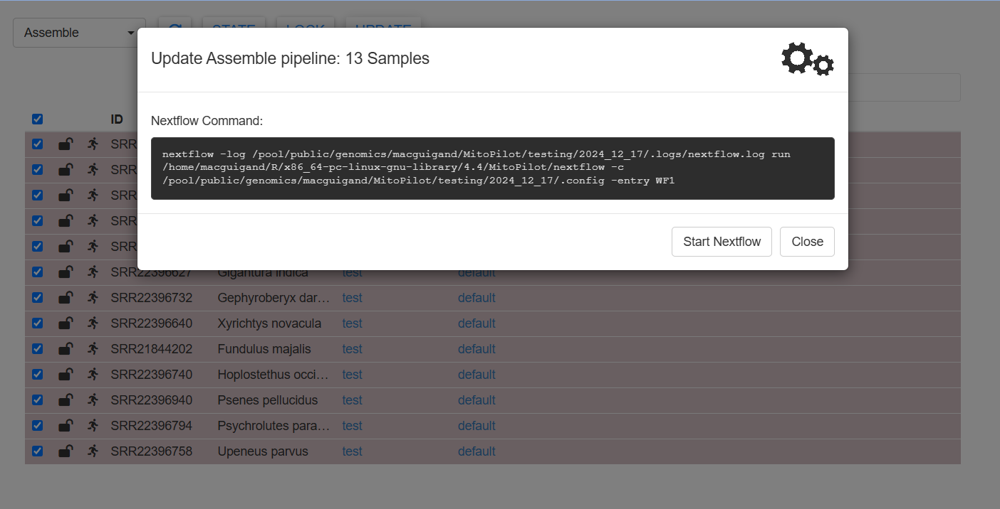

<style>
.alert {
  border-left: 5px solid;
  padding: 10px;
  margin: 10px 0;
  border-radius: 5px;
}
.alert-tip { border-color: #28A745; background-color: #E9F7EF; }
.alert-note { border-color: #007BFF; background-color: #EBF5FF; }
.alert-warning { border-color: #FFC107; background-color: #FFF9E6; }
.alert-danger { border-color: #DC3545; background-color: #F8D7DA; }
strong { font-weight: bold; }
</style>

# How to use MitoPilot on the Smithsonian Hydra computing cluster

You will need an account to access the Hyrda computing cluster. Instructions are available [here](https://confluence.si.edu/display/HPC/Hydra+Policies).

## First time setup

Dan MacGuigan has submitted a request to the Hydra team for installation of a Nextflow module. But for now, you will need to install your own copy of Nextflow on the cluster. Login to Hydra and run the following.

```{bash eval=F}
# Nextflow installation instructions
# from https://www.nextflow.io/docs/latest/install.html
cd ~
module load tools/java/21.0.2
curl -s https://get.nextflow.io | bash # install Nextflow
chmod +x nextflow # make Nextflow executable
```

There will now be an executable `nextflow` file in your home directory. You should move it to a location that is in your `PATH`. For example:

```{bash eval=F}
mkdir ~/bin # create bin directory, if needed
mv ~/nextflow ~/bin/nextflow # move nextflow to bin directory
echo 'export PATH="${HOME}/bin:${PATH}"' >> ~/.bashrc # add bin directory to PATH, in case it's not already there
source ~/.bashrc
```
 
This should allow you to call `nextflow` from anywhere on the cluster.

<div class="alert alert-note">
  <strong>Note:</strong> You must load the Hydra Java module (`module load tools/java/21.0.2`) whenever you wish to use Nextflow.
</div>


## Launching RStudio server

Next, let's launch RStudio server, which we'll use to install and run MitoPilot.

- login to Hydra
- run `conda deactivate` to avoid package conflicts (may not be necessary for all users)
- run `module load tools/R/RStudio/server`
- run `start-rstudio-server` (you may be asked to run a different command if this is your first time)
- leave this cluster terminal window open 
- in a new terminal window on your local computer:
	- start an ssh tunnel by running something like `ssh -N -L 8787:compute-64-16:8787 sylvain@hydra-login01.si.edu`
	  - the exact command should have been printed by `start-rstudio-server` in your cluster terminal window
	- leave this local terminal window open
	- open a web browser and enter `http://localhost:8787` in the URL bar
	- enter your cluster login credentials to access the RStudio server
	- any commands run in this new window will execute on the cluster in the interactive session

## Installing MitoPilot

To install MitoPilot, use the RStudio server window to run the following. This might take a while.

```{R eval=F}
if (!requireNamespace("BiocManager", quietly = TRUE)) {
  install.packages("BiocManager")
  install.packages("remotes")
}
BiocManager::install("Smithsonian/MitoPilot")
```

If the installation was successful, you're ready to start using MitoPilot!

## Updating MitoPilot

If you need to update MitoPilot, simply run the BiocManager installation command again. 
If you would like to ensure that you’re using the latest MitoPilot version, run `remove.packages("MitoPilot")` prior to installation.

After updating MitoPilot, we recommend restarting R (In the RStudio menu, Session > Restart R) and the reloading the package with `library(MitoPilot)`.

## Launching MitoPilot

We recommend running MitoPilot within an interactive session on the cluster to avoid unnecessary computational burden on the login nodes. First, initialize an interactive session on Hydra.

```{bash eval=F}
qrsh -l h_rt=24:00:00 -pe mthread 2
```

<div class="alert alert-note">
  <strong>Note:</strong> You must include `-pe mthread 2` in order to have enough available RAM for building the MitoPilot Singularity image.
</div>

<div class="alert alert-note">
  <strong>Note:</strong> Interactive sessions on Hydra can run for a maximum of 24 hours. Additionally, users are limited to one active interactive session at a time.
</div>

Once the interactive session starts, you can launch RStudio server.

```{bash eval=F}
conda deactivate
module load tools/R/RStudio/server tools/java/21.0.2
start-rstudio-server
```

Follow the login instructions as presented above. Once you have an Rstudio server window open, run `library(MitoPilot)` to load the package.

Want to learn how to use MitoPilot? Check out the [Test Project Tutorial](https://Smithsonian.github.io/MitoPilot/articles/test-project.html).

## Running Large MitoPilot Jobs
If you have a large number of samples to process (more than a few dozen), we recommend running the assemble and annotate MitoPilot modules as batch jobs. 

Running these modules within the R Shiny GUI requires you to maintain an open connection to the cluster. There may be issues restarting if the connection breaks while Nextflow is running. Instead, we can "fire and forget" by submitting batch jobs.

First, initialize your new project and modify any desired parameters using the GUI. Once ready, click `UPDATE`. A new window should appear.



Rather than clicking the `Start Nextflow` button, copy the Nextflow command and create a submission script. We have provided a template below. You may wish to modify the job name (`-N`) and the log file name (`-o`).

```{bash eval=F}
#!/bin/sh
#$ -N MitoPilot_assembly # MODIFY THIS IF DESIRED
#$ -o MitoPilot_assembly.log # MODIFY THIS IF DESIRED
#$ -cwd -j y
#$ -q lTWFM.sq
#$ -l wfmq
#$ -pe mthread 2
#$ -S /bin/sh

echo + `date` job $JOB_NAME started in $QUEUE with jobID=$JOB_ID on $HOSTNAME

source ~/.bashrc

module load tools/java/21.0.2 # required for Nextflow on Hydra

# NEXTFLOW COMMAND, example below
nextflow -log /pool/public/genomics/macguigand/MitoPilot/22030FL-06-02/run_02/.logs/nextflow.log run /home/macguigand/R/x86_64-pc-linux-gnu-library/4.4/MitoPilot/nextflow -c /pool/public/genomics/macguigand/MitoPilot/22030FL-06-02/run_02/.config -entry WF1

echo = `date` job $JOB_NAME done

```

<div class="alert alert-note">
  <strong>Note:</strong> You must use the options `-q lTWFM.sq` and `-l wfmq`. This is a special Hydra queue for workflow managers like Nextflow. You must also include `-pe mthread 2` in order to have enough available RAM for building the MitoPilot Singularity image.
</div>

Move the submission script into your MitoPilot run directory (in the above example, `/pool/public/genomics/macguigand/MitoPilot/22030FL-06-02/run_02/`). Then submit the job using `qsub MY_SCRIPT_NAME.sh`.

You can monitor the progress of this job using the `qstat` command and by checking on the log files. Once the job is done, you can relaunch the GUI to inspect the results. The same approach can be used for the annotate module.

## Known Issues

If when launching RStudio server you receive the error message `[rserver] ERROR system error 98 (Address already in use);`, the TCP port is already in use by another user.
Specify a different port in the range of 1025-65535 when starting the server. E.g., `start-studio-server -port 8890`.
