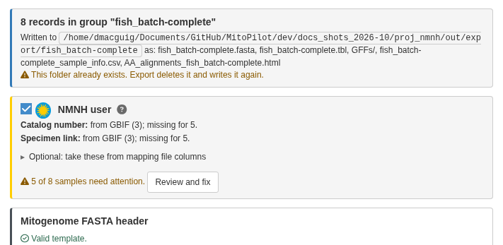
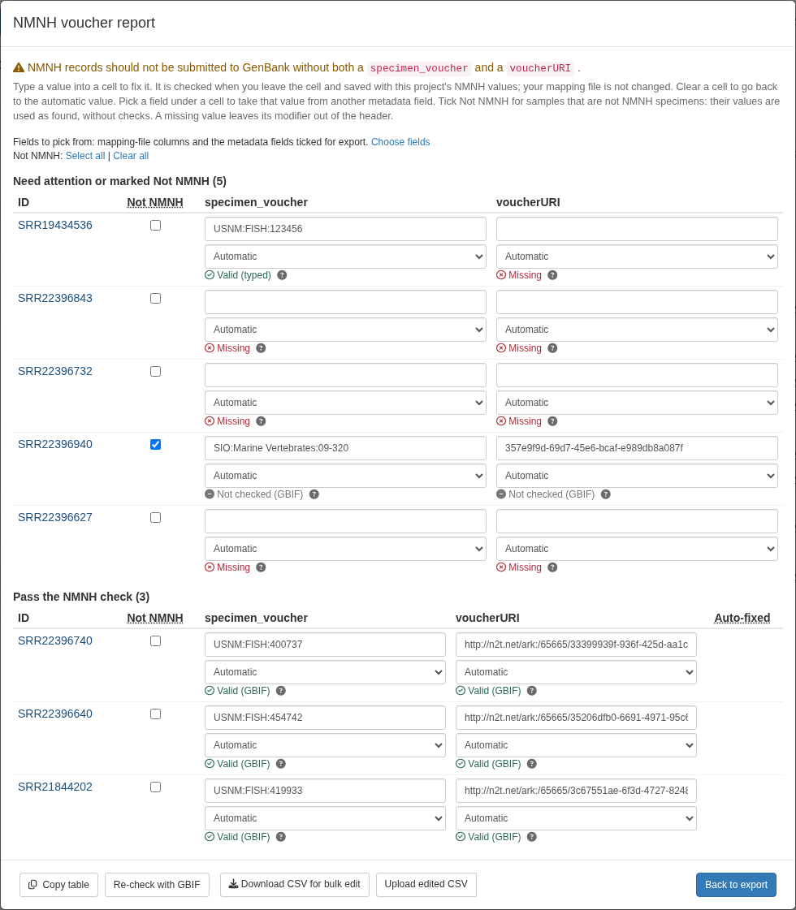

<style>
.alert {
  border-left: 5px solid;
  padding: 10px;
  margin: 10px 0;
  border-radius: 5px;
}
.alert-note { border-color: #007BFF; background-color: #EBF5FF; }
strong { font-weight: bold; }
</style>

This page is for GenBank submission containing specimens from the Smithsonian National Museum of Natural
History (NMNH). Other users can skip it.

NMNH asks that each GenBank record from one of its specimens carry the
specimen voucher and the specimen's EZID in the following format:

```
[specimen_voucher=USNM:FISH:487075] [voucherURI=http://n2t.net/ark:/65665/30f303846-9d23-4069-881e-e43ff718ef9f]
```

Not sure how to find the specimen EZIDs for your samples? Consult your department's data manager.

<div class="alert alert-note">
<code>specimen_voucher</code> is a standard GenBank source modifier.
<code>voucherURI</code> is an NMNH requirement and is not on GenBank's list of
source modifiers.
</div>

## Steps

1. **Turn it on.** In **Export Data**, tick **NMNH user**. MitoPilot adds
   `[specimen_voucher={nmnh_specimen_voucher}] [voucherURI={nmnh_voucherURI}]`
   to the FASTA header templates. If
   the template already has either modifier, it asks before replacing it. The
   switch is remembered when the header template is saved.
2. **Check the status.** The NMNH box shows how many samples need attention,
   or "All N samples ready".
3. **Review and fix** samples in the voucher report (below).
4. **Export** as usual.



## Where the values come from

For each sample, MitoPilot takes the first valid value from, in order:

1. your mapping file (pick the columns under **Optional: take these from
   mapping file columns**)
2. the linked GBIF record
3. the NCBI BioSample
4. the GEOME record

A voucher with no EZID is looked up in GBIF to find the EZID, and an EZID with
no voucher is looked up to find the voucher. Linking the samples first (see
[Linking records across databases](Metadata-Linking.html)) fills in more
values.

## What is checked and fixed

- **Voucher:** must be `USNM:<collection>:<catalog>` with an NCBI collection
  code (`FISH`, `Birds`, `MAMM`, `Herp`, `IZ`, `ENT`, `Botany`), or
  `US:<catalog>` for botany. Letter case and repeated `USNM` prefixes are fixed.
- **EZID:** written as `http://n2t.net/ark:/65665/3...` and checked against
  GBIF. A tissue EZID is replaced with its parent specimen's, and the voucher
  must match the GBIF record.

## The voucher report

**Review and fix** (or **Review NMNH values**) opens the report. It has two
tables: **Need attention...**, and **Pass the NMNH check**. Each
cell shows the value, where it came from, and the result.
The **Auto-fixed** column marks samples whose values MitoPilot corrected.

To fix a sample:

- **Type** a value into the cell. It is checked when you leave the cell and
  saved in the project; your mapping file is not changed. Clear the cell to go
  back to the automatic value.
- **Pick a field** under the cell to take the value from another mapping-file
  column or metadata field, or **None** to leave the modifier out.
- **Tick "Not NMNH"** for samples that are not NMNH specimens. Their values are
  used as found, without NMNH checks.
- **Click the sample ID** to open its metadata; **Back to voucher report**
  returns.
- To easily edit many samples, use **Download CSV for bulk edit**, edit the file, then
  **Upload edited CSV**.


