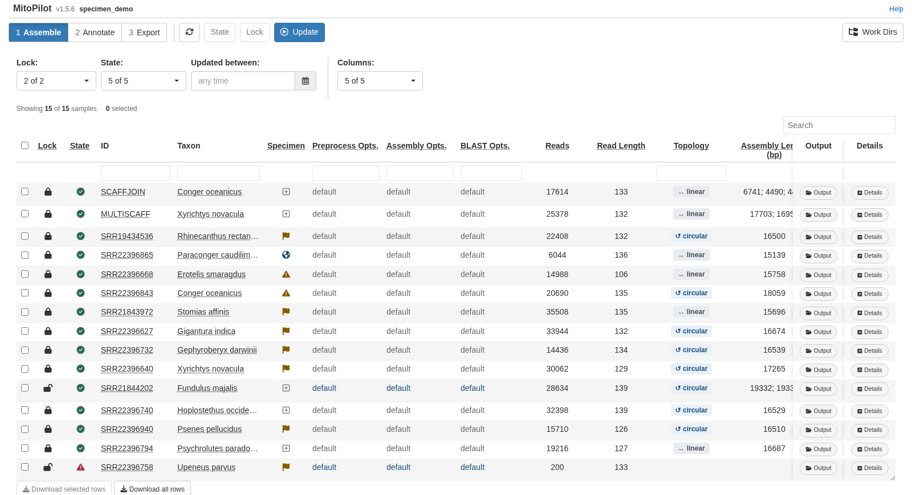
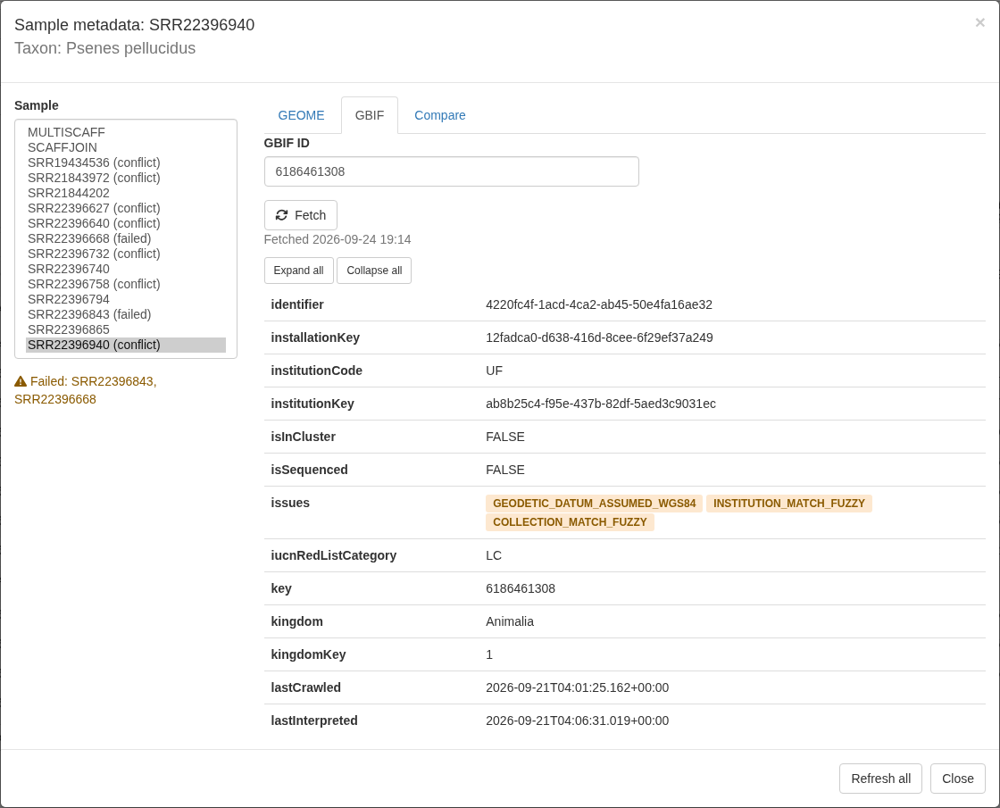
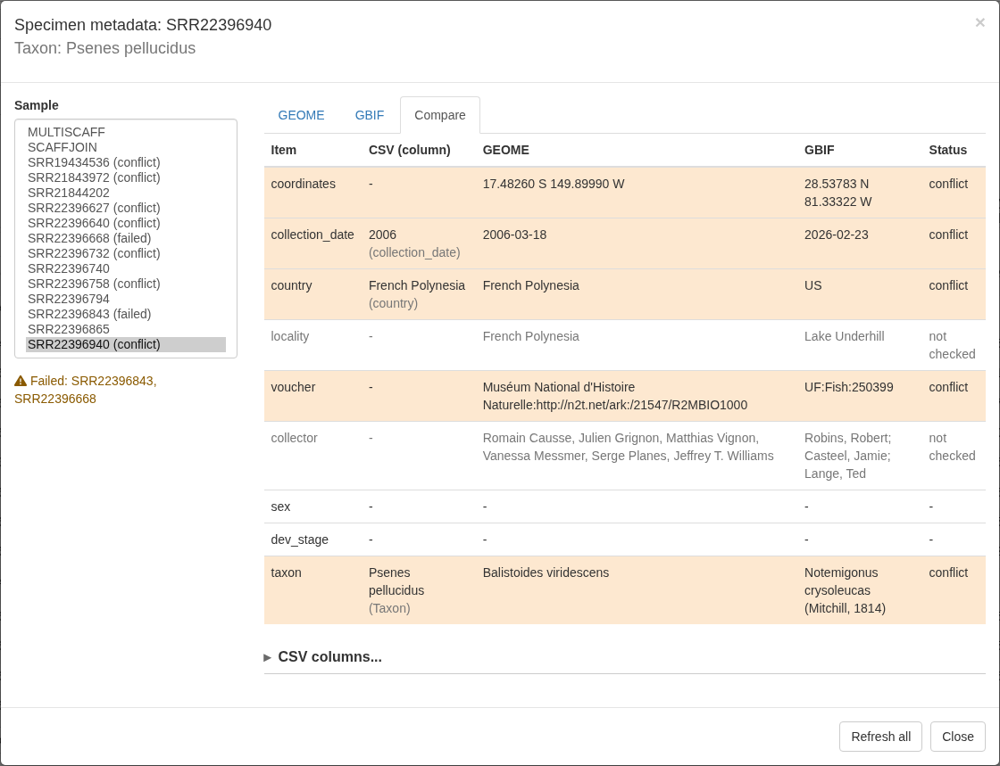
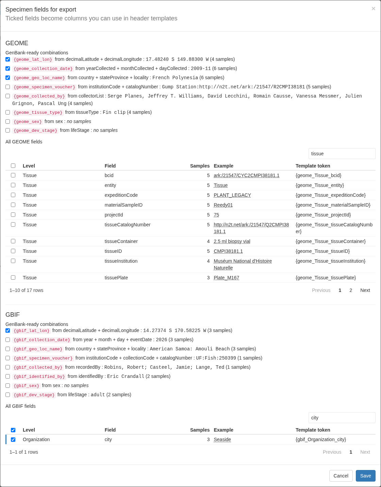
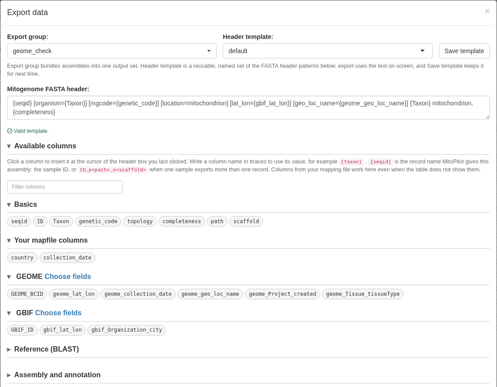
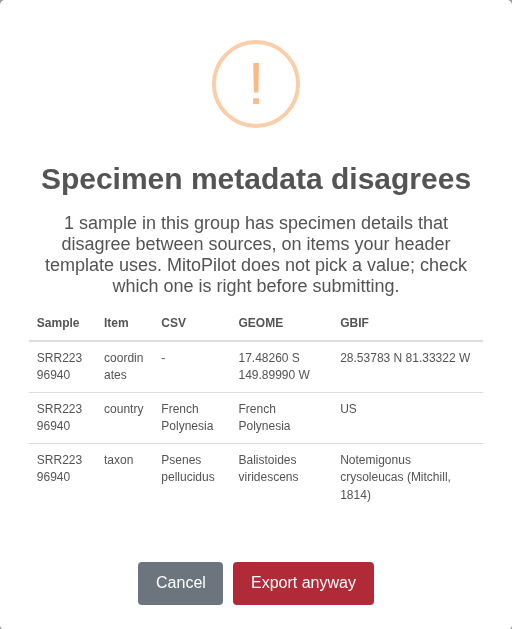

<style>
.alert {
  border-left: 5px solid;
  padding: 10px;
  margin: 10px 0;
  border-radius: 5px;
}
.alert-tip { border-color: #28A745; background-color: #E9F7EF; }
.alert-note { border-color: #007BFF; background-color: #EBF5FF; }
.alert-warning { border-color: #FFC107; background-color: #FFF9E6; }
.alert-danger { border-color: #DC3545; background-color: #F8D7DA; }
strong { font-weight: bold; }
</style>

```{r, include = FALSE}
knitr::opts_chunk$set(eval = FALSE)
```

## What MitoPilot pulls, and from where

MitoPilot can link each sample to specimen records in two public databases:

- [GEOME](https://geome-db.org) (the Genomic Observatories Metadatabase) stores
  specimen, tissue, and collecting-event metadata. Every record has a BCID, a
  persistent identifier such as `ark:/21547/CXu2MBIO1000.1`. Given a BCID,
  MitoPilot fetches that record, walks up its parent records (for example
  Tissue, then Sample, then collecting Event), and adds the GEOME expedition
  and project.
- [GBIF](https://www.gbif.org) (the Global Biodiversity Information Facility)
  publishes occurrence records from museums and other collections. Every
  occurrence has a gbifID, a number such as `6186461308`. Given a gbifID,
  MitoPilot fetches the occurrence, the dataset it belongs to, and the
  organization that published it.

Everything is stored in the project database, so you can:

- browse the full records for each sample in the app,
- see where your mapping file, GEOME, and GBIF disagree, and
- pick fields, including GenBank-ready source modifiers such as `lat_lon` and
  `collection_date`, to use in FASTA headers at export.

MitoPilot never merges values or picks one source over another. Each source
keeps its own fields, and you decide which ones go into your headers.

Both links are optional. Projects without BCIDs or gbifIDs work exactly as
before.

<div class="alert alert-warning">
<strong>Public records only.</strong> MitoPilot reads public GEOME records and
public GBIF occurrences. Private GEOME projects are not supported yet, because
logging in to GEOME from another program needs credentials issued by the GEOME
team.
</div>

## Finding the identifiers

**GEOME BCID.** Open a record on [geome-db.org](https://geome-db.org) (a tissue,
sample, or event) and copy its identifier, which starts with `ark:/`. Use the
BCID of the most specific record that matches your sequenced material, usually
the tissue: MitoPilot fetches everything above it. Full URLs are trimmed to the
bare ARK, so all of these work:

```
ark:/21547/CXu2MBIO1000.1
https://n2t.net/ark:/21547/CXu2MBIO1000.1
https://geome-db.org/record/ark:/21547/CXu2MBIO1000.1
```

**GBIF ID.** Open the occurrence on [gbif.org](https://www.gbif.org) and copy
the number at the end of its address. The number and both link forms work:

```
6186461308
https://www.gbif.org/occurrence/6186461308
https://api.gbif.org/v1/occurrence/6186461308
```

<div class="alert alert-note">
<strong>GBIF IDs can change.</strong> GBIF may give an occurrence a new gbifID
when its dataset is republished. If an ID that used to work stops resolving,
MitoPilot keeps the data it fetched before and shows the fetch as failed. Look
the specimen up again on gbif.org (the stored <code>occurrenceID</code> and
catalog number help) and paste the new ID.
</div>

Some GEOME projects also publish to GBIF. Their GBIF occurrences carry the
GEOME ARK in `occurrenceID` or `catalogNumber`, and their publisher is "The
Genomic Observatories Metadatabase (GeOMe)". MitoPilot does not link the two
automatically; add both IDs if you want both.

## Adding identifiers at project setup

Add a column of BCIDs, a column of gbifIDs, or both to your mapping file (see
[Running Your Own Project](Your-Own-Project.html#the-mapping-file)), and name
them with `mapping_geome` and `mapping_gbif`:

```
ID,Taxon,R1,R2,Tissue_BCID,Occurrence
FISH01,Psenes pellucidus,FISH01_R1.fastq.gz,FISH01_R2.fastq.gz,ark:/21547/CXu2MBIO1000.1,
FISH02,Notemigonus crysoleucas,FISH02_R1.fastq.gz,FISH02_R2.fastq.gz,,6186461308
FISH03,Conger oceanicus,FISH03_R1.fastq.gz,FISH03_R2.fastq.gz,,
```

```r
new_project(path = "my_project", mapping_fn = "mapping.csv",
            mapping_geome = "Tissue_BCID", mapping_gbif = "Occurrence",
            data_path = "reads/")
```

- The columns are stored in the project as `GEOME_BCID` and `GBIF_ID`. If your
  columns already have those names, leave out `mapping_geome` and
  `mapping_gbif`.
- Blank cells are fine: those samples simply have no link.
- MitoPilot fetches the records during setup, which needs an internet
  connection. When setting up offline, pass `fetch_geome = FALSE` and
  `fetch_gbif = FALSE`, then run `fetch_geome()` and `fetch_gbif()` later.

`new_project_userAsmb()` takes the same arguments.

## Adding or changing identifiers later

`add_samples()` and `update_sample_metadata()` accept `mapping_geome`,
`mapping_gbif`, `fetch_geome`, and `fetch_gbif` too. With
`update_sample_metadata()`, samples whose identifier changed (or was added) are
fetched again, and a blank cell removes that sample's link and its data for
that source only.

To fetch again without touching the mapping file:

```r
fetch_geome("my_project")                     # refresh every BCID
fetch_gbif("my_project")                      # refresh every gbifID
fetch_gbif("my_project", ids = "FISH02")      # refresh one sample
fetch_gbif("my_project", ids = c("FISH01", "FISH02"),
           gbifs = c("2336663130", "6186461308"))
```

The last form sets (or replaces) the gbifIDs of those samples before fetching;
`fetch_geome()` does the same with `bcids`. A blank value removes the link.

When some fetches fail, the functions finish the rest and then give one warning
listing each failed sample with the reason, for example:

```
Warning message:
GBIF fetch failed for FISH02 (GBIF occurrence not found (IDs can change when a dataset is republished))
```

Records are fetched when you run these functions, not when the pipeline runs.

## Viewing records in the app

### The Specimen column

The Assemble, Annotate, and Export tables have a **Specimen** column right after
**Taxon**. Each sample gets one icon, and the most serious state wins:

| Icon | Meaning |
|---|---|
| Warning triangle | A GEOME or GBIF fetch failed. Hover to see why. |
| Orange flag | The sources disagree on at least one item (see [Comparing sources](#comparing-sources)). |
| Globe | Records fetched, no conflicts. |
| Faint plus | No GEOME BCID or GBIF ID. |

Hovering over an icon lists each source with its status, then any items in
conflict and any notes.



The column belongs to the **Specimen** entry in each table's **Columns**
picker. It is on when at least one sample has a BCID or gbifID, and off
otherwise. To add identifiers from the app in a project that has none yet, tick
**Specimen** in the Columns picker, then click a sample's plus icon.

### The specimen metadata viewer

Click any icon in the Specimen column to open the viewer for that sample.
Clicking the icon does not select or deselect the row. The title shows the
sample ID and its Taxon; **Sample** on the left lists every sample, with
"(failed)" or "(conflict)" after samples that need attention.

- **GEOME** shows the GEOME BCID box with **Fetch**, the time of the last fetch
  or the reason it failed, and the record level by level from Project down to
  the sample's own record. Each level links to its page on geome-db.org.
- **GBIF** shows the gbifID box with **Fetch**, then three cards: the
  **Occurrence**, its **Dataset** (with the citation GBIF asks you to use), and
  the publishing **Organization**. Each card links to gbif.org. GBIF's data
  quality flags for the occurrence are shown as badges in the `issues` row.
- **Compare** puts the sources side by side (see below).

**Expand all** and **Collapse all** open or close every card. Clearing an
identifier box and clicking **Fetch** removes that link. **Refresh all**
fetches every sample's GEOME and GBIF records again.



## Comparing sources

The **Compare** tab lists each item MitoPilot checks, with the value from your
mapping file (and the column it came from), from GEOME, and from GBIF, and a
status:

| Status | Meaning |
|---|---|
| agree | Every source that has a value agrees. |
| note | A minor difference worth a look (shown in grey). |
| conflict | A real disagreement (shown in orange). |
| single | Only one source has a value. |

Blanks never conflict: only sources that both have a value are compared.

| Item | Agree when | If not |
|---|---|---|
| coordinates | Both parse (decimal, or `17.5 S 149.8 W`) and differ by at most 0.01 degree in each axis | conflict; unparseable value = note |
| collection_date | Equal at the coarser of the two precisions (`2026` agrees with `2026-02-23`) | conflict; unparseable value = note |
| country | Same ISO country code; names such as `USA`, `United States of America`, and `US` all map to the same code | conflict; a name MitoPilot cannot map, compared with a code, is a note |
| voucher | Same catalog number after dropping institution and collection prefixes, spaces, and case | conflict |
| taxon | First two words equal, ignoring case | conflict |
| locality, collector | Equal ignoring case and extra spaces | note |
| sex, dev_stage | Equal ignoring case | note |



### Which mapping-file columns are compared

MitoPilot finds your mapping-file columns by name (ignoring case):

| Item | Columns tried, first match wins |
|---|---|
| coordinates | `lat_lon`; or a latitude column (`lat`, `latitude`, `decimalLatitude`) plus a longitude column (`lon`, `long`, `longitude`, `decimalLongitude`) |
| collection_date | `collection_date`, `date`, `eventDate` |
| country | `country`, `geo_loc_name` (the part before `:`) |
| locality | `locality` |
| voucher | `specimen_voucher`, `voucher`, `catalogNumber` |
| collector | `collected_by`, `collector`, `recordedBy` |
| sex | `sex` |
| dev_stage | `dev_stage`, `life_stage`, `lifeStage` |
| taxon | `Taxon` (always) |

If a column has another name, or a matching name holds something else, open
**CSV columns...** at the bottom of the Compare tab, pick the column for each
item (or **(none)** to skip it), and click **Save columns**. Leaving a box
empty goes back to automatic detection. The same works from R:

```r
set_metadata_columns("my_project", country = "Country_Name",
                     coordinates = c("Lat_DD", "Long_DD"))
set_metadata_columns("my_project", country = NA)   # back to automatic
set_metadata_columns("my_project", sex = "")       # do not compare sex
```

## Using specimen fields at export

Fetched data does not reach your exported files until you choose which fields
to use. In the Export module, click **Specimen Fields** in the toolbar.



The window has a **GEOME** section and a **GBIF** section. Each starts with
**GenBank-ready combinations**: values built from one or more fields in the
format GenBank expects for a FASTA source modifier, each with an example and the
number of samples that have one. Below that, a table lists every raw field found
in the project's records; use its search box to find a field, and click rows to
tick them. Nothing is ticked by default. Click **Save** and each ticked field
becomes a column in the Export table, in the **Specimen** entry of the Columns
picker.

### GEOME combinations

Source fields are taken from the nearest level that has them (a tissue value
wins over a sample value, which wins over an event value).

| Column | Built from | Example |
|---|---|---|
| `geome_lat_lon` | `decimalLatitude`, `decimalLongitude` | `17.48260 S 149.89990 W` |
| `geome_collection_date` | `yearCollected`, `monthCollected`, `dayCollected` | `2006-03-18`, `2009-11`, or `2009` |
| `geome_geo_loc_name` | `country`, then `stateProvince` and `locality` | `French Polynesia: Moorea` |
| `geome_specimen_voucher` | `catalogNumber` (required), `institutionCode` (optional prefix) | `UF:12345` |
| `geome_collected_by` | `collectorList` | as in GEOME |
| `geome_tissue_type` | `tissueType` | as in GEOME |
| `geome_sex` | `sex` | as in GEOME |
| `geome_dev_stage` | `lifeStage` | as in GEOME |

### GBIF combinations

Built from the occurrence only (never from the dataset or organization).

| Column | Built from | Example |
|---|---|---|
| `gbif_lat_lon` | `decimalLatitude`, `decimalLongitude` | `28.53783 N 81.33322 W` |
| `gbif_collection_date` | `year`, `month`, `day`; else `eventDate` when it is a single date | `2026-02-23`, `2026-02`, or `2026` |
| `gbif_geo_loc_name` | `country`, then `stateProvince` and `locality` | `United States of America: Florida, Lake Underhill` |
| `gbif_specimen_voucher` | `institutionCode`, `collectionCode`, `catalogNumber` (required) | `UF:Fish:250399` |
| `gbif_collected_by` | `recordedBy` | as in GBIF |
| `gbif_identified_by` | `identifiedBy` | as in GBIF |
| `gbif_sex` | `sex` | lowercased |
| `gbif_dev_stage` | `lifeStage` | lowercased |

A combination is empty for a sample unless its required parts exist. Two GBIF
rules keep questionable values out of your headers:

- `gbif_lat_lon` is empty when GBIF flags the coordinates with
  `ZERO_COORDINATE`, `COORDINATE_INVALID`, or `COORDINATE_OUT_OF_RANGE`. Other
  flags, such as `COORDINATE_ROUNDED` or `COUNTRY_COORDINATE_MISMATCH`, are
  shown in the viewer but do not empty the value, so check them yourself.
- `gbif_specimen_voucher` is empty when the catalog number is a web address or
  an ARK rather than a real catalog number.

GBIF's `country` is its own English name (`United States of America`), which
is not always the name GenBank expects (`USA`). Check `geo_loc_name` values
against GenBank's country list before submitting.

Raw fields become columns named `geome_<Level>_<field>` or
`gbif_<Level>_<field>`, for example `geome_Tissue_tissueType` or
`gbif_Occurrence_occurrenceID`.

### Adding columns to a header template

The **Available columns** list in the Export Data window groups every column you
can use: **Basics**, **Your CSV columns**, **GEOME**, **GBIF**, **Reference
(BLAST)**, and **Assembly and annotation**. Click a column to insert it at the
cursor of the header box you last clicked (the mitogenome FASTA header box if
you have not clicked one). A GenBank-ready combination inserts the whole source
modifier, for example `[lat_lon={geome_lat_lon}]`. Hover over a column to see its
value for the first record in the export group, and type in the filter box to
find one. **Choose fields** next to GEOME or GBIF opens the Specimen Fields
window (this closes the Export Data window, so save your template first).



A template using GEOME and GBIF fields:

```
{seqid} [organism={Taxon}] [mgcode={genetic_code}] [location=mitochondrion] [lat_lon={gbif_lat_lon}] [collection_date={gbif_collection_date}] [geo_loc_name={geome_geo_loc_name}] [specimen_voucher={gbif_specimen_voucher}] {Taxon} mitochondrion, {completeness}
```

<div class="alert alert-warning">
<strong>Empty values stay in the header.</strong> If a sample has no value for
a field, the header still gets the modifier with nothing after it, such as
<code>[lat_lon=]</code>, which GenBank rejects. Only add a modifier to a template
when every sample in the export group has a value for it. MitoPilot never
changes your templates on its own.
</div>

### The conflict warning at export

When you click **Export**, MitoPilot checks which items your header templates
use: GEOME and GBIF combinations and raw fields, and mapping-file columns
matched to an item (including `{Taxon}`). If any sample in the export group has
a **conflict** on one of those items, a warning lists each sample, item, and the
differing values. Click **Export anyway** to continue or **Cancel** to go back
and fix the data or the template. Notes never trigger the warning.



The ticked columns are also written to the group's `sample_info` CSV.

## Limits and troubleshooting

- **Public records only** (see above).
- **Internet access is needed** by the machine running R or the app, since
  that is where GEOME and GBIF are contacted. Compute nodes running the
  pipeline never contact them.
- **A failed refresh of the same identifier keeps the previous data.** Only the
  status changes to failed. Changing a sample to a different identifier clears
  its old record for that source right away, even if the new fetch then fails.

Messages you may see in the viewer, on a warning icon, or in a fetch warning:

| Message | Meaning |
|---|---|
| `BCID not found in GEOME` | GEOME has no record with that identifier. GEOME answers unknown IDs with a server error, so a typo in a well-formed BCID shows up this way. |
| `record is private or needs a GEOME login` | The record belongs to a private GEOME project. |
| `could not reach GEOME (...)` | No connection to `api.geome-db.org`. Try again later with `fetch_geome()` or **Refresh all**. |
| `'x' is not a GEOME BCID (expected ark:/NNNNN/...)` | The value does not look like a BCID. |
| `BCID not recognized by GEOME` | GEOME rejected the identifier as malformed. |
| `GEOME returned HTTP ...` | Any other error from GEOME. Try again later. |
| `GBIF occurrence not found (IDs can change when a dataset is republished)` | GBIF has no occurrence with that gbifID. It may have been replaced when its dataset was republished; look the specimen up again on gbif.org. |
| `could not reach GBIF (...)` | No connection to `api.gbif.org`. Try again later with `fetch_gbif()` or **Refresh all**. |
| `'x' is not a GBIF occurrence ID (expected digits)` | The value is not a gbifID or a gbif.org occurrence link. |
| `GBIF returned HTTP ...` | Any other error from GBIF, for example when it is busy. Try again later. |
