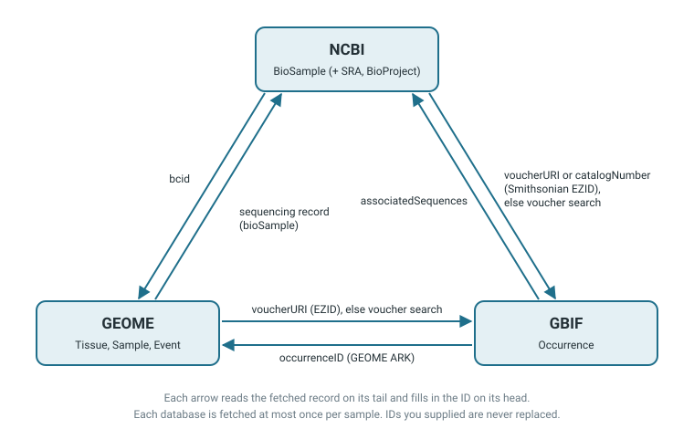
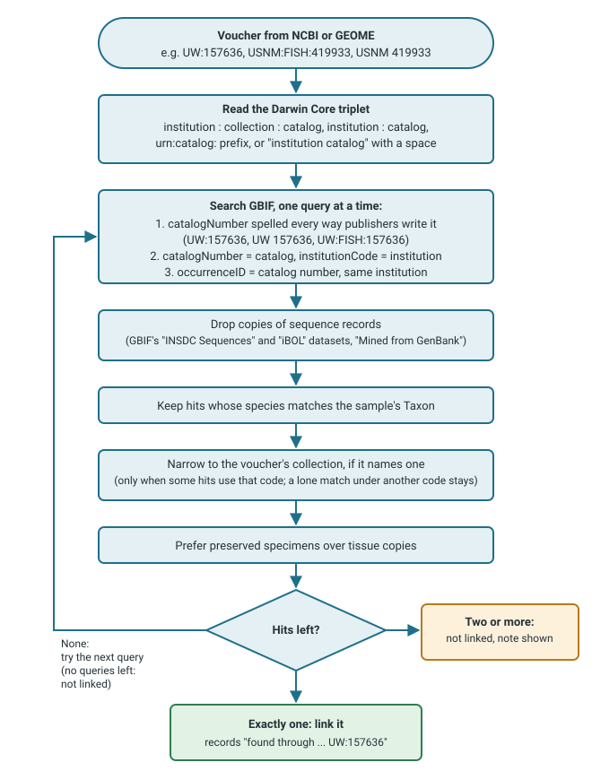
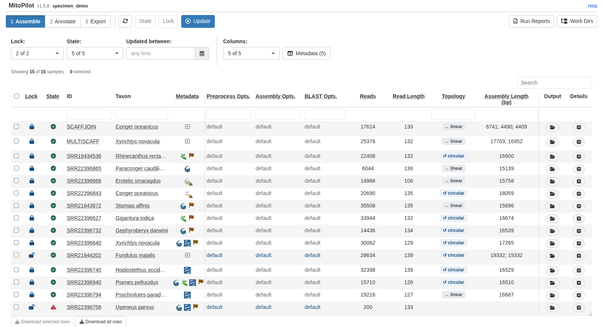
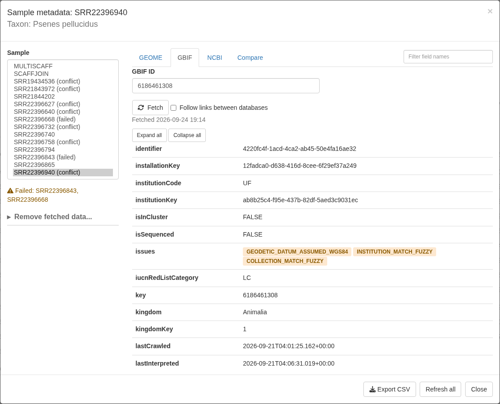
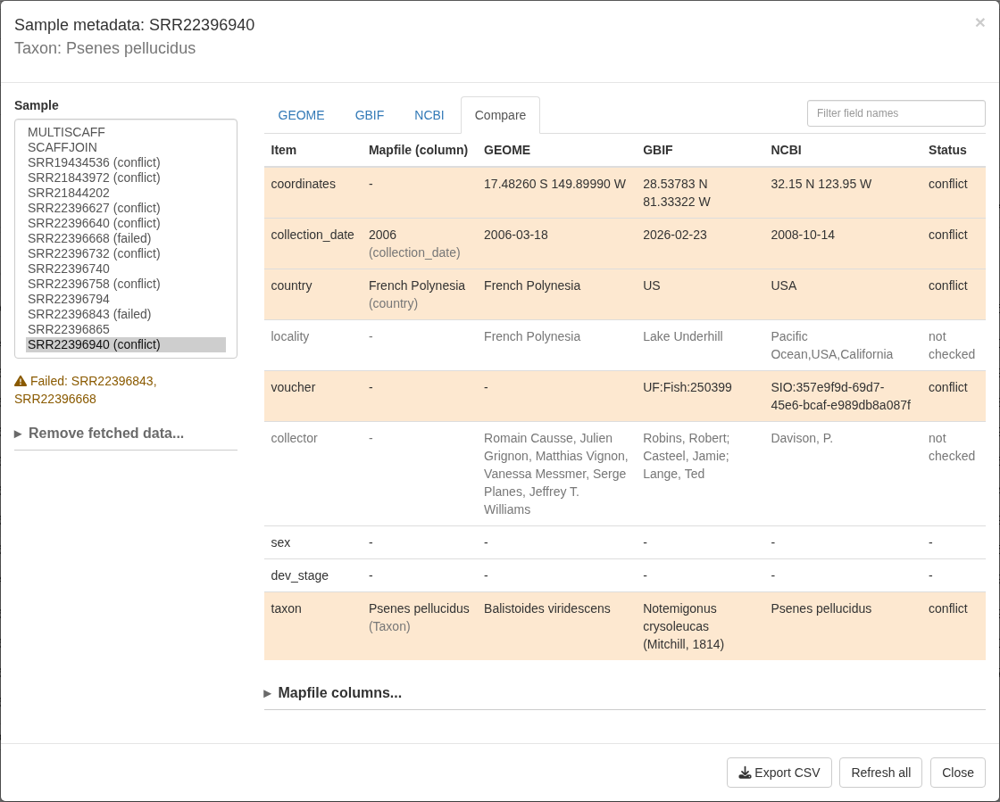
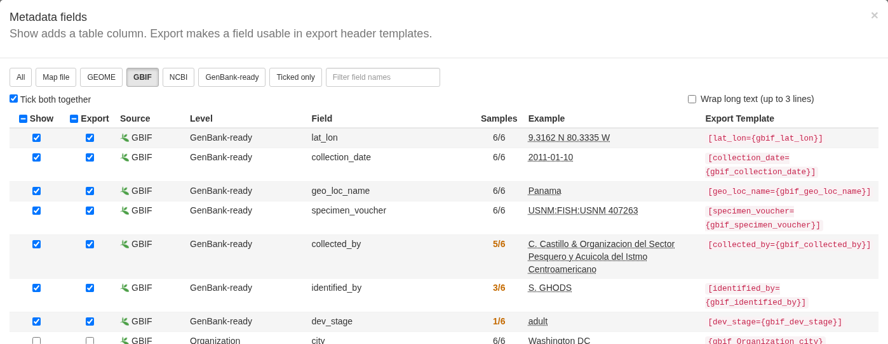
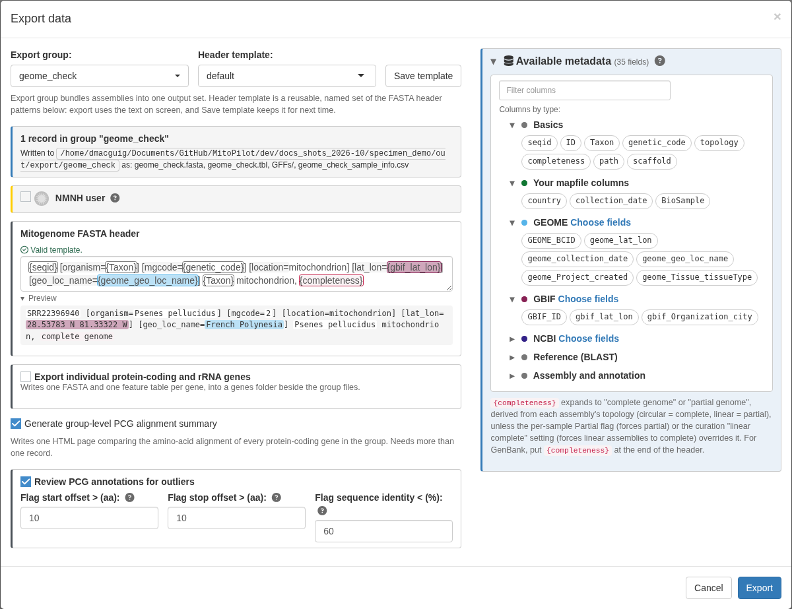
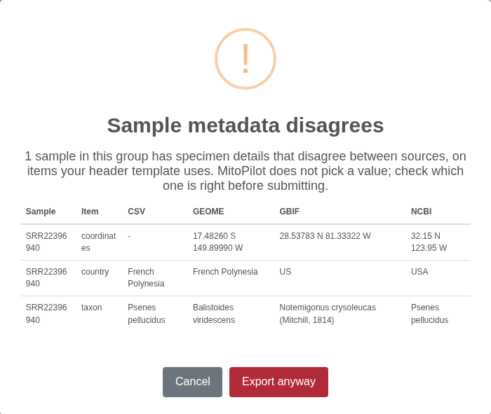

<style>
.alert {
  border-left: 5px solid;
  padding: 10px;
  margin: 10px 0;
  border-radius: 5px;
}
.alert-tip { border-color: #28A745; background-color: #E9F7EF; }
.alert-note { border-color: #007BFF; background-color: #EBF5FF; }
.alert-warning { border-color: #FFC107; background-color: #FFF9E6; }
.alert-danger { border-color: #DC3545; background-color: #F8D7DA; }
strong { font-weight: bold; }
</style>

```{r, include = FALSE}
knitr::opts_chunk$set(eval = FALSE)
```

## What MitoPilot pulls, and from where

MitoPilot can link each sample to specimen records in three public databases:

- [GEOME](https://geome-db.org) (the Genomic Observatories Metadatabase) stores
  specimen, tissue, and collecting-event metadata. Every record has a BCID, a
  persistent identifier such as `ark:/21547/CXu2MBIO1000.1`. Given a BCID,
  MitoPilot fetches that record, walks up its parent records (for example
  Tissue, then Sample, then collecting Event), and adds the GEOME expedition
  and project.
- [GBIF](https://www.gbif.org) (the Global Biodiversity Information Facility)
  publishes occurrence records from museums and other collections. Every
  occurrence has a gbifID, a number such as `6186461308`. Given a gbifID (or
  EZID for Smithsonian NMNH records), MitoPilot fetches the occurrence, the dataset it belongs to, and the
  organization that published it.
- [NCBI BioSample](https://www.ncbi.nlm.nih.gov/biosample) describes the
  biological material behind sequence data in GenBank and the SRA. Every
  BioSample has an accession such as `SAMN29555051`. Given a BioSample, or an
  SRA accession such as `SRR21844202` that links to one, MitoPilot fetches the
  BioSample with all of its attributes and the BioProject(s) it belongs to.

Everything is stored in the project database, so you can:

- browse the full records for each sample in the app,
- see where your mapping file, GEOME, GBIF, and NCBI disagree, and
- pick fields, including GenBank-ready source modifiers such as `lat_lon` and
  `collection_date`, to use in FASTA headers at export.

MitoPilot never merges values or picks one source over another. Each source
keeps its own fields, and you decide which ones go into your headers.

All links are optional. Projects without BCIDs, gbifIDs, or BioSamples work
exactly as before.

<div class="alert alert-warning">
<strong>Public records only.</strong> MitoPilot reads public GEOME records and
public GBIF occurrences and public NCBI BioSamples. Private GEOME projects are not supported yet, because
logging in to GEOME from another program needs credentials issued by the GEOME
team.
</div>

## Finding the identifiers

**GEOME BCID.** Open a record on [geome-db.org](https://geome-db.org) (a tissue,
sample, or event) and copy its identifier, which starts with `ark:/`. Use the
BCID of the most specific record that matches your sequenced material, usually
the tissue: MitoPilot fetches everything above it. Full URLs are trimmed to the
bare ARK, so all of these work:

```
ark:/21547/CXu2MBIO1000.1
https://n2t.net/ark:/21547/CXu2MBIO1000.1
https://geome-db.org/record/ark:/21547/CXu2MBIO1000.1
```

**GBIF ID.** Open the occurrence on [gbif.org](https://www.gbif.org) and copy
the number at the end of its address. The number and both link forms work:

```
6186461308
https://www.gbif.org/occurrence/6186461308
https://api.gbif.org/v1/occurrence/6186461308
```

Smithsonian NMNH specimens can use their EZID instead. MitoPilot looks up the
matching GBIF occurrence, so the specimen must already be on GBIF. The bare ARK
and both link forms work, with or without dashes:

```
ark:/65665/35921f3971d824c6ca6ce808364d17e8d
http://n2t.net/ark:/65665/35921f397-1d82-4c6c-a6ce-808364d17e8d
https://collections.nmnh.si.edu/search/fishes/?ark=ark:/65665/35921f3971d824c6ca6ce808364d17e8d
```

An EZID never changes, so it is a safer choice than a gbifID for NMNH
specimens.

<div class="alert alert-note">
<strong>GBIF IDs can change.</strong> GBIF may give an occurrence a new gbifID
when its dataset is republished. If an ID that used to work stops resolving,
MitoPilot keeps the data it fetched before and shows the fetch as failed. Look
the specimen up again on gbif.org (the stored <code>occurrenceID</code> and
catalog number help) and paste the new ID.
</div>

Some GEOME projects also publish to GBIF. Their GBIF occurrences carry the
GEOME ARK in `occurrenceID` or `catalogNumber`, and their publisher is "The
Genomic Observatories Metadatabase (GeOMe)". MitoPilot does not link the two
automatically; add both IDs if you want both.

**NCBI BioSample or SRA accession.** Copy the BioSample accession from
[NCBI BioSample](https://www.ncbi.nlm.nih.gov/biosample), or the SRA accession
of your reads. Upper or lower case, bare BioSample numbers, and NCBI links all
work:

```
SAMN29555051
29555051
https://www.ncbi.nlm.nih.gov/biosample/SAMN29555051
SRR21844202                 (an SRA run; ERR and DRR runs work too)
SRX17832658                 (an SRA experiment)
SRS14384543                 (an SRA sample)
```

For an SRA accession, MitoPilot finds its linked BioSample and also stores the
SRA details (run, experiment, study, platform, and library). If your sample IDs
are SRA runs, you do not need a separate column; see below.

## Adding identifiers at project setup

Add a column of BCIDs, gbifIDs, or BioSample/SRA accessions (any or all) to
your mapping file (see
[Running Your Own Project](Your-Own-Project.html#the-mapping-file)), and name
them with `mapping_geome`, `mapping_gbif`, and `mapping_biosample`:

```
ID,Taxon,R1,R2,Tissue_BCID,Occurrence
FISH01,Psenes pellucidus,FISH01_R1.fastq.gz,FISH01_R2.fastq.gz,ark:/21547/CXu2MBIO1000.1,
FISH02,Notemigonus crysoleucas,FISH02_R1.fastq.gz,FISH02_R2.fastq.gz,,6186461308
FISH03,Conger oceanicus,FISH03_R1.fastq.gz,FISH03_R2.fastq.gz,,
```

```r
new_project(path = "my_project", mapping_fn = "mapping.csv",
            mapping_geome = "Tissue_BCID", mapping_gbif = "Occurrence",
            data_path = "reads/")
```

- The columns are stored in the project as `GEOME_BCID`, `GBIF_ID`, and
  `BioSample`. If your columns already have those names, leave out
  `mapping_geome`, `mapping_gbif`, and `mapping_biosample`.
- When your sample IDs are SRA runs (or BioSamples), point `mapping_biosample`
  at the ID column: `mapping_biosample = "ID"`. Samples whose ID is not a
  BioSample or SRA accession are simply left without an NCBI link.
- Blank cells are fine: those samples simply have no link.
- MitoPilot fetches the records during setup, which needs an internet
  connection. When setting up offline, pass `fetch_geome = FALSE`,
  `fetch_gbif = FALSE`, and `fetch_biosample = FALSE`, then run
  `fetch_geome()`, `fetch_gbif()`, and `fetch_biosample()` later.

`new_project_userAsmb()` takes the same arguments.

## Adding or changing identifiers later

`add_samples()` and `update_sample_metadata()` accept `mapping_geome`,
`mapping_gbif`, `mapping_biosample`, `fetch_geome`, `fetch_gbif`, and
`fetch_biosample` too. With
`update_sample_metadata()`, samples whose identifier changed (or was added) are
fetched again, and a blank cell removes that sample's link and its data for
that source only.

To fetch again without touching the mapping file:

```r
fetch_geome("my_project")                     # refresh every BCID
fetch_gbif("my_project")                      # refresh every gbifID
fetch_gbif("my_project", ids = "FISH02")      # refresh one sample
fetch_gbif("my_project", ids = c("FISH01", "FISH02"),
           gbifs = c("2336663130", "6186461308"))
```

The last form sets (or replaces) the gbifIDs of those samples before fetching;
`fetch_geome()` does the same with `bcids`, and `fetch_biosample()` with
`biosamples`. A blank value removes the link.

For NCBI, `from_id = TRUE` uses each sample's own ID as its BioSample value
when that ID is a BioSample or SRA accession, then fetches:

```r
fetch_biosample("my_project", from_id = TRUE)        # every sample with an SRR/SAMN ID
fetch_biosample("my_project", ids = "FISH03", biosamples = "SAMN29555051")
```

NCBI allows three requests per second. For larger projects, get a free
[NCBI API key](https://www.ncbi.nlm.nih.gov/books/NBK25497/) and set it
before fetching, for example in your `.Renviron` file:
`ENTREZ_KEY=your_key`. MitoPilot then makes up to ten requests per second.

When some fetches fail, the functions finish the rest and then give one warning
listing each failed sample with the reason, for example:

```
Warning message:
GBIF fetch failed for FISH02 (GBIF occurrence not found (IDs can change when a dataset is republished))
```

Records are fetched when you run these functions, not when the pipeline runs.

## Resolving records across databases

The three databases often point at each other. A BioSample submitted through
GEOME names its GEOME tissue record; a GEOME record names the museum voucher,
which is on GBIF; a Smithsonian GBIF record lists the BioSample and SRA runs
sequenced from it. With linking turned on, MitoPilot reads each record it
fetches for IDs of the other databases, adds the ones a sample does not have
yet, and fetches those too. One column of SRA runs can then bring in all three
records for every sample.

Linking is off by default, because it makes extra requests and fills in IDs you
did not type. Turn it on for a project at setup, for one fetch, or in the app:

```r
new_project(path = "my_project", mapping_fn = "mapping.csv", data_path = "reads/",
            mapping_biosample = "ID", link_sources = TRUE)
fetch_biosample("my_project", link_sources = TRUE)   # this fetch only
```

In the sample metadata viewer, tick **Follow links between databases** next to
**Refresh all**. The setting is saved in the project: `link_sources = TRUE` at
setup and the checkbox both turn it on for later fetches, and `fetch_*()`
follow it unless you pass `link_sources = TRUE` or `FALSE`.



| From | To | Where the link is read |
|---|---|---|
| NCBI BioSample | GEOME | the `bcid` attribute (samples submitted to the SRA through GEOME) |
| NCBI BioSample | GBIF | a Smithsonian EZID in `voucherURI` or `catalogNumber`; otherwise a search for the `specimen_voucher` (see below) |
| GEOME | NCBI | the tissue's sequencing record, which names its BioSample (one extra GEOME request) |
| GEOME | GBIF | a Smithsonian EZID in `voucherURI` or `catalogNumber`; otherwise a search for `genbankSpecimenVoucher` or `materialSampleID` |
| GBIF | NCBI | a BioSample (or else an SRA run) listed in `associatedSequences` |
| GBIF | GEOME | a GEOME ARK in `occurrenceID` or `materialSampleID` (datasets GEOME publishes to GBIF) |

Rules that keep linking safe:

- **Your IDs always win.** MitoPilot only fills a database a sample has no ID
  for. If a record points to a different ID than the one you gave, yours is
  kept and the viewer shows a note such as "NCBI record links to ark:/...; kept
  your ID ark:/...".
- **Each database is fetched at most once per sample**, so links cannot loop.
- **A failed linked fetch never fails the fetch that found it.** The linked
  source simply shows as failed, like any other fetch.
- **Every linked ID says where it came from.** The viewer tab shows, for
  example, "Found through NCBI BioSample voucherURI", and the Metadata column
  tooltip adds "(linked from ...)".

### Matching a voucher to a GBIF record

Only Smithsonian specimens carry an EZID that points straight at a GBIF record.
For other museums MitoPilot searches GBIF for the voucher, which GenBank writes
as `institution:collection:catalog` (for example `UW:157636`,
`USNM:FISH:419933`). GBIF stores catalog numbers in several forms, so it tries
three queries in turn, then filters the hits strictly and links only when
exactly one specimen is left:



The species check matters: one catalog number can belong to many specimens (a
museum lot such as `SIO 09-320` holds 27 species, and `USNM 419933` exists in
the fish, herpetology, and mammal collections). When several specimens still
match, nothing is linked and the viewer says "N possible GBIF matches for
...; not linked"; paste the right gbifID yourself. Vouchers without an
institution code, or specimens the museum has not published to GBIF, cannot be
matched.

<div class="alert alert-note">
<strong>Records can disagree about sequencing runs.</strong> GEOME's sequencing
record may name a different SRA run than the one you assembled (for example
when a tissue was sequenced twice). MitoPilot links by BioSample, which both
runs share, so the NCBI record is still the right one.
</div>

## Viewing records in the app

### The Metadata column

The Assemble, Annotate, and Export tables have a **Metadata** column right after
**Taxon**. It shows one icon for each source the sample has an ID for, plus a
flag when the sources disagree:

| Icon | Meaning |
|---|---|
| GEOME "G" | The sample has a GEOME BCID and its record was fetched. |
| GBIF leaf | The sample has a GBIF ID and its record was fetched. |
| NCBI helix | The sample has a BioSample or SRA accession and its record was fetched. |
| Faded logo | That source has an ID but has not been fetched yet. |
| Faded logo with a small warning triangle | The fetch from that source failed. Hover to see why. |
| Orange flag | The sources disagree on at least one item (see [Comparing sources](#comparing-sources)). |
| Faint plus | No GEOME BCID, GBIF ID, or BioSample. |

Hovering over an icon lists each source with its status, then any items in
conflict and any items that were not checked.



The column is always shown. To add identifiers from the app, click a sample's
plus icon.

### Showing metadata in the tables

The **Metadata** button next to each table's **Columns** picker chooses which
metadata fields appear as table columns. The choice is saved in the project and
shared by the Assemble, Annotate, and Export tables. You can temporarily hide
all metadata fields using the `Columns` picker.

The window lists every field that has a value for at least one sample: the
extra columns from your mapping file, then GEOME, GBIF, and NCBI fields, with
the number of samples that have each one and an example value. Use the search
box, or the **Map file**, **GEOME**, **GBIF**, and **NCBI** buttons, to narrow
the list, and click rows to tick them. Mapping-file fields start ticked; GEOME,
GBIF, and NCBI fields start unticked. **Clear all** unticks everything.

This only changes what you see. What goes into exported files is set with
**Choose fields** (see [Using metadata fields at export](#using-metadata-fields-at-export)).

### The sample metadata viewer

Click any icon in the Metadata column to open the viewer for that sample. The title shows the
sample ID and its Taxon; **Sample** on the left lists every sample, with
"(failed)" or "(conflict)" after samples that need attention.

Clearing an identifier box and clicking **Fetch** removes that link. **Refresh all**
fetches every sample's GEOME, GBIF, and NCBI records again. Tick **Follow links
between databases** to let fetches fill in IDs for the other databases (see
[Resolving records across databases](#resolving-records-across-databases)).

The **NCBI** tab has a **Use sample ID** button: when the sample ID is an SRA
run or BioSample, it copies the ID into the box and fetches. Records are shown
as SRA (when you gave an SRA accession), BioSample, and BioProject cards, each
linked to its NCBI page.



### Comparing sources

The **Compare** tab lists each item MitoPilot checks, with the value from your
mapping file (and the column it came from), from GEOME, from GBIF, and from
NCBI, and a status:

| Status | Meaning |
|---|---|
| agree | Every source that has a value agrees. |
| not checked | MitoPilot does not judge this difference: the values are free text, or a value could not be read. |
| conflict | A real disagreement. |
| single | Only one source has a value. |
| - | No source has a value. |

Blanks never conflict: only sources that both have a value are compared.
BioSample placeholders such as `missing`, `not collected`, `not applicable`, or
`restricted access` count as blank. NCBI's country and locality come from the
two parts of `geo_loc_name`, and its taxon from the BioSample organism.



#### Which mapping-file columns are compared

MitoPilot finds your mapping-file columns by name (ignoring case):

| Item | Columns tried, first match wins |
|---|---|
| coordinates | `lat_lon`; or a latitude column (`lat`, `latitude`, `decimalLatitude`) plus a longitude column (`lon`, `long`, `longitude`, `decimalLongitude`) |
| collection_date | `collection_date`, `date`, `eventDate` |
| country | `country`, `geo_loc_name` (the part before `:`) |
| locality | `locality` |
| voucher | `specimen_voucher`, `voucher`, `catalogNumber` |
| collector | `collected_by`, `collector`, `recordedBy` |
| sex | `sex` |
| dev_stage | `dev_stage`, `life_stage`, `lifeStage` |
| taxon | `Taxon` (always) |

If a column has another name, or a matching name holds something else, open
**Mapfile columns...** at the bottom of the Compare tab, pick the column for each
item (or **(none)** to skip it), and click **Save columns**. Leaving a box
empty goes back to automatic detection. The same works from R:

```r
set_metadata_columns("my_project", country = "Country_Name",
                     coordinates = c("Lat_DD", "Long_DD"))
set_metadata_columns("my_project", country = NA)   # back to automatic
set_metadata_columns("my_project", sex = "")       # do not compare sex
```

## Removing fetched data

**Remove fetched data...** under the sample list in the viewer deletes records
MitoPilot fetched. Tick the sources to remove (GEOME, GBIF, NCBI; all are
ticked to start), choose **This sample** or **All samples**, and click
**Remove**. The same from R:

```r
remove_metadata("my_project")                             # everything fetched
remove_metadata("my_project", sources = "GBIF")           # one source
remove_metadata("my_project", sources = c("GEOME", "GBIF"), ids = "FISH02")
```

Only fetched data goes: the stored records, their fetch status, and IDs that
linking filled in. These are always kept:

- every column of your mapping file,
- the IDs you supplied, in the mapping file, in the app, or with `fetch_*()`
  (including the ID column used as `BioSample`), so **Refresh all** or
  `fetch_*()` brings the data back,
- the fields ticked in **Set Export Metadata** and the **Metadata** button;
  they stay empty until you fetch again.

## Using metadata fields at export

Fetched data does not reach your exported files until you choose which fields
to use. In the Export module, click **Set Export Metadata** in the toolbar.



The window has a **GEOME**, a **GBIF**, and an **NCBI** section. Each starts with
**GenBank-ready combinations**: values built from one or more fields in the
format GenBank expects for a FASTA source modifier, each with an example and the
number of samples that have one. Below that, a table lists every raw field found
in the project's records; use its search box to find a field, and click rows to
tick them. Nothing is ticked by default. Click **Save** and each ticked field
can be used in export header templates and is written to the sample summary
CSV. To see a field in the tables, use the **Metadata** button instead.

### GEOME combinations

Source fields are taken from the nearest level that has them (a tissue value
wins over a sample value, which wins over an event value).

| Column | Built from | Example |
|---|---|---|
| `geome_lat_lon` | `decimalLatitude`, `decimalLongitude` | `17.48260 S 149.89990 W` |
| `geome_collection_date` | `yearCollected`, `monthCollected`, `dayCollected` | `2006-03-18`, `2009-11`, or `2009` |
| `geome_geo_loc_name` | `country`, then `stateProvince` and `locality` | `French Polynesia: Moorea` |
| `geome_specimen_voucher` | `catalogNumber` (required; skipped if it is a web address or ARK), `institutionCode` (optional prefix) | `UF:12345` |
| `geome_collected_by` | `collectorList` | as in GEOME |
| `geome_tissue_type` | `tissueType` | as in GEOME |
| `geome_sex` | `sex` | as in GEOME |
| `geome_dev_stage` | `lifeStage` | as in GEOME |

### GBIF combinations

Built from the occurrence only (never from the dataset or organization).

| Column | Built from | Example |
|---|---|---|
| `gbif_lat_lon` | `decimalLatitude`, `decimalLongitude` | `28.53783 N 81.33322 W` |
| `gbif_collection_date` | `year`, `month`, `day`; else `eventDate` when it is a single date | `2026-02-23`, `2026-02`, or `2026` |
| `gbif_geo_loc_name` | `country`, then `stateProvince` and `locality` | `United States of America: Florida, Lake Underhill` |
| `gbif_specimen_voucher` | `institutionCode`, `collectionCode`, `catalogNumber` (required) | `UF:Fish:250399` |
| `gbif_collected_by` | `recordedBy` | as in GBIF |
| `gbif_identified_by` | `identifiedBy` | as in GBIF |
| `gbif_sex` | `sex` | lowercased |
| `gbif_dev_stage` | `lifeStage` | lowercased |

A combination is empty for a sample unless its required parts exist. Two GBIF
rules keep questionable values out of your headers:

- `gbif_lat_lon` is empty when GBIF flags the coordinates with
  `ZERO_COORDINATE`, `COORDINATE_INVALID`, or `COORDINATE_OUT_OF_RANGE`. Other
  flags, such as `COORDINATE_ROUNDED` or `COUNTRY_COORDINATE_MISMATCH`, are
  shown in the viewer but do not empty the value, so check them yourself.
- `gbif_specimen_voucher` is empty when the catalog number is a web address or
  an ARK rather than a real catalog number.

GBIF's `country` is its own English name (`United States of America`), which
is not always the name GenBank expects (`USA`). Check `geo_loc_name` values
against GenBank's country list before submitting.

### NCBI combinations

BioSample attributes already use GenBank's source-modifier names, so most NCBI
combinations pass the BioSample value through. Placeholders such as `missing`
or `not collected` (including forms like `missing: control sample`) give an
empty value.

| Column | Built from | Example |
|---|---|---|
| `ncbi_lat_lon` | `lat_lon` (a decimal pair is converted) | `44.5 N 63.1 W` |
| `ncbi_collection_date` | `collection_date` | `2024-06-27` |
| `ncbi_geo_loc_name` | `geo_loc_name` | `Canada: Nova Scotia` |
| `ncbi_specimen_voucher` | `specimen_voucher` | as in NCBI |
| `ncbi_collected_by` | `collected_by` | as in NCBI |
| `ncbi_identified_by` | `identified_by` | as in NCBI |
| `ncbi_sex` | `sex` | lowercased |
| `ncbi_dev_stage` | `dev_stage` | lowercased |
| `ncbi_biosample` | BioSample accession | `SAMN29555051` |
| `ncbi_bioproject` | first BioProject accession | `PRJNA720393` |

`ncbi_biosample` and `ncbi_bioproject` are not FASTA source modifiers, so their
chips insert a plain column such as `{ncbi_biosample}`; use them in the sample
summary or in your own notes. GenBank links a submission to its BioSample and
BioProject in the submission form, not in the FASTA header.

Raw fields become columns named `geome_<Level>_<field>`,
`gbif_<Level>_<field>`, or `ncbi_<Level>_<field>`, for example
`geome_Tissue_tissueType`, `gbif_Occurrence_occurrenceID`, or
`ncbi_BioSample_isolate`.

### Adding columns to a header template

The **Available columns** list in the Export Data window groups every column you
can use: **Basics**, **Your mapfile columns**, **GEOME**, **GBIF**, **NCBI**,
**Reference (BLAST)**, and **Assembly and annotation**. Click a column to insert it at the
cursor of the header box you last clicked (the mitogenome FASTA header box if
you have not clicked one). A GenBank-ready combination inserts the whole source
modifier, for example `[lat_lon={geome_lat_lon}]`. Hover over a column to see its
value for the first row of any export group, and type in the filter box to
find one. **Choose fields** next to GEOME, GBIF, or NCBI opens the Metadata fields
window (this closes the Export Data window, so save your template first).



A template using GEOME and GBIF fields:

```
{seqid} [organism={Taxon}] [mgcode={genetic_code}] [location=mitochondrion] [lat_lon={gbif_lat_lon}] [collection_date={gbif_collection_date}] [geo_loc_name={geome_geo_loc_name}] [specimen_voucher={gbif_specimen_voucher}] {Taxon} mitochondrion, {completeness}
```

<div class="alert alert-warning">
<strong>Empty values stay in the header.</strong> If a sample has no value for
a field, the header still gets the modifier with nothing after it, such as
<code>[lat_lon=]</code>, which GenBank rejects. Only add a modifier to a template
when every sample in the export group has a value for it. MitoPilot never
changes your templates on its own.
</div>

### The conflict warning at export

When you click **Export**, MitoPilot checks which items your header templates
use: GEOME, GBIF, and NCBI combinations and raw fields, and mapping-file columns
matched to an item (including `{Taxon}`). If any sample in the export group has
a **conflict** on one of those items, a warning lists each sample, item, and the
differing values. Click **Export anyway** to continue or **Cancel** to go back
and fix the data or the template. Items marked not checked never trigger the warning.



The ticked columns are also written to the group's `sample_info` CSV.

## Limits and troubleshooting

- **Public records only** (see above).
- **Internet access is needed** by the machine running R or the app, since
  that is where GEOME, GBIF, and NCBI are contacted. Compute nodes running the
  pipeline never contact them.
- **A failed refresh of the same identifier keeps the previous data.** Only the
  status changes to failed. Changing a sample to a different identifier clears
  its old record for that source right away, even if the new fetch then fails.

Messages you may see in the viewer, on a warning icon, or in a fetch warning:

| Message | Meaning |
|---|---|
| `BCID not found in GEOME` | GEOME has no record with that identifier. GEOME answers unknown IDs with a server error, so a typo in a well-formed BCID shows up this way. |
| `record is private or needs a GEOME login` | The record belongs to a private GEOME project. |
| `could not reach GEOME (...)` | No connection to `api.geome-db.org`. Try again later with `fetch_geome()` or **Refresh all**. |
| `'x' is not a GEOME BCID (expected ark:/NNNNN/...)` | The value does not look like a BCID. |
| `BCID not recognized by GEOME` | GEOME rejected the identifier as malformed. |
| `GEOME returned HTTP ...` | Any other error from GEOME. Try again later. |
| `GBIF occurrence not found (IDs can change when a dataset is republished)` | GBIF has no occurrence with that gbifID. It may have been replaced when its dataset was republished; look the specimen up again on gbif.org. |
| `could not reach GBIF (...)` | No connection to `api.gbif.org`. Try again later with `fetch_gbif()` or **Refresh all**. |
| `'x' is not a GBIF occurrence ID (expected digits)` | The value is not a gbifID or a gbif.org occurrence link. |
| `GBIF returned HTTP ...` | Any other error from GBIF, for example when it is busy. Try again later. |
| `BioSample ... not found` | NCBI has no BioSample with that accession or number. |
| `SRA accession ... not found` | NCBI has no SRA record with that accession. |
| `SRA accession ... has no linked BioSample` | The SRA record exists but is not linked to a BioSample. Add the BioSample accession instead. |
| `could not reach NCBI (...)` | No connection to `eutils.ncbi.nlm.nih.gov`. Try again later with `fetch_biosample()` or **Refresh all**. |
| `'x' is not a BioSample or SRA accession (...)` | The value is not a BioSample accession, BioSample number, or SRA accession. |
| `NCBI returned HTTP ...` | Any other error from NCBI, for example when it is busy. Set `ENTREZ_KEY` if you fetch many samples. |
| `N possible GBIF matches for ...; not linked` | Linking found several GBIF specimens for a voucher after all filters. Paste the right gbifID in the GBIF tab. |
| `... record links to ...; kept your ID ...` | A fetched record names a different ID than the one you set. MitoPilot kept yours; check which is right. |
