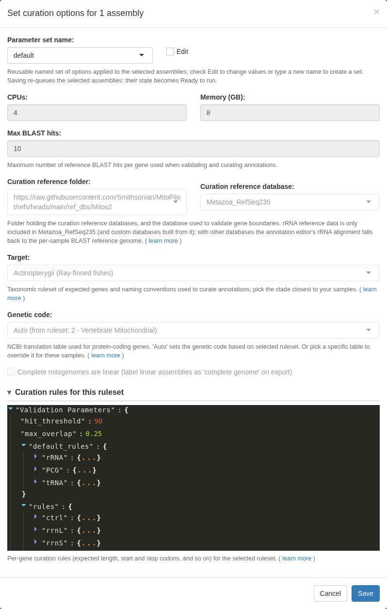
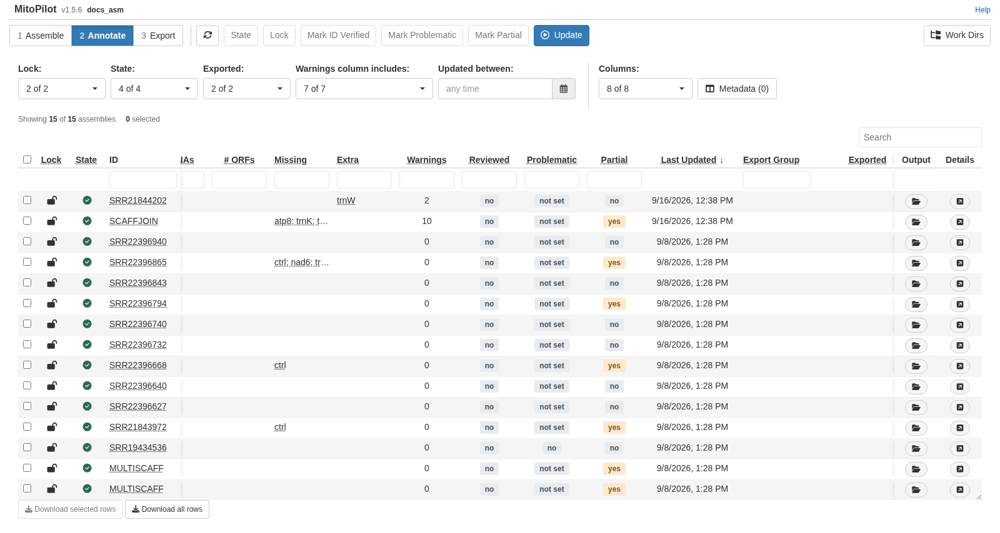
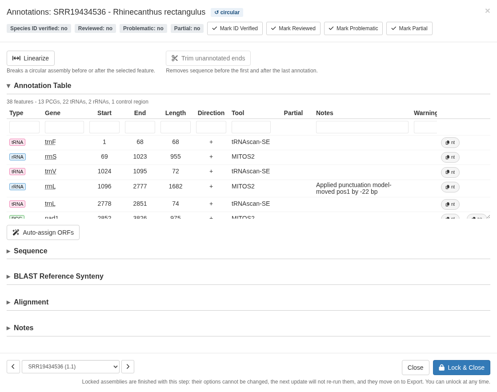
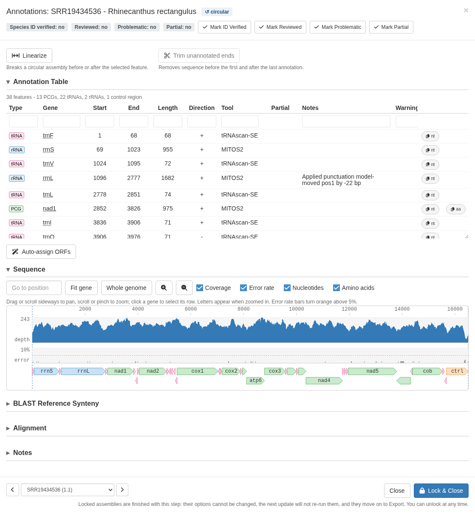
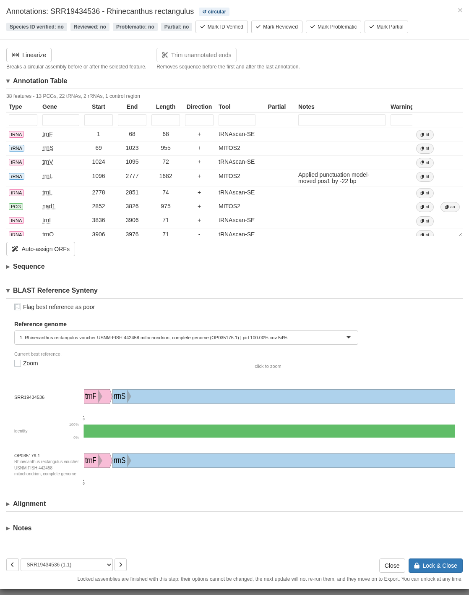
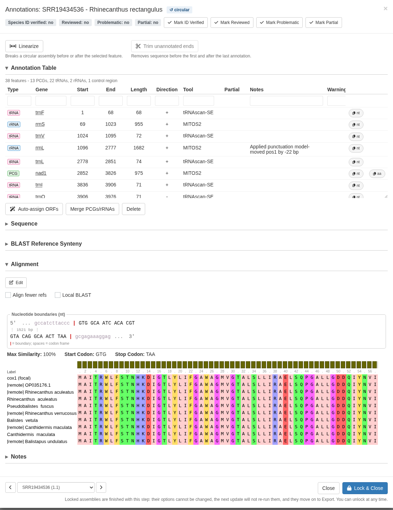
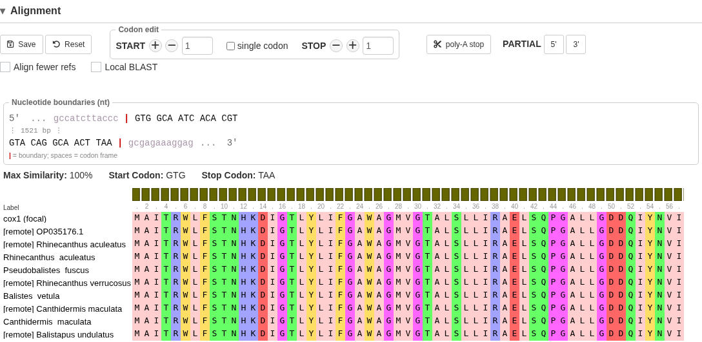

Test project:
<a href="Test-Project-Assemble.html">1. Assemble</a>
2. Annotate
<a href="Test-Project-Export.html">3. Export</a>

This module finds the genes, curates the gene models against reference sequences from GenBank,
and validates the result against rules for your taxonomic group. It attempts to flag any issues
that would cause a rejection during GenBank submission.

Each row here is one **assembly unit**, not one sample. A sample that kept several
scaffolds or paths will be represented by several rows, and each is annotated and validated on its
own.

## Set the options

**Annotate Opts.** controls the annotation tools.

Genes come from [MITOS2](https://gitlab.com/Bernt/MITOS) (protein-coding genes, tRNAs,
and rRNAs) and [tRNAscan-SE](https://github.com/UCSC-LoweLab/tRNAscan-SE)
(tRNAs), with MitoFinder, ARWEN, ARAGORN, and ORFfinder available as optional annotators. 
The MITOS2 reference database defaults to `Chordata`, but `Metazoa_RefSeq89` is the
general-purpose choice for other groups.

**Curate Opts.** controls what MitoPilot does with those raw annotations.

The setting that matters most is **Target**, the taxonomic ruleset. It sets the
expected gene content, the allowed start and stop codons, the naming
conventions, and the genetic code. It defaults to Actinopterygii, which is correct
for the test fishes. 

For your own data, pick the closest clade from the
[ruleset browser](Ruleset-Browser.html). The validation parameters below are the
ruleset itself, laid out so you can see exactly which rules a sample is being
judged against.

<strong>No ruleset for your samples?</strong> If you do not see an appropriate clade for your samples,
please post an
[issue](https://github.com/Smithsonian/MitoPilot/issues) or reach out to
Dan MacGuigan directly at <macguigand@si.edu>. We are always looking to expand the taxonomic scope
of MitoPilot.

When ready, click **UPDATE** and run the workflow the same way you ran Assemble.

This module is slower than Assemble. MITOS2 takes a few minutes per unit,
and curation aligns every protein-coding gene against reference sequences. 
When working on a computing cluster with your own project, consider 
running this step as a job rather than directly from the MitoPilot app.

## Read the results

Scroll right in the table for the columns that matter:

- **PCGCount, tRNACount, rRNACount**: how many of each gene type were annotated.
  For a vertebrate mitogenome you expect 13, 22, and 2.
- **Missing**: expected genes that were not found.
- **Extra**: genes annotated more times than the ruleset expects.
- **Warnings**: how many validation flags were raised. This is your work queue.

A few units stand out in the test project. For example, SRR21844202 has an extra `trnW` and two
warnings. 

SCAFFJOIN is missing `atp8` and `trnK` and carries eight warnings.
This is a real consequence of joining scaffolds across coverage gaps. The
sequence in those gaps is set to "N", so the genes in those gaps cannot be annotated.

<strong>Note.</strong> The <strong>Warnings column includes</strong> dropdown menu at
the top filters which warning types are counted. Narrow it to one warning type to
pull out every sample with that problem and work through them as a batch.

## Inspect a sample

Click `details` on any row. Here we'll look at sample SRR19434536.

The annotation table lists every gene with its position, strand, and the tool
that called it. The **Notes** column records changes made during automatic curation, such as
a start position moved upstream or a stop codon trimmed.
**Warnings** shows what validation flagged. The `nt` and `aa` buttons copy the
nucleotide or amino acid sequence to your clipboard.

The badges along the top track the sample: topology, ID verified, reviewed,
problematic, and partial. The buttons at the bottom toggle them, which is how you
keep track of what you have already looked at across a large project.

Below the table are three collapsible views.

**Coverage Map** plots read depth along the assembly with the gene models drawn below,
zoomed to whichever gene you have selected. The gene bars are
semi-transparent so overlapping gene models are easy to spot.

**BLAST Reference Synteny** lines your annotation up against the closest GenBank
mitogenome, with a percent-identity bar between them. Click anywhere in this plot to show a
zoomed-in base-pair level alignment of your sample
versus the reference.

The reference mitogenome shown in this plot will be exported in your GenBank submission files as a note: 
"annotation compared to GenBank accession XXX".
If the reference mitogenome is a poor match, you can flag it (remove the submission note)
or use the dropdown menu to pick a better reference from among the top BLAST hits.

**Alignment** shows a selected protein-coding gene aligned to its reference hits
and the curation database.

The nucleotide boundary box shows the exact sequence at each end of the gene with
the codon frame marked, along with the start and stop codons that were called.
Below it, the protein alignment shows your gene ("focal") alongside the reference
proteins.

## Manually fix annotations

Click **EDIT** in the alignment section to nudge the start or stop position 
and watch the alignment respond. 

By default, the `+` and `-` buttons search
for the next valid start or stop codon (according to the curation ruleset you selected). 
You can toggle the `single codon` button to
instead nudge the position one codon at a time. This can lead to a **partial**
gene model with undetermined start or stop codons.

Clicking the `poly-A stop` button will truncate a stop codon to **TA** or **T**. 
Sometimes this is required by GenBank to avoid overlapping gene models. When transcribed,
these genes will have their stop codon completed by the addition of the 3' poly-A tail.

You can manually set a gene to have an undetermined start or stop codon by clicking the
Partial `5'` or `3'` buttons. MitoPilot will add the appropriate format and notes for that gene
in the GenBank submission files. Best to use this sparingly, as GenBank may not accept a submission
with many "partial" gene models.

Other useful editing tools:

- **Merge PCGs/rRNAs** joins gene models that were split into separate pieces,
  which is how you handle spliced or fragmented genes.
- **Auto-assign ORFs** renames open reading frames found by ORFfinder based
  on sequence similarity with the curation database of protein-coding genes.
- **Delete** removes an annotation entirely. Bring back a deleted annotation
  using the **Restore** button.
- **Trim unannotated ends** cuts assembly overhang that carries no genes, can
  be undone.
- **Linearize** converts a circular assembly to linear, useful when the control
  region assembled poorly. 
- **Align fewer refs** in the Alignment panel speeds up editing by restricting the alignment to the top
  five hits, which matters because the alignment is recomputed on every start/stop codon nudge.

You can record what you did in the **Notes** box; it saves automatically and is retained
with the sample.

<strong>Warning.</strong> Validation warnings do not disappear when you fix the
underlying problem. They record the state at the time the Annotate module ran. Use the
<strong>Reviewed</strong> toggle to track what you have actually dealt with.

## Lock and move on

When you are satisfied, select the samples and click **LOCK** to release them to
the Export module.

<a href="Test-Project-Export.html">Next: Export &rarr;</a>

