<style>
.alert {
  border-left: 5px solid;
  padding: 10px;
  margin: 10px 0;
  border-radius: 5px;
}
.alert-tip { border-color: #28A745; background-color: #E9F7EF; }
.alert-note { border-color: #007BFF; background-color: #EBF5FF; }
.alert-warning { border-color: #FFC107; background-color: #FFF9E6; }
.alert-danger { border-color: #DC3545; background-color: #F8D7DA; }
strong { font-weight: bold; }
</style>


# `{MitoPilot}` - Test Project Tutorial

## Installation

Before running MitoPilot with your own samples, we recommend trying out the included test project consisting of Illumina data for 12 fish species. The following document will walk you through the process of analyzing the test dataset.

First, make sure you have [R
(\>=4.0.0)](https://www.r-project.org/) and
[Nextflow](https://www.nextflow.io/docs/latest/install.html) installed. This tutorial also assumes that you are using [RStudio](https://posit.co/download/rstudio-desktop/) to interface with R. If you're working on a computing cluster, we recommend checking out [RStudio Server](https://posit.co/products/open-source/rstudio-server/). We have provided detailed instructions for using RStuio Server on the [Smithsonian Hydra](SI_NMNH_Hydra_README.md) and [NOAA SEDNA](NOAA_SEDNA_README.md) computing clusters.  

Next you'll need to install the `{MitoPilot}` R package from GitHub. Within RStudio, run the following.

```{r eval=F}
if (!requireNamespace("BiocManager", quietly = TRUE)) {
    install.packages("BiocManager")
}
BiocManager::install("JonahVentures/MitoPilot")
```
## Project Initialization

Now we can initialize the test project. For your own data, you would use the function `MitoPilot::new_project`. However, for the test data, we'll use `MitoPilot::new_project`.

```{r eval=F}
# load the package
library(MitoPilot)

# specify the directory where your test project will be created
wd = "/pool/public/genomics/macguigand/MitoPilot/testing/2024_12_13"

# specify an execution environment, "local", "NMNH_Hydra", or "NOAA_SEDNA"
ex = "NMNH_Hydra"

# initialize the test project
MitoPilot::new_test_project(
    path = wd, 
    executor = ex, 
    container = "drleopold/mitopilot",
    full_size = FALSE,
    Rproj = FALSE
)
```

<div class="alert alert-note">
  <strong>Note:</strong> UNDER DEVELOPMENT. If you are using an execution environment that is not currently supported, you could use `config = config.MyEnv` to pass a custom Nextflow config to the `new_test_project` function.
</div>

If the test project is successfully intialized, you should see the following.

```
SRR22396794 - Psychrolutes paradoxus  
SRR22396940 - Psenes pellucidus
SRR22396740 - Hoplostethus occidentalis
SRR21844202 - Fundulus majalis
SRR22396640 - Xyrichtys novacula
SRR22396732 - Gephyroberyx darwinii
SRR22396627 - Gigantura indica
SRR21843972 - Stomias affinis
SRR22396843 - Conger oceanicus
SRR22396668 - Erotelis smaragdus
SRR22396758 - Upeneus parvus
SRR22396865 - Paraconger caudilimbatus
Project initialized successfully.
Please open and review the .config file to ensure all required options are specified.
```

## Exploring the MitoPilot GUI

We can now launch the R Shiny Graphical User Interface (GUI) to examine our test project and start the MitoPilot analysis pipeline.

```{r eval=F}
# the function to launch the GUI must be called from within your project's directory
setwd(wd)
MitoPilot::MitoPilot()
```
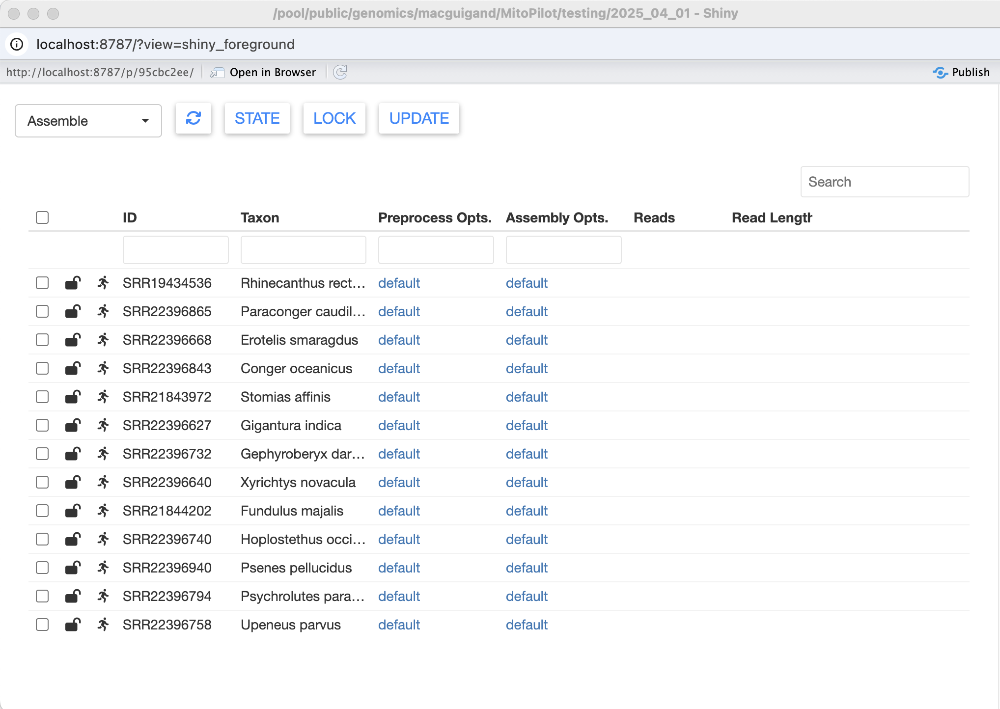

Nice! We can see some basic information about our samples. When initializing your own project, this is pulled from the mapping CSV file.

You can sort the samples by any column simply by clicking on the header. You can also filter samples using the search box in the top right.

To the left of the sample ID column are two icons. The first shows whether the sample is locked or unlocked. If a sample is unlocked, it will be included when running the current pipeline module. A locked sample cannot be edited for the current module, but will be made available for the next pipeline module. You can toggle the lock by selecting the sample (check mark), then pressing `LOCK` at the top of the window. Multiple samples can be locked or unlocked simultaneously.

The other icon shows the state of the sample. These states vary depending on the analysis module and will be automatically updated when running the pipeline. However, you can also manually change the state of a sample by selecting the sample and using the `STATE` button. 

## Modifying Pipeline Parameters

Within the GUI, we can modify options for each step of the current pipeline module. Select all samples by clicking the empty checkbox at the top left of the table. Then click on one of the `default` links in the `Preprocess Opts` column.

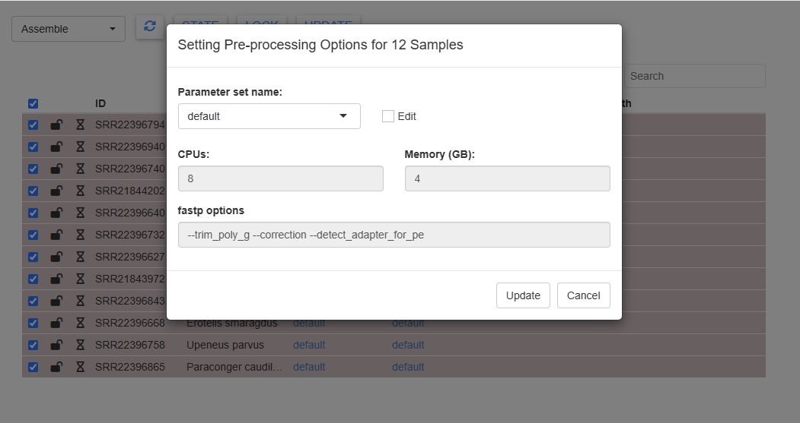

Here you can see the default options for pre-processing your raw FASTQ files. We can modify these by clicking the `edit` checkbox. Let's change the CPUs to 4 and the Memory to 40 GB. You could also change the options passed to [fastp](https://github.com/OpenGene/fastp), but let's keep those at the defaults.

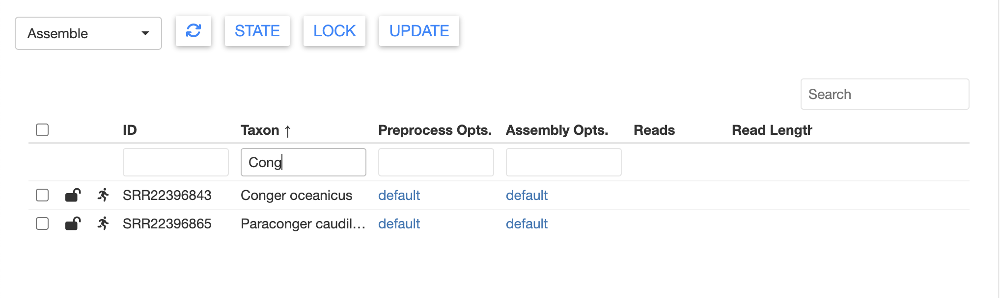

We can save these new parameter options by clicking on the `Parameter set name` box, typing a new name, and clicking  `Add YOUR NEW NAME...` in the dropdown. Finally, click `Update` in the bottom right to save your selection. 

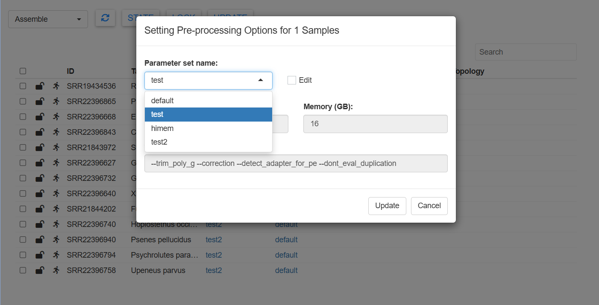

Once you've saved a new parameter set, you can easily access it again using the dropdown menu. In the screenshot below, you can see a couple of other parameter sets that I created. 

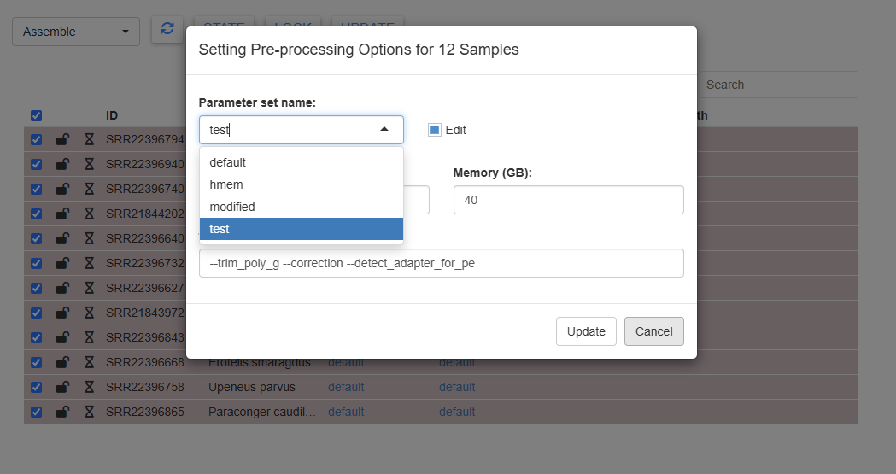

After clicking `Update`, your table should now show `test` for all samples in the Preprocess column.

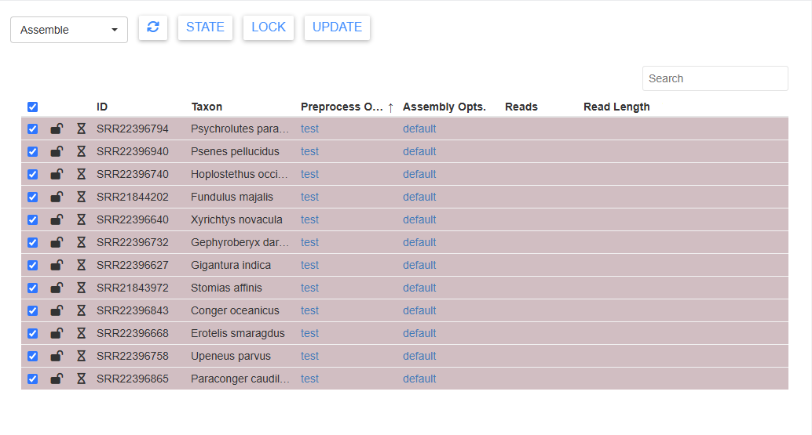

You can set different parameters for different samples by simply selecting the set you want to change and repeating the above process. But for this test dataset, let's keep everything consistent.

Let's also change the `Assembly Opts`. Repeat the process above, selecting all samples and creating a new `himem` setting.


## Running the Assemble Module

Let's get started with the pipeline! Select all samples, then click the `UPDATE` button. A new window should appear.

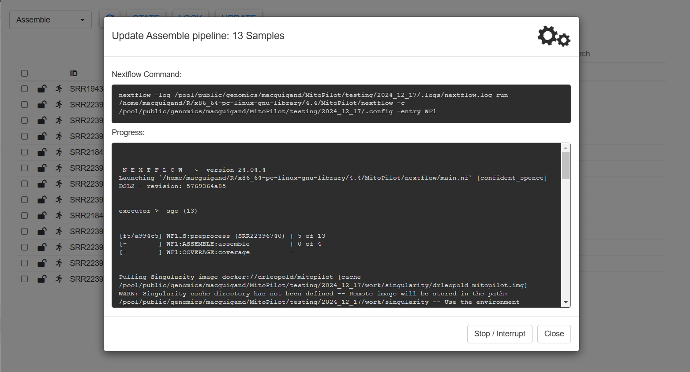


You have two options for running the pipeline. First, you could copy the Nextflow command and run it within a terminal window on your computing system. This command could also be embedded within a submission script for a computing cluster, if you would prefer. Running the Nextflow command externally from the GUI may be preferable for batches with large numbers of samples, since you can perform the analyses in the background.

Alternatively, you press the `Start Nextflow` button to launch the pipeline from within the GUI. Since our test dataset is small, let's do that.

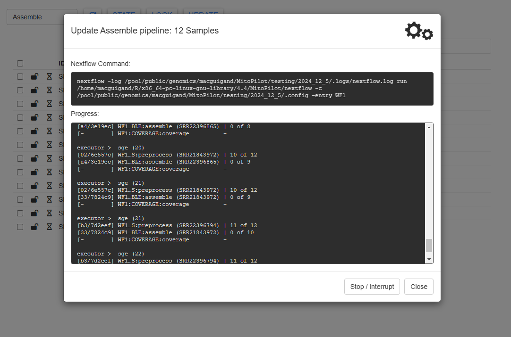

Awesome! You should see Nextflow output being printed the to `Progress` window. This window will continually update as the pipeline progresses. If you're unsure whether the pipeline is still running, check to see if the gears in the top right are spinning.

This pipeline module has 3 steps: preprocessing (filtering) the raw FASTQ files with [fastp](https://github.com/OpenGene/fastp), assembling the mitogenomes using [GetOrganelle](https://github.com/Kinggerm/GetOrganelle), and calculating coverage maps for the assemblies using [bowtie2](https://github.com/BenLangmead/bowtie2).

The test dataset should take a few minutes to finish. When it's done,, your `Progress` window should look something like this.

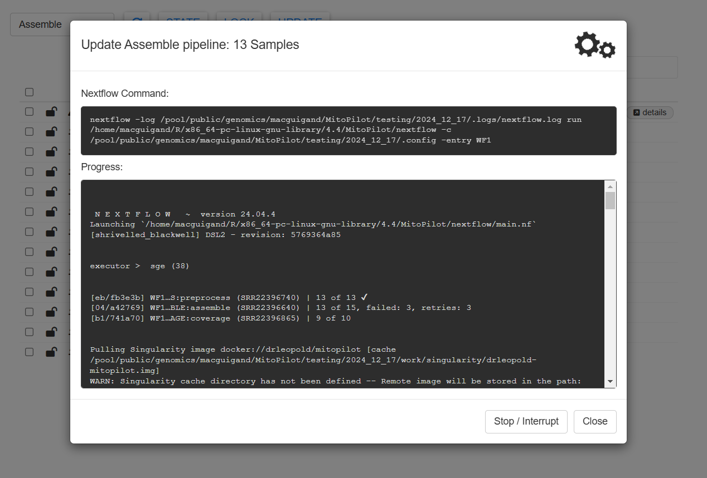

You can now click `Close` to go back to the samples table. 

## Inspecting Assembly Results

The sample table should now be updated with a bunch of new information. 

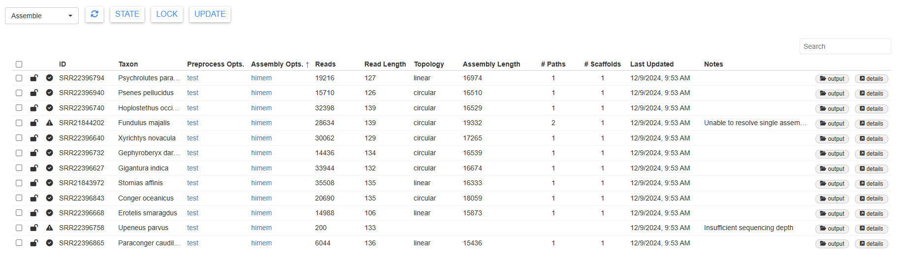

If you want to locate the results files for a sample, you can scroll all the way to the right and click `output`. This will open the appropriate folder in your RStudio session.

You can also view the results within the MitoPilot GUI. For example, select SRR21843972 (_Stomias affinis_), then click `details`. This will show you a new window with the mitogenome sequence. 

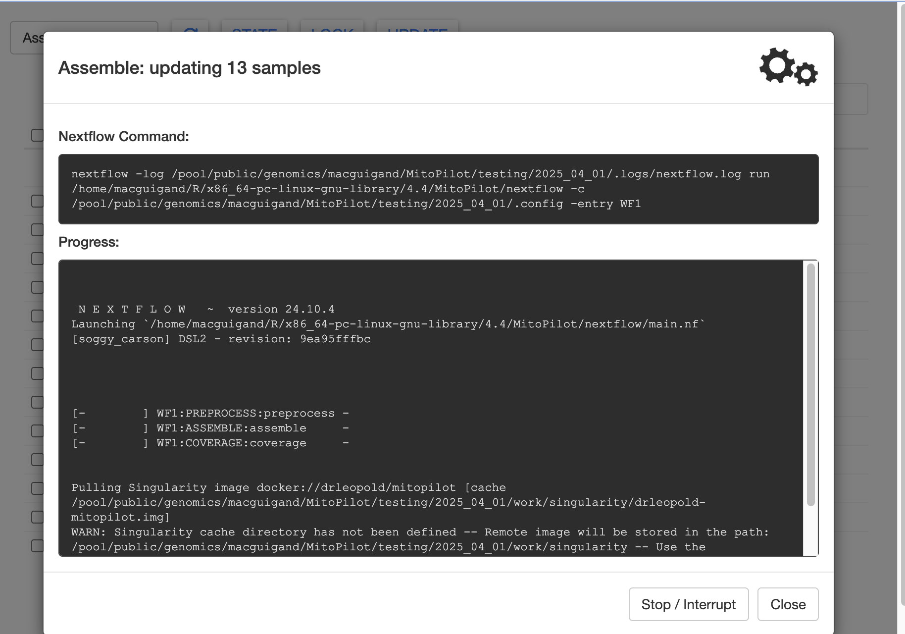

Select that sequence and click the `Fasta` button in the bottom right. This will copy the FASTA formatted mitogenome to your clipboard. This could be useful for a quick BLAST search. 

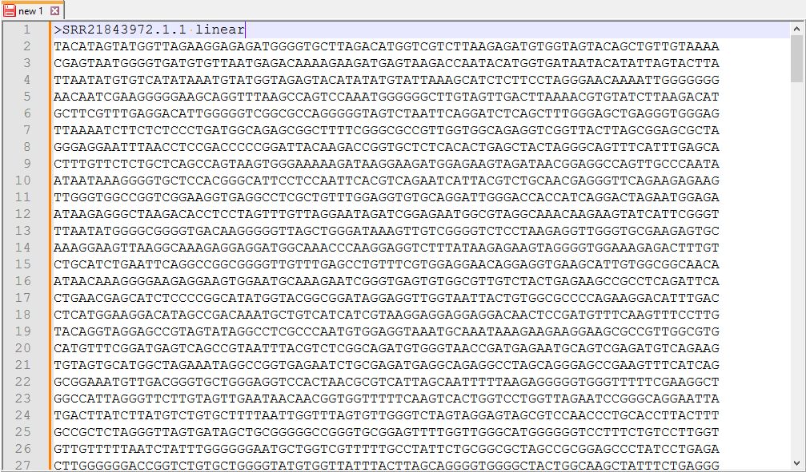

You can also click the `view` button, which will open a summary figure in a new tab, including mean read depth, sequence error rate, and GC content. 

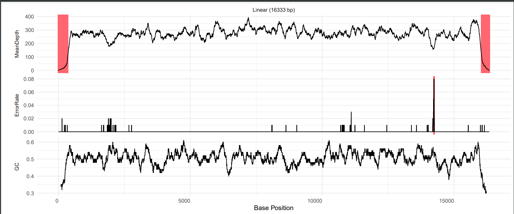

Notice that in this figure, sequence depth drops off dramatically at both ends of the sequence. SRR21843972 was unable to assemble a circular mitogenome due to poor read coverage in this region. To try and recover a circular mitogenome, you could try running the assembly again with different `GetOrganelle` settings (see their [Wiki](https://github.com/Kinggerm/GetOrganelle/wiki/FAQ)) or more sequence data.

## Problematic Samples

In this test dataset, there are two problematic samples which returned failed states. You can see which samples failed by looking for the exclamation mark state icon. Selecting a sample with that icon and clicking on the `STATE` button will cofirm.

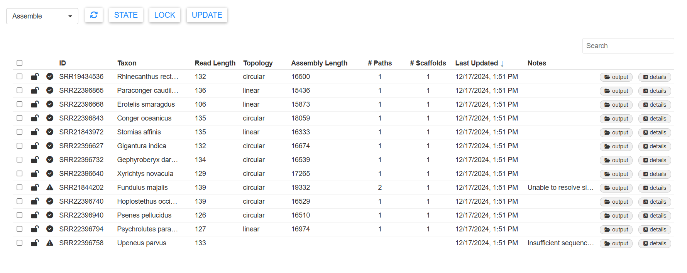

One failed sample is SRR22396758 (_Upeneus parvus_). We purposefully truncated the FASTQ file to 200 reads for this sample. With so few reads, this sample failed to assemble and returned a message "Insufficient sequencing depth" in the `Notes` column. 

The other failed sample is SRR21844202
(_Fundulus majalis_). This sample had plenty of data and was able to assemble a mitogenome. However, the message in the `Notes` columns says "Unable to resolve single assembly from reads". 

[GetOrganelle](https://github.com/Kinggerm/GetOrganelle) produced two alternate assembly paths for this sample. This is usually due to tricky assembly near a repeat region. Please refer to [the GetOrganlle paper](https://doi.org/10.1186/s13059-020-02154-5) for more information about multiple assembly paths.

Let's take a peek at SRR21844202. Select the sample, scroll all the way to the right, and click on `details`. 


We can see two assemblies listed here. Clicking on `view` will show us the coverage, error, and GC content graphs for each assembly.  

Path #1

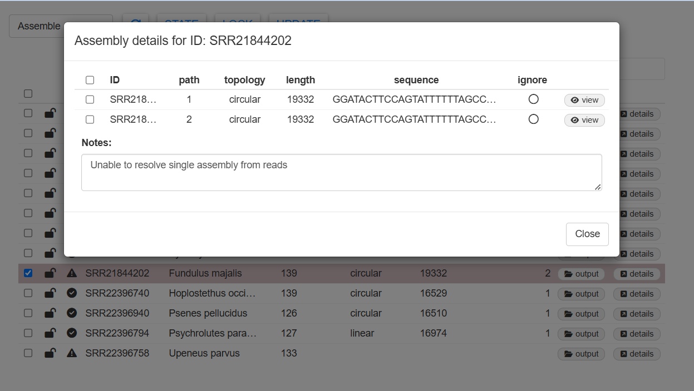

Path #2

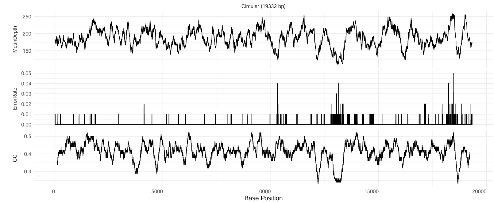

The two assembly paths are very similar, differeing only slightly around 13,000 bp. 

We can chose to move forward with just one assembly path and ignore the other.

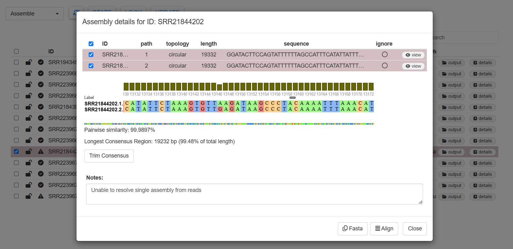

Alternatively, we can determine the consensus sequence of both paths. Selecting both paths and click the `Align` button in the bottom right. The sequence alighment will pop up, showing us that the two paths have 99.9897% sequence similarity.

If we scroll through the alignment, we can see a few bp differences. For example:

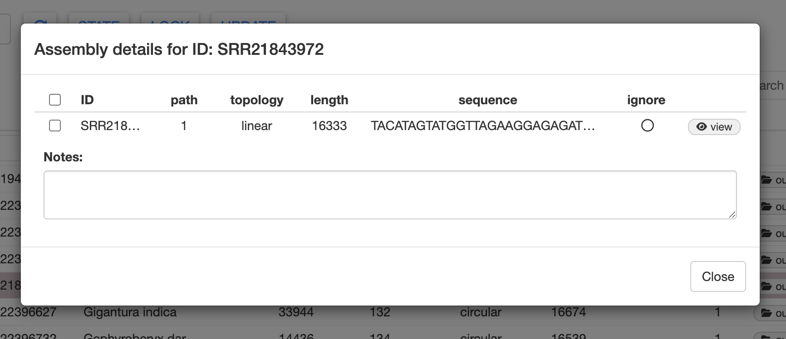

Selecting `Trim Consensus` will remove any conflicting regions of the aligned assemblies and produce a shorter consensus sequence of both alignments. Doing so will automatically ignore the original two assembly paths.

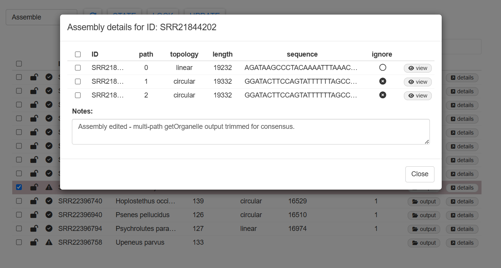

Click close and return to the samples table. You will see that the entry in the `# Paths` column for SRR21844202 is highlighted and there is a note indicating that the assembly was edited. This sample has also been automatically changed to a locked state.

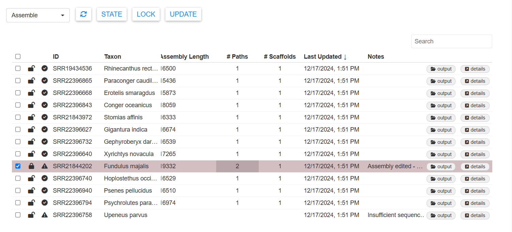

<div class="alert alert-note">
  <strong>Note:</strong> Carefully consider your options for problematic samples with multiple assembly paths. There is no one-size-fits-all solution.
</div>

## Running the Annotate Module
We can now move on to the Annotate pipeline module. This module consists of an annotation step using [Mitos2](https://gitlab.com/Bernt/MITOS) and [tRNAscan-SE](https://github.com/UCSC-LoweLab/tRNAscan-SE), a taxon-specific curation step to refine the annotation models, and a validation step to flag possible issues or known errors that would be rejected by NCBI GenBank.  

First, we need to lock all of the successful samples in th Assemble module. Select all of the samples and click the `LOCK` button. Then use the dropdown menu in the top left to navigate to the Annotate module.

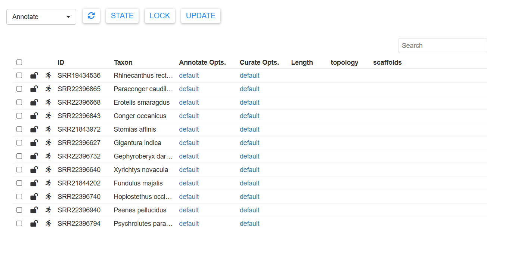

Like before, let's edit the `Annotate Opts` and increase the memory allocation to 36 GB. In this window, you could also edit the Mitos2 and tRNAscan-SE options. In the future, we will allow users to specify custom reference databases for annotation.

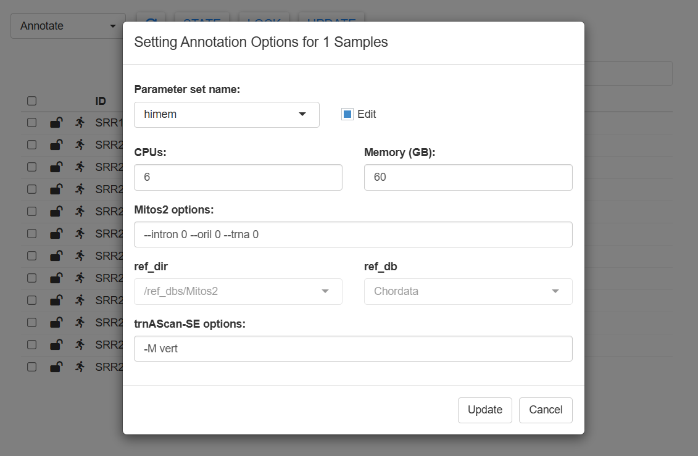

You can also edit the curation options. Currently, we only have one set of curation parameters: `fish_mito`. This will be updated in the near future.

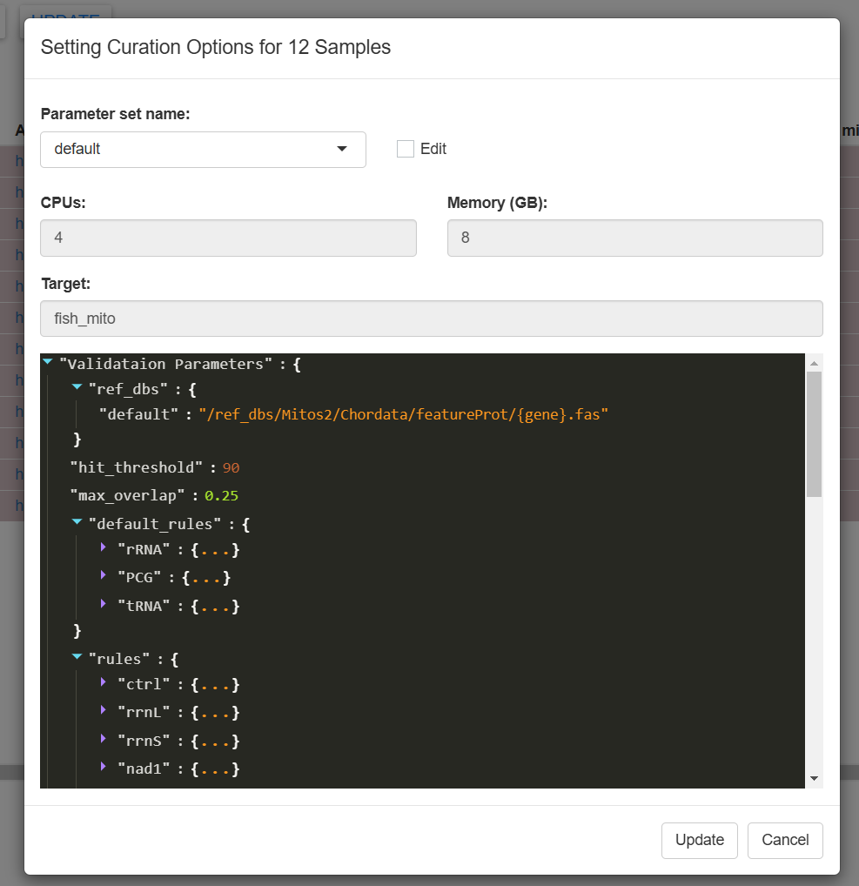

To run the Annotate module, select all samples, click `UPDATE`, then click `Start Nextflow`. This will take a few minutes. As long as the gears in the top right are spinning, the pipeline is still running. Once all steps are complete, click `Close` to return to the sample table.

## Exploring Annotation Results
There are a LOT of results to explore in the Annotate module. The sample table reports some basic stats about the number of protein-coding genes (PCGs), tRNAs, and rRNAs. The `missing` column reports the number of mitochondrial genes that were not annotated, based on the provided curation model. The `extra` column notes the number of potentially duplicated genes. 

Lastly, the `warnings` column indicates how many warning flags were raised during the validation step. Samples with many warnings will require more manual curation to ensure that they are not rejected during submission to NCBI GenBank.


The annotation results for each sample can be examined more closely by clicking the `details` button. First, let's examine the details for a good sample, SRR19434536 (_Rhinecanthus rectangulus_). 

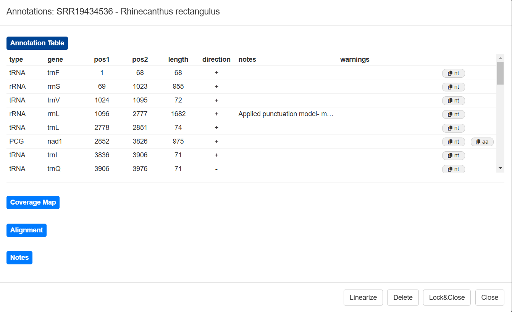

This sample had the expected number of genes and no warnings. However, the `notes` column shows that MitoPilot still made some tweaks to the annotation during the curation step. For example, the start position of rRNA rrnL was moved 22 bp upstream and the stop codon for NAD2 was trimmed by 2 bp.

The nucleotide (and amino acid sequence for PCGs) can be copied to the clipboard using the `nt` and `aa` buttons on the far right. This could be helpful if you'd like to manually BLAST some results.

Clicking on the `Coverage Map` button will show a plot of sequence depth, zooming to the position of the highlighted gene

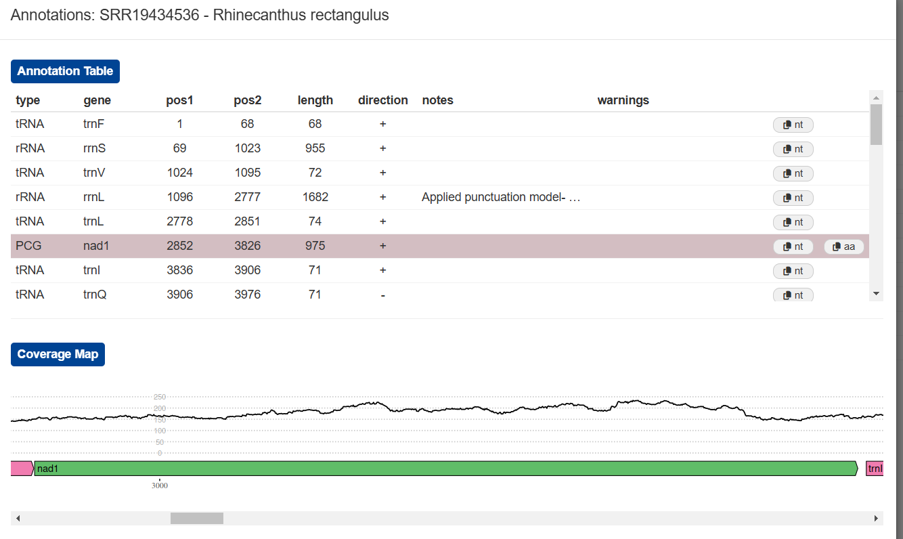

For protein coding genes, you can click the `Alignment` button to show the protein alignment of your annotated gene against a reference database. NEED TO ASK DEVIN ABOUT THIS. ONLY SHOWS TOP SCORING ALIGNMENT?

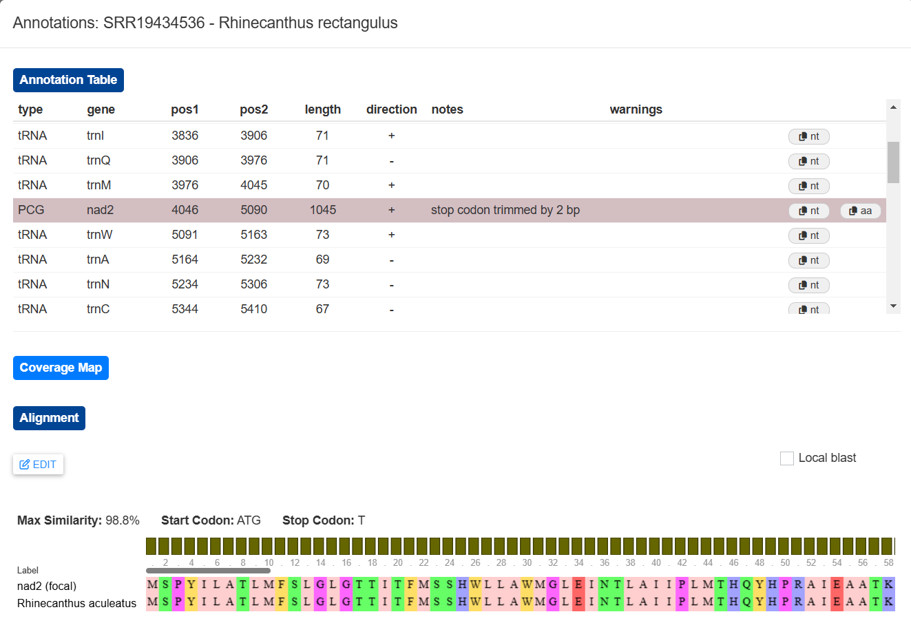

If you provided a path to a local BLAST database when initializing the project, you can choose to use that database here by checking the `Local blast` box. MitoPilot will rerun the BLAST search for the highlighted gene (CONFIRM WITH DEVIN).

## Editing Annotation Results
Editing annotation within the MitoPilot is currently bugged due to issues with the R package `Biostrings`. Devin and Dan are working on a solution.

## Running the Export Module
Let's move to the final step of the pipeline: the Export module. This module allows you to create groups of samples, then generate alignments and files formatted for submission to GenBank.

First, we need to lock the successful samples in the Annotate module. Select all of the samples and click the `LOCK` button. Then use the dropdown menu in the top left to navigate to the Export module.

Next, let's create a group of samples. Sort the samples table by clicking on the `Taxon` column, then select the first five samples and click the `GROUP` button. 

A new window will appear showing some summary information for the selected samples. Type a name for the group, then click `Create`. You can then click `Close` to return to the sample table.

<div class="alert alert-note">
  <strong>Note:</strong> You can assign new samples to an existing group. Simply select the samples you wish to add, click `GROUP`, then choose the existing group from the dropdown menu.
</div>


The sample table should now show assignment to our newly created group. 

<div class="alert alert-note">
  <strong>Note:</strong> Each sample can only belong to one group. MitoPilot will produce a warning message if you attempt to re-assign a sample to a new group.
</div>

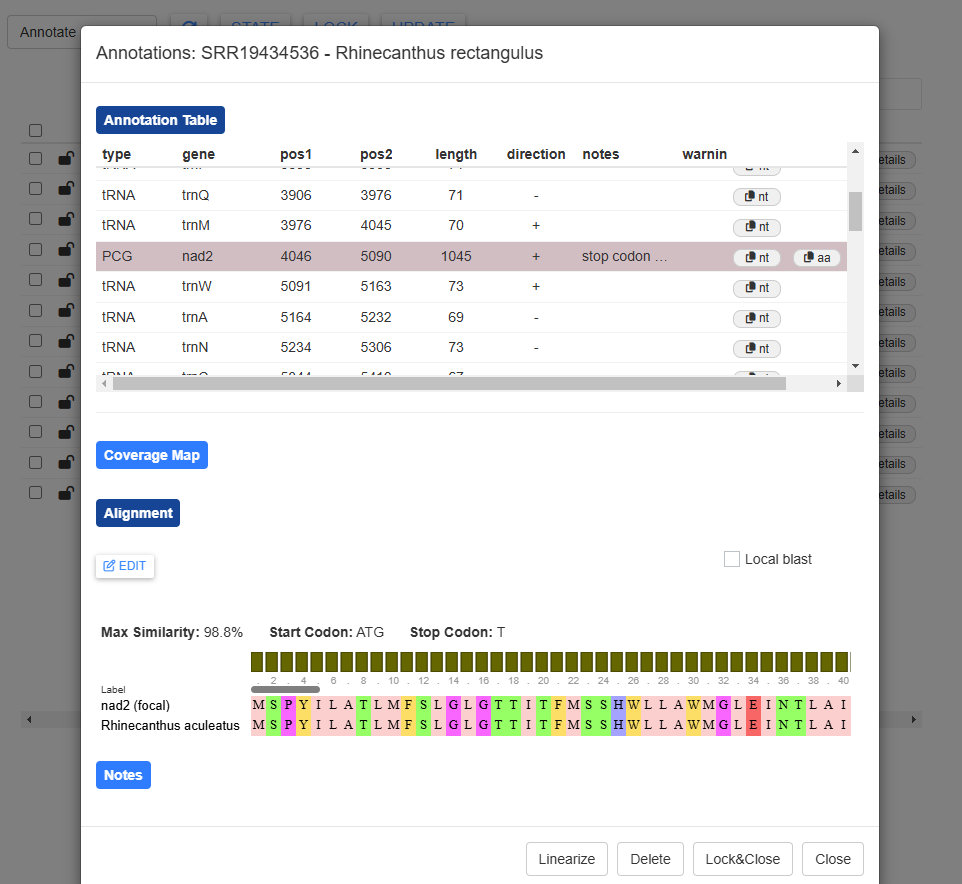

We can proceed to exporting the data for this group. Click `EXPORT DATA`, which will open a new window.

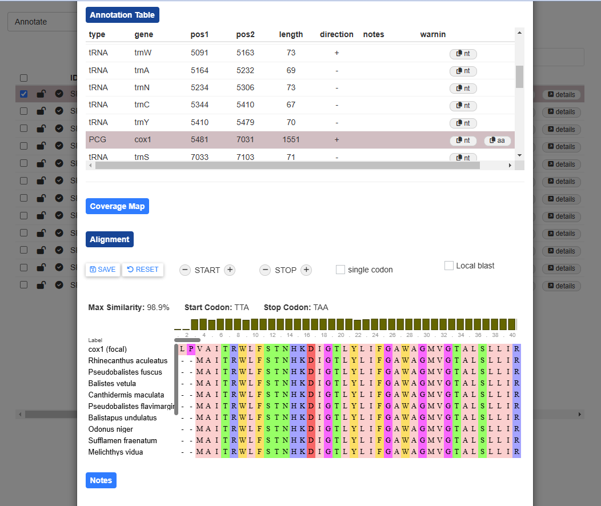

If you have multiple groups, you can select the appropriate one from the dropdown menu.

MitoPilot allows you to create a custom FASTA header for your samples, pulling from extra columns in the CSV file you supplied for the `mapping_fn` argument of the `new_project` function. This conviniently allows you to include metadata needed for your NCBI GenBank submission. For this test project, we can leave the `Fasta Header Template` at the default value.

There is also toggle `Generate Group-level PCG alignment summary`, which will run aligments of all the protein coding genes in your group. For large groups, this can take a while. But it's a useful final quality control.

Click `Export` to generate the final files. It may take a couple of minutes. As long as the gears are spinning, MitoPilot is still running.


